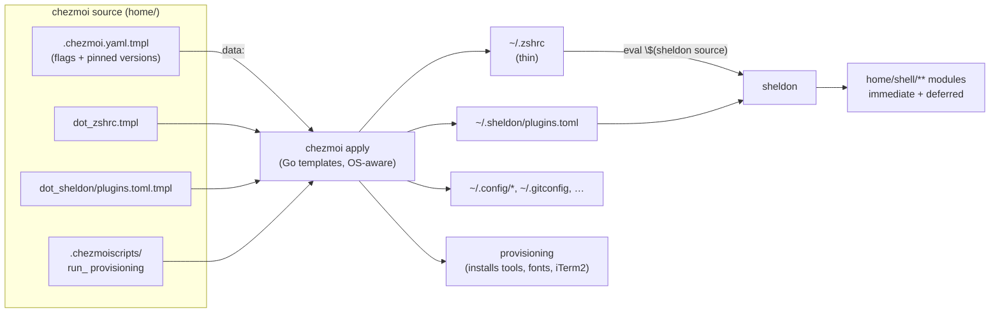

# zsh-dotfiles

A cross-platform (macOS + Linux) ZSH environment managed with [chezmoi](https://www.chezmoi.io/), with fast startup via deferred plugin loading through [sheldon](https://sheldon.cli.rs/), a switchable [asdf](https://asdf-vm.com/) ⇄ [mise](https://mise.jdx.dev/) runtime layer, and reproducible provisioning that's exercised in CI on every push.

> **New here?** Jump to the [60-second quick start](#quick-start), then the [tutorial track](docs/tutorials/README.md).
> **Know the codebase?** The [documentation map](#documentation) links straight to the deep dives — including an honest [Gotchas](docs/gotchas.md) page.

---

## Quick start

One line, on a fresh macOS or Linux machine:

```sh
sh -c "$(curl -fsLS chezmoi.io/get)" -- init -R --debug -v --apply https://github.com/bossjones/zsh-dotfiles.git
```

This installs chezmoi, pulls this repo, prompts for a few [configuration values](docs/feature-flags.md#chezmoi-feature-booleans), renders your dotfiles, and runs the provisioning scripts. For the manual path, the `install.sh` bootstrap, and the `make macos-init-good-defaults-*` new-machine targets, see **[docs/installation.md](docs/installation.md)** or **[Tutorial 00: First-time setup](docs/tutorials/00-first-time-setup.md)**.

Verify a healthy install:

```sh
sheldon --version          # plugin manager present
echo $ZSH_DOTFILES_VERSION_MANAGER   # asdf or mise
chezmoi doctor             # chezmoi environment sane
```

---

## How it works

The design in one picture: `~/.zshrc` is deliberately thin — it hands off almost everything to sheldon, which loads the `home/shell/**` modules as plugins, most of them *deferred* until after your first prompt is drawn.



Read the deep dive in **[docs/architecture.md](docs/architecture.md)** and the exact 24-step load order in **[docs/shell-loading.md](docs/shell-loading.md)**.

---

## Documentation

| Page | What it covers |
|------|----------------|
| 🚀 [Installation](docs/installation.md) | Every install path, the prompts, the `zsh-dotfiles-prep` prerequisite, `post-install-chezmoi` |
| 🧭 [Architecture](docs/architecture.md) | chezmoi source model, thin-`.zshrc` philosophy, module conventions, template/data layer |
| ⚡ [Shell Loading](docs/shell-loading.md) | The deferred sheldon pipeline — load order, defer tiers, the `env.zsh`/`path.zsh` glob convention |
| 🎚️ [Feature Flags](docs/feature-flags.md) | Every prompt, boolean, install-time `ZSH_DOTFILES_*` var, and runtime toggle — including which flags are **inert** |
| 🔀 [Version Managers](docs/version-managers.md) | The asdf ⇄ mise toggle threaded end-to-end, plus the pinned tool-version matrix |
| ⌨️ [fzf-tab](docs/fzf-tab.md) | The optional `fzf_tab` feature flag — fzf-powered Tab completion, off by default |
| 📦 [Provisioning Scripts](docs/provisioning-scripts.md) | The chezmoi `run_` lifecycle and every provisioning script by phase |
| 🖥️ [iTerm2 &amp; macOS](docs/iterm2-and-macos.md) | The self-verifying iTerm2 settings importer, Nerd Fonts, and `~/.osx` |
| 🧪 [Testing &amp; CI](docs/testing-and-ci.md) | pytest + libtmux, Docker smoke lanes, the 5 GitHub workflows and 8-cell matrix |
| ⚠️ [Gotchas](docs/gotchas.md) | Candid known warts and cleanup candidates — dead code, inert flags, mis-named scripts |
| 🎓 [Tutorials](docs/tutorials/README.md) | Hands-on, numbered walkthroughs (00 → 06), newcomer-first with verification steps |
| 🤝 [Contributing](CONTRIBUTING.md) | Dev setup, pre-commit hooks, editing templates, adding a tool module |

---

## What's inside

Core shell experience:

| Tool | Role |
|------|------|
| [zsh](https://www.zsh.org/) | The shell — extensive history, keybindings, completions |
| [sheldon](https://sheldon.cli.rs/) | Plugin manager with deferred loading for fast startup |
| [pure](https://github.com/sindresorhus/pure) | Minimal async prompt |
| [fzf](https://github.com/junegunn/fzf) · [ripgrep](https://github.com/BurntSushi/ripgrep) · [fd](https://github.com/sharkdp/fd) · [jq](https://jqlang.github.io/jq/) · [yq](https://github.com/mikefarah/yq) | Fuzzy finding, search, JSON/YAML |
| [tmux](https://github.com/tmux/tmux) (+ [oh-my-tmux](https://github.com/gpakosz/.tmux)) | Terminal multiplexer |
| [direnv](https://direnv.net/) · [gh](https://cli.github.com/) · [uv](https://github.com/astral-sh/uv) | Per-dir env, GitHub CLI, Python packaging |

Runtime version management — pick one at install time (see [Version Managers](docs/version-managers.md)):

| | |
|---|---|
| [asdf](https://asdf-vm.com/) | Default. `version_manager: asdf` |
| [mise](https://mise.jdx.dev/) | Modern alternative. `version_manager: mise` |

Both provision pinned versions of Go, Ruby, Node, Neovim, tmux, shellcheck/shfmt, the Kubernetes toolchain, and more — the exact matrix lives in [docs/version-managers.md](docs/version-managers.md#pinned-tool-versions).

Optional features are prompted at init. **Note:** of the eight boolean prompts, `pyenv`, `opencv`, `cuda`, and `fzf_tab` are live (they change your rendered config); `ruby`, `nodejs`, `k8s`, and `fnm` are recorded but not yet wired to any template — see [Feature Flags](docs/feature-flags.md#chezmoi-feature-booleans) and [Gotchas](docs/gotchas.md#6-several-feature-flags-are-inert). The newest, [`fzf_tab`](docs/fzf-tab.md), is off by default and swaps zsh's completion menu for an fzf selector when enabled.

---

## Repository layout

```
.
├── home/                     # chezmoi source root (.chezmoiroot points here)
│   ├── dot_zshrc.tmpl        # thin entry point → sheldon
│   ├── dot_sheldon/          # plugins.toml.tmpl — plugin/load orchestration
│   ├── shell/                # modular config: <tool>/{env,path,aliases,…}.zsh
│   ├── .chezmoi.yaml.tmpl    # feature flags + pinned tool versions
│   ├── .chezmoiscripts/      # run_ provisioning scripts (per-OS, ordered)
│   ├── .chezmoiexternal.yaml # git externals (oh-my-tmux, boss-cheatsheets)
│   └── private_dot_config/   # ~/.config payloads (iterm2, sheldon, ghostty, cmux)
├── docs/                     # ← this documentation set
├── scripts/                  # PEP 723 helper scripts (backup-dotfiles, check-jsonc)
├── ai_docs/                  # generated notes: reports/, workflows/, cheatsheets/
├── hack/                     # dev tooling (doctor/, drafts/cursor_rules/)
├── specs/                    # design specs (e.g. asdf→mise migration)
├── .github/workflows/        # CI: tests, future-macos canary, actionlint, tmate
├── Makefile                  # test, smoke lanes, provisioning targets
├── install.sh                # bootstrap installer (mirrors CI)
└── test_dotfiles.py, conftest.py, ...  # pytest + libtmux suite
```

---

## Common commands

```sh
make sync            # uv sync --all-extras + install pre-commit hooks
make test            # pytest (libtmux integration + script unit tests), 6 reruns
make smoke           # reproduce CI in Docker (asdf lane); smoke-mise for mise
make pre-commit      # run all pre-commit hooks

chezmoi diff                              # preview pending changes
chezmoi apply --dry-run -v                # preview without touching files
chezmoi apply                             # apply
chezmoi git pull -- --autostash --rebase  # pull upstream, then apply
```

Full target reference in [docs/testing-and-ci.md](docs/testing-and-ci.md#makefile-targets).

---

## Additional resources

- [chezmoi documentation](https://www.chezmoi.io/user-guide/command-overview/)
- [Go templates](https://pkg.go.dev/text/template)
- [sheldon plugin manager](https://sheldon.cli.rs/)
