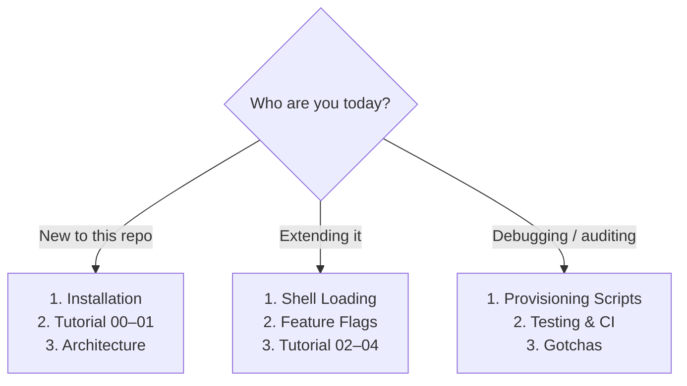

# Documentation

Everything about this ZSH dotfiles system, organized so you can either read top-to-bottom or jump straight to the one thing you need. Back to the [project README](../README.md).

## Start here

- **New here?** [Installation](installation.md) → [Tutorial 00: First-time setup](tutorials/00-first-time-setup.md) → [Tutorial 01: Daily workflow](tutorials/01-daily-workflow.md) → [Architecture](architecture.md).
- **Extending it?** [Shell Loading](shell-loading.md) and [Feature Flags](feature-flags.md), then the hands-on [tutorials](tutorials/README.md).
- **Auditing it?** [Provisioning Scripts](provisioning-scripts.md), [Testing &amp; CI](testing-and-ci.md), and the candid [Gotchas](gotchas.md).

## Reference &amp; explanation

| Page | One-line description |
|------|----------------------|
| [Installation](installation.md) | Every install path, prompts, the `zsh-dotfiles-prep` prerequisite, `post-install-chezmoi` |
| [Architecture](architecture.md) | chezmoi source model, thin-`.zshrc`→sheldon philosophy, module conventions, template/data layer |
| [Shell Loading](shell-loading.md) | The deferred sheldon pipeline — full load order, defer tiers, the `env.zsh`/`path.zsh` glob convention |
| [Feature Flags](feature-flags.md) | Every prompt, boolean, install-time `ZSH_DOTFILES_*` var, and runtime toggle (marks the inert ones) |
| [Version Managers](version-managers.md) | asdf ⇄ mise toggle threaded end-to-end + pinned tool-version matrix |
| [Provisioning Scripts](provisioning-scripts.md) | The chezmoi `run_` lifecycle and every provisioning script by phase |
| [iTerm2 &amp; macOS](iterm2-and-macos.md) | The self-verifying iTerm2 importer, Nerd Fonts, and `~/.osx` |
| [Testing &amp; CI](testing-and-ci.md) | pytest + libtmux, Docker smoke lanes, the 5 GitHub workflows and 8-cell matrix |
| [Gotchas](gotchas.md) | Known warts and cleanup candidates — dead code, inert flags, mis-named scripts |

## Tutorials (hands-on)

The [tutorial track](tutorials/README.md) is a numbered, goal-oriented path — each ends with a **Verify** step.

| # | Tutorial | You end up with |
|---|----------|-----------------|
| 00 | [First-time setup](tutorials/00-first-time-setup.md) | A working zsh + sheldon + prompt |
| 01 | [Daily workflow](tutorials/01-daily-workflow.md) | Confidence editing dotfiles safely |
| 02 | [Add a tool module](tutorials/02-add-a-tool-module.md) | A new module loading at startup |
| 03 | [Toggle a feature flag](tutorials/03-toggle-a-feature-flag.md) | A feature enabled deterministically |
| 04 | [Switch version manager](tutorials/04-switch-version-manager.md) | A shell running on mise |
| 05 | [Run smoke tests locally](tutorials/05-run-smoke-tests-locally.md) | CI parity on your laptop |
| 06 | [Customize iTerm2](tutorials/06-customize-iterm2.md) | Version-controlled terminal settings |

## Conventions

- **Reference pages** live in `docs/*.md`; **tutorials** live in `docs/tutorials/NN-slug.md`.
- **Diagrams** are GitHub-native [Mermaid](https://mermaid.js.org/) fenced blocks (no images).
- **Links** are relative — sibling pages by filename, source files via `../` — so they resolve in forks and local checkouts.

See [CONTRIBUTING.md](../CONTRIBUTING.md) for how to add or edit these docs.
