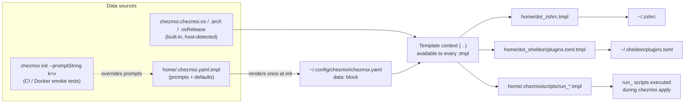
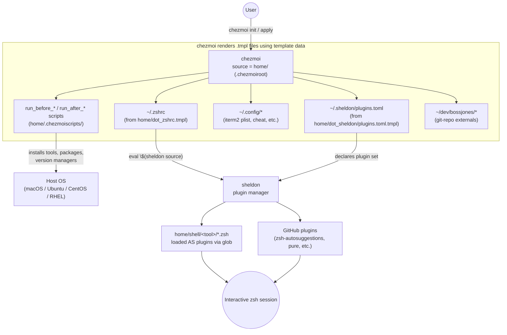

# Architecture Overview

> **Audience**: this page assumes nothing. If you already know the codebase, skim the tables and diagrams — every claim here is sourced from a specific file in this repo, cited inline as `path:line`.

## 1. What this repo actually is

This repository is the [chezmoi](https://www.chezmoi.io/) **source directory** for one person's dotfiles: shell configuration, plugin management via [sheldon](https://sheldon.cli.rs/), and machine provisioning (package installs, version-manager setup, macOS/Linux tool bootstrapping). chezmoi turns the templated files under `home/` into real files in your `$HOME`, and its `run_` script mechanism turns declarative "install this tool" scripts into an ordered, idempotent provisioning pipeline.

The one sentence that explains most of the surprising decisions in this repo: **the source directory is not the repo root.**

```
.chezmoiroot   ->  "home"
```

([.chezmoiroot](../.chezmoiroot)) tells chezmoi that everything it manages lives under `home/`, not at the repository root. Everything else in the repo — `hack/`, `ai_docs/`, `scripts/`, `specs/`, `.github/`, `test_dotfiles.py` — is tooling *around* the dotfiles, not dotfiles chezmoi will ever touch. This is what lets the repo host a full CI suite, spec documents, and AI-authoring scaffolding side-by-side with the actual managed config, without any of it leaking into your `$HOME`.

The repo also pins a minimum chezmoi version:

```
.chezmoiversion -> 2.20.0
```

([.chezmoiversion](../.chezmoiversion)) — chezmoi refuses to apply this source state with an older binary, which matters because several templates below use functions (`stdinIsATTY`, `promptBool`, `osRelease`) that are not ancient chezmoi features.

## 2. Configuration is YAML, not TOML

chezmoi's own config format is user-selectable; this repo uses **YAML**, driven entirely by a template: [`home/.chezmoi.yaml.tmpl`](../home/.chezmoi.yaml.tmpl). On `chezmoi init`, this template is rendered *once* to produce `~/.config/chezmoi/chezmoi.yaml`, and the resulting `data:` block becomes the `.` context available to every other template in the repo (`.name`, `.email`, `.ruby`, `.version_manager`, `.myGolangVersion`, and so on).

Two things worth calling out because they're easy to miss on a skim:

- **Interactive vs. non-interactive detection.** The template checks `stdinIsATTY` first ([home/.chezmoi.yaml.tmpl:2](../home/.chezmoi.yaml.tmpl#L2)). On a real terminal it prompts (`promptString`, `promptBool`) for anything not already cached; in CI/Codespaces/Docker it silently falls back to defaults or `--promptString`/`--promptBool` flags passed on the command line. This is why the same template works both for a human running `chezmoi init` interactively and for the GitHub Actions matrix running it headless.
- **`version_manager` is special-cased outside the `if $interactive` block** ([home/.chezmoi.yaml.tmpl:112-117](../home/.chezmoi.yaml.tmpl#L112-L117)) specifically so that non-TTY invocations (`chezmoi init --promptString version_manager=mise`) still resolve it — the comment in the template spells out that this ordering is load-bearing for the Docker smoke tests.
- **Pinned tool versions live here too.** `myGolangVersion`, `myRubyVersion`, `myAsdfVersion`, `myFzfVersion`, `mySheldonVersion`, and a dozen more are declared in the same `data:` block. Every `run_` script that installs a tool reads its version from here rather than hard-coding it — one file to bump when you want a new Go or Ruby release everywhere.

Feature toggles (`ruby`, `pyenv`, `nodejs`, `k8s`, `cuda`, `opencv`, `fnm`) gate whole categories of provisioning. The full list, defaults, and where each flag is consumed is documented separately in **[docs/feature-flags.md](./feature-flags.md)** — this page won't duplicate it.

## 3. The core philosophy: a thin `.zshrc` that hands off immediately

The single most important architectural decision in this repo is that **`~/.zshrc` does almost nothing**. It is rendered from [`home/dot_zshrc.tmpl`](../home/dot_zshrc.tmpl), and per-OS (darwin/linux branches in the same file), it does exactly three things:

1. Inline `home/shell/init.zsh` via `{{ include "shell/init.zsh" }}` — a handful of lines that dedupe `$path`/`$fpath` and set XDG vars on Linux ([home/shell/init.zsh](../home/shell/init.zsh)).
2. Export `ZSH_DOTFILES_VERSION_MANAGER` from the template data.
3. Hand everything else to sheldon: `eval "$(sheldon source)"`, guarded by a check that sheldon is on `$PATH` (or present at `~/.local/bin/sheldon`) *and* that `~/.sheldon/plugins.toml` already exists.

```zsh
{{ include "shell/init.zsh" }}
...
{{ if or (lookPath "sheldon") (stat (joinPath .chezmoi.homeDir ".local" "bin" "sheldon")) -}}
if [[ -f "$HOME/.sheldon/plugins.toml" ]]; then
    export PATH="$HOME/.local/bin:$PATH"
    eval "$(sheldon source)"
fi
{{  end -}}
```
*(condensed from [home/dot_zshrc.tmpl](../home/dot_zshrc.tmpl))*

That's it. There is no long chain of `source ~/.zsh/*.zsh` in `.zshrc` itself. **All** of the actual configuration — aliases, `env.zsh`, `path.zsh`, completions, keybindings, the prompt — is delegated to [sheldon](https://sheldon.cli.rs/), configured via [`home/dot_sheldon/plugins.toml.tmpl`](../home/dot_sheldon/plugins.toml.tmpl), which renders to `~/.sheldon/plugins.toml`.

This matters because it inverts the usual dotfiles mental model. The `home/shell/<tool>/*.zsh` files are not sourced directly by `.zshrc` — they are treated **as sheldon plugins**, pulled in via glob patterns against a `local` plugin source:

```toml
[plugins.env]
local = "~/.local/share/chezmoi/home/shell"
use = ["**/env.zsh"]

[plugins.path]
local = "~/.local/share/chezmoi/home/shell"
use = ["**/path.zsh"]
```
*(from [home/dot_sheldon/plugins.toml.tmpl](../home/dot_sheldon/plugins.toml.tmpl))*

Sheldon then compiles all matched plugin files (local globs, GitHub repos like `zsh-users/zsh-autosuggestions`, inline snippets) into a single generated script that `eval "$(sheldon source)"` sources in one shot — with `zsh-defer` used liberally (`apply = ["defer"]` / `"defer-more"`) so heavy plugins (syntax highlighting, autosuggestions, completions) don't block prompt paint at shell startup.

**Why this shape?** It cleanly separates *what* to load (declared once, per-tool, under `home/shell/<tool>/`) from *how* and *when* to load it (sheldon's plugin/apply/defer machinery). Adding a new tool means adding a `home/shell/newtool/env.zsh` file — it's picked up automatically by the existing `**/env.zsh` glob, no `.zshrc` edit required.

The full plugin/module *load order* — which sheldon plugin block runs before which, how `defer` vs `defer-more` staggers things, and why `compinit` and `config.zsh` are special-cased — is intentionally **not** covered here; see **[docs/shell-loading.md](./shell-loading.md)**.

## 4. Module convention: `home/shell/<tool>/{env,path,completion,keybinding,aliases}.zsh`

Tool-specific configuration lives in its own directory under `home/shell/`, and by convention each directory holds a subset of five well-known filenames:

| File | Loaded by (sheldon glob) | Purpose |
|---|---|---|
| `env.zsh` | `[plugins.env]` → `**/env.zsh` | Environment variables (`$FOO_HOME`, feature flags) |
| `path.zsh` | `[plugins.path]` → `**/path.zsh` | `$PATH`/`$fpath` additions |
| `completion.zsh` | `[plugins.local]` → `**/{keybinding,completion}.zsh` | Shell completion setup |
| `keybinding.zsh` | `[plugins.local]` → `**/{keybinding,completion}.zsh` | Custom keybindings (deferred) |
| `aliases.zsh` | `[plugins.aliases]` → `**/aliases.zsh` | Tool-specific aliases |

Confirmed present today (non-exhaustive — see `home/shell/` for the current set): `asdf/`, `bun/`, `centos/`, `cheat/`, `chezmoi/`, `cuda/`, `deno/`, `direnv/`, `editor/`, `fnm/`, `fzf/` (has all four of env/path/completion/keybinding), `go/`, `gpg/`, `invokeai/`, `k3d/`, `klam-ext/`, `krew/`, `mise/`, `pyenv/`, `rust/`, `secrets/`, `wtp/`, plus `customs/aliases.zsh` for personal aliases and a top-level `env.zsh`/`path.zsh`/`keybinding.zsh`/`config.zsh`/`compinit.zsh`/`ohmyzshsnippet.zsh` for cross-cutting concerns. `zsh_dot_d/before` and `zsh_dot_d/after` hold hook points for init ordering that don't fit the tool-module pattern.

Because sheldon globs by filename rather than by explicit directory list, **any new `home/shell/<tool>/env.zsh` is picked up automatically** — no registration step, no edit to `plugins.toml.tmpl`. This is the payoff of the convention: it turns "add a tool" into "add a directory following the naming convention."

## 5. The template/data layer

Every `.tmpl` file in this repo is a [Go template](https://pkg.go.dev/text/template) evaluated by chezmoi with a data context built from `home/.chezmoi.yaml.tmpl`'s `data:` block plus chezmoi's built-in `.chezmoi.*` variables. The three conditionals you'll see repeated throughout the codebase:

```gotemplate
{{ if eq .chezmoi.os "darwin" }}        {{/* macOS-only block */}}
{{ if eq .chezmoi.arch "arm64" }}       {{/* Apple Silicon vs Intel */}}
{{ if eq .chezmoi.osRelease.name "Ubuntu" }}   {{/* or "CentOS Linux" / "Oracle Linux Server" */}}
```

`.chezmoi.osRelease` is populated from `/etc/os-release` on Linux, so distro branching uses either `.osRelease.name` (human string like `"Ubuntu"`, `"CentOS Linux"`, `"Oracle Linux Server"`) or `.osRelease.id` (machine-readable, e.g. `"ubuntu"`, `"centos"`, `"ol"`, `"rhel"`) depending on the script — both forms appear across `home/.chezmoiscripts/`.

Data flows one direction: `home/.chezmoi.yaml.tmpl` → rendered `~/.config/chezmoi/chezmoi.yaml` → available as `.` in every other template at `chezmoi apply` time. A minimal version of the flow:



The full inventory of feature-toggle flags (what each one gates, its default, where it's read) lives in **[docs/feature-flags.md](./feature-flags.md)**.

## 6. External resources: `.chezmoiexternal.yaml`

Two directories are not authored in this repo at all — they're pulled in as [`git-repo` externals](https://www.chezmoi.io/reference/source-state-attributes/#external-attributes) declared in [`home/.chezmoiexternal.yaml`](../home/.chezmoiexternal.yaml):

| Target (relative to `$HOME`) | Source | What it is |
|---|---|---|
| `dev/bossjones/oh-my-tmux` | `https://github.com/bossjones/.tmux.git` | tmux configuration (fork of gpakosz/.tmux) |
| `dev/bossjones/boss-cheatsheets` | `https://github.com/bossjones/boss-cheatsheets.git` | Personal [cheat](https://github.com/cheat/cheat) sheets |

chezmoi clones/updates these repos as part of `chezmoi apply`, independent of the `run_` script pipeline. (Two other externals — a tpm archive and an AstroVim archive — are present in the file but commented out.)

## 7. System context: how it all fits together



The provisioning half of this diagram — the exact ordering of `run_before`/`run_once`/`run_onchange`/`run_after` scripts and what each one does — is documented in **[docs/provisioning-scripts.md](./provisioning-scripts.md)**.

## 8. Directory map

| Path | Role |
|---|---|
| [`home/`](../home/) | chezmoi **source root** (`.chezmoiroot` points here) — everything chezmoi manages |
| [`home/shell/`](../home/shell/) | Tool-specific modules (`env.zsh`/`path.zsh`/`completion.zsh`/`keybinding.zsh`/`aliases.zsh`), loaded by sheldon as plugins, not sourced directly |
| [`home/.chezmoiscripts/`](../home/.chezmoiscripts/) | ~50 `run_*` provisioning scripts (package installs, version managers, fonts, iTerm2 import) — see [docs/provisioning-scripts.md](./provisioning-scripts.md) |
| [`home/dot_sheldon/`](../home/dot_sheldon/) | [sheldon](https://sheldon.cli.rs/) plugin manifest (`plugins.toml.tmpl`) that becomes `~/.sheldon/plugins.toml` |
| [`hack/`](../hack/) | Development scaffolding: `drafts/cursor_rules/` (source for `.cursor/rules`), `doctor/`, `schemas/` |
| [`ai_docs/`](../ai_docs/) | AI-generated documentation: `reports/`, `workflows/`, `cheatsheets/` |
| [`scripts/`](../scripts/) | Standalone maintenance scripts (secrets audit, dotfiles backup, JSONC checking, Claude completion generation) — not chezmoi-managed |
| [`specs/`](../specs/) | Design/spec documents for larger changes (e.g. the mise migration, Docker smoke test design) |
| [`.github/workflows/`](../.github/workflows/) | CI: `tests.yml`, `tests-future-macos.yml`, `actionlint.yml`, `tmate.yml`/`tmate-mac.yml` (debug SSH) |

## 9. Where to go next

| Topic | Page |
|---|---|
| Sheldon plugin load order, defer strategy, `compinit` timing | [docs/shell-loading.md](./shell-loading.md) |
| Full feature-flag inventory (`ruby`, `pyenv`, `k8s`, `cuda`, `opencv`, `fnm`, `version_manager`, …) | [docs/feature-flags.md](./feature-flags.md) |
| asdf vs. mise: how the toggle works, what each installs | [docs/version-managers.md](./version-managers.md) |
| The `run_` script lifecycle in depth, script-by-script | [docs/provisioning-scripts.md](./provisioning-scripts.md) |
| First-time setup, `chezmoi init --apply`, CI mirroring | [docs/installation.md](./installation.md) |
| Test suite (`pytest` + `libtmux`), GitHub Actions matrix | [docs/testing-and-ci.md](./testing-and-ci.md) |

---

*Sources consulted for this page: [.chezmoiroot](../.chezmoiroot), [.chezmoiversion](../.chezmoiversion), [home/.chezmoi.yaml.tmpl](../home/.chezmoi.yaml.tmpl), [home/dot_zshrc.tmpl](../home/dot_zshrc.tmpl), [home/dot_sheldon/plugins.toml.tmpl](../home/dot_sheldon/plugins.toml.tmpl), [home/shell/init.zsh](../home/shell/init.zsh), [home/.chezmoiexternal.yaml](../home/.chezmoiexternal.yaml), and a directory listing of `home/shell/`, `home/.chezmoiscripts/`, `hack/`, `ai_docs/`, `scripts/`, `specs/`, `.github/workflows/`.*
