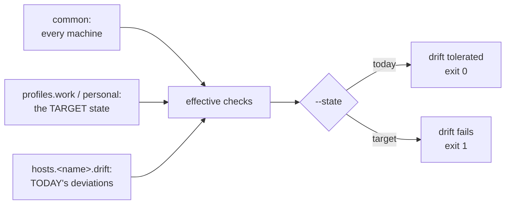

# Convergence Doctor

`hack/doctor/doctor.py` answers one question, four ways: **does this machine match what its
profile says it should be, and where doesn't it?**

It is a self-contained [uv](https://docs.astral.sh/uv/) script driven by a single committed YAML
file. It is **read-only by construction** — every check may carry a `fix:` string, which is
*printed and never executed*. It never runs `chezmoi init` or `chezmoi apply`.

Back to the [documentation index](README.md). Design rationale lives in
[`specs/migration-doctor.md`](../specs/migration-doctor.md); the findings it encodes come from
[`specs/unified-dotfiles-gap-analysis.md`](../specs/unified-dotfiles-gap-analysis.md).

> **New to this?** Start with the hands-on
> [Tutorial 08: Investigate an environment](tutorials/08-investigate-an-environment.md). This page
> is the reference.

---

## Why it exists

The fleet is three macOS machines, and the goal is that **every work machine looks like every
other work machine, and every personal machine like every other personal machine.** Divergence
inside a profile is drift to eliminate, not configuration to preserve.

That target shape is what the config encodes. See
[Part 4 of the gap analysis](../specs/unified-dotfiles-gap-analysis.md) for how the fleet got
here.



---

## Quick start

```bash
make doctor-identity   # probe hostnames — needs no config, no resolved host
make doctor            # full run against this machine
make doctor-test       # unit tests (no real system access)
make smoke-doctor      # prove the script runs from scratch
```

Or call it directly — the [PEP 723](https://peps.python.org/pep-0723/) header makes it
self-bootstrapping, so there is no virtualenv to create:

```bash
./hack/doctor/doctor.py --state target --format json
```

---

## Command reference

| Flag | Effect |
|------|--------|
| *(none)* | Resolve the host, run `phase=always`, `state=today`, text output |
| `--identity` | Probe every macOS hostname source. **Needs no config and no resolved host** |
| `--state today \| target` | Tolerate tracked drift, or demand convergence. Default `today` |
| `--phase pre \| post \| always \| all` | Which lifecycle checks to run. Default `always` |
| `--profile <name>` | Override host resolution |
| `--list-profiles` | Show every host and whether it is an unsurveyed `hypothesis` |
| `--drift` | Show only the drift register |
| `--explain <id>` | Print one check's full definition; run nothing |
| `--only a,b` / `--skip a,b` | Run or exclude a subset by id |
| `--format text \| json` | `json` for `jq`, CI, or handing to an agent |
| `--validate` | Schema-check the config and exit; execute nothing |
| `--dry-run` | List what would run, in order |
| `--config <path>` | Defaults to `hack/doctor/profiles.yaml` |

### Exit codes

The real interface for scripting:

| Code | Meaning |
|------|---------|
| `0` | All `error` checks passed. `warn` failures and (under `--state today`) known drift may be present |
| `1` | At least one `error` check failed, or unresolved drift under `--state target` |
| `2` | Config missing, unparseable, or schema-invalid |
| `3` | Host could not be resolved, or resolved **ambiguously** |

`1` and `3` are deliberately distinct: a pre-flight gate must tell *"this machine is not ready"*
apart from *"I do not know what this machine is."*

### Statuses

| Glyph | Status | Meaning |
|---|---|---|
| `✓` | `PASS` | Assertion held |
| `✗` | `FAIL` | Assertion did not hold |
| `⚠` | `WARN` | Failed, but `severity: warn` — does not affect the exit code |
| `⊘` | `SKIP` | A `when:` gate did not match, or a probe directory is absent |
| `●` | `KNOWN` | Tracked drift, tolerated under `--state today` |
| `✗` | `ERROR` | The check itself is broken (bad type, handler raised) |

---

## Host resolution

Ordered — the first rule producing a unique answer wins:

```
1.  --profile <name>                       explicit CLI flag
2.  $DOTFILES_DOCTOR_PROFILE               environment override
3.  ~/.config/dotfiles-doctor/profile      machine-local file, never chezmoi-managed
4.  hostname match                         any settable name == host key, or in identity.aliases
5.  identity.match fingerprint             ONLY if exactly one host matches
```

### Ambiguity is a hard error, by design

`supertop` and `minitop` are **both `arm64` running as `bossjones`**, so a fingerprint alone
cannot separate them. Rather than guess, the doctor exits `3` and names the candidates:

```
✗ Cannot resolve profile: 2 candidates match this machine's fingerprint
    minitop     arch=arm64, username=bossjones
    supertop    arch=arm64, username=bossjones

  Disambiguate by any of:
    sudo scutil --set ComputerName minitop && sudo scutil --set LocalHostName minitop
    echo minitop > ~/.config/dotfiles-doctor/profile
    doctor.py --profile minitop
```

**This friction is deliberate.** It converts "the hostnames are probably wrong" from a hunch into
an enforced precondition — and a correct `LocalHostName` is the prerequisite for
host-conditional chezmoi templates, which is how genuine per-machine differences get expressed.

`identity.aliases` lets a mis-named machine resolve *today* under its stale name while
`identity.assert` still reports the drift. `match` **resolves**; `assert` **verifies**.

---

## macOS hostnames

`--identity` probes nine sources. Only three are settable; everything else derives:

| Source | Kind |
|---|---|
| `scutil --get ComputerName` | **settable** — UI name; spaces and unicode legal |
| `scutil --get LocalHostName` | **settable** — Bonjour/mDNS; DNS-safe charset only |
| `scutil --get HostName` | **settable** — *usually unset, and that is the healthy default* |
| `sysctl -n kern.hostname` | derived — what `hostname` reads |
| `hostname`, `hostname -s`, `hostname -f`, `uname -n` | derived |
| `networksetup -getcomputername` | mirror of `ComputerName` |

When `HostName` is unset, macOS synthesises `kern.hostname` as `LocalHostName + .local`. So an
unset `HostName` is **not a fault** — it is asserted at `warn` severity with `allow_unset: true`,
while `ComputerName` and `LocalHostName` are `error`.

The failure mode worth catching is **disagreement between the three settable names**, which
`--identity` reports directly.

Four other candidates were investigated and deliberately **not** probed, because they are not
hostname sources on modern macOS: `hostinfo` (reports kernel info only), `smbutil status`
(requires SMB to be running), `ipconfig getpacket` (only if DHCP supplies a `host_name` option),
and `/etc/hosts` (loopback entries only). See
[`specs/migration-doctor.md`](../specs/migration-doctor.md) for the measurements.

---

## Xcode toolchain shims

Two checks guard the `/usr/bin` build toolchain on macOS, because when it breaks **every
`make` target in this repo fails before running anything** — and so does sheldon-from-source
on arm64, any brew build from source, and any mise tool that falls back to compiling.

| Check | Catches |
|---|---|
| `xcode-toolchain-shims-usable` | the **symptom** — `/usr/bin/make` and `/usr/bin/clang` no longer execute |
| `xcode-system-resources-match-xcode` | the **cause**, before it becomes a symptom |

### The failure

`/usr/bin/make`, `/usr/bin/clang`, `/usr/bin/cc` and `xcrun` are not compilers. They are shims
that ask `xcode-select`'s active developer directory to locate the real tool. When the handoff
breaks, `make` only shows you the fallback, which misdiagnoses it as a missing install:

```
$ /usr/bin/make --version
xcode-select: Failed to locate 'make', requesting installation of command line developer tools.
```

**Run `/usr/bin/clang --version` instead** — it prints the actual error:

```
dlopen(@rpath/libxcodebuildLoader.dylib): Symbol not found: _XPCTypeBool
  Referenced from: /Library/Developer/PrivateFrameworks/CoreDevice.framework/…/CoreDevice
  Expected in:     /Library/Apple/System/Library/PrivateFrameworks/Mercury.framework/…/Mercury
```

That is a **version skew between two private frameworks**, not a missing or corrupt Xcode.
`CoreDevice` belongs to Xcode; `Mercury` belongs to macOS. An old `CoreDevice` asks for a
symbol the current OS stopped exporting, and the loader gives up.

### Why `xcodebuild -version` lies

Upgrading Xcode.app replaces the *app*. The system components it installs outside the bundle —
into `/Library/Developer/PrivateFrameworks` — are installed separately, on first launch. If
that step never runs, you get a new app sitting on old frameworks, and the obvious diagnostic
reports everything is fine:

```sh
xcodebuild -version                                    # Xcode 26.6   <- the APP
pkgutil --pkg-info com.apple.pkg.XcodeSystemResources  # version: 16.2.0.0…  <- the FRAMEWORKS
```

**The receipt is the number that matters.** `xcode-system-resources-match-xcode` compares its
major version against `Xcode.app`'s and fails on disagreement, which is why it fires while the
toolchain still works — the skew is detectable before the next macOS update makes it fatal.

### Repair

Install the package the app already ships. This is the root-cause fix and keeps Xcode selected,
so iOS SDKs and simulators stay available:

```sh
sudo installer -pkg \
  /Applications/Xcode.app/Contents/Resources/Packages/XcodeSystemResources.pkg -target /
```

`sudo xcodebuild -runFirstLaunch` does the same thing plus the rest of first-launch setup.

If you do not need Xcode at all, point the shims at the standalone Command Line Tools, which
carry their own self-contained toolchain and never load `CoreDevice`:

```sh
sudo xcode-select -s /Library/Developer/CommandLineTools
```

This sidesteps the problem rather than fixing it — the stale framework stays on disk, and
anything wanting an Xcode-only SDK stops working. Verify either route with:

```sh
xcode-select -p && /usr/bin/make --version && /usr/bin/clang --version
```

> Seen on `minitop` (macOS 26.6.2, Xcode 26.6 on an Xcode-16.2 receipt) — [#138](https://github.com/bossjones/zsh-dotfiles/issues/138).
> Note that `make doctor` cannot help you here: `make` is one of the casualties. Run
> `./hack/doctor/doctor.py` directly, or use the CLT's
> `/Library/Developer/CommandLineTools/usr/bin/make`.

---

## Configuration

One file: [`hack/doctor/profiles.yaml`](../hack/doctor/profiles.yaml), validated against
[`hack/schemas/doctor-profiles.schema.json`](../hack/schemas/doctor-profiles.schema.json).

```yaml
version: 1
defaults: {timeout: 15, shell: /bin/zsh}

common:
  checks: [...]              # every machine

profiles:
  work:     {checks: [...]}  # every work machine
  personal: {checks: [...]}  # every personal machine

hosts:
  adobetop:
    identity: {...}          # inherent: names, arch, hw model
    drift:    [...]          # tracked, dated, expiring deviations
```

> **There is no `hosts.<name>.checks` key, and that is the point.** The schema provides *nowhere*
> to park a permanent per-host assertion. A host block may contain only what is inherent
> (`identity`) and what is temporary (`drift`).
>
> A genuine hardware difference goes at **profile** level behind a gate:
> `when: {hw_model: "MacBook.*"}`.

### Anatomy of a check

```yaml
- id: gitconfig-no-adobe          # unique, kebab-case
  title: personal gitconfig carries no Adobe references
  type: command                   # from the registry below
  phase: post                     # pre | post | always   (default: always)
  severity: error                 # error | warn          (default: error)
  traces: [M2, C1, "#119"]        # spec findings and/or GitHub issues
  when: {os: darwin}              # SKIP unless every key matches
  fix: |                          # PRINTED on failure, never executed
    Re-run chezmoi init with --promptString "profile=personal".
  run: chezmoi cat ~/.gitconfig
  want_stdout_not_matching: "(?i)adobe"
```

`when.profile` is deliberately unavailable — a profile-specific check belongs in that profile's
block, not in `common` behind a condition.

### Anatomy of a drift entry

Every field of a check, plus three **required** ones:

```yaml
- id: adobetop-cuda-true-on-macos
  title: cuda is true on a macOS host
  observed: "2026-08-31"     # when first recorded
  expected: "false"          # what the target state says
  tracked: "#101"            # REQUIRED — no untracked drift
  type: chezmoi_data
  key: cuda
  want: true                 # describes the DEVIATION as it exists today
```

A drift assertion describes the deviation **as it is now**, so it *passes* under `--state today`
(the drift is still what we think it is) and *fails* under `--state target` (it has not been
eliminated). If it **stops** passing under `today`, that is its own finding: the machine moved
underneath the register, and the entry is stale.

`tracked` is schema-enforced because drift with no tracking issue has no convergence plan — it is
an unmanaged difference, not an accepted deviation.

---

## Check types

| Type | Asserts |
|------|---------|
| `command` | Escape hatch — `want_exit`, `want_stdout[_matching\|_not_matching\|_empty]`, `want_stderr_matching` |
| `file_exists` | A path is `present` or `absent` |
| `file_contains` | Literal `want` or regex `want_matching`; `absent: true` inverts |
| `symlink` | Link presence and **raw link text** via `readlink`, not `realpath` |
| `binary` | On `PATH`, optionally `in_dir` and `version_matching` |
| `path_entry` | A dir is in the **interactive** `$path` (`zsh -i`), not the doctor's own |
| `git_config` | The **resolved** value via `git -C <cwd> config --get`, with `includeIf` applied |
| `chezmoi_data` | A dotted key in `chezmoi data` |
| `chezmoi_managed` | Count of lines in `chezmoi managed` matching a pattern |
| `chezmoi_data_complete` | **Every key the template declares is present in the live config** |
| `hostname` | One of the three settable names; `allow_unset` for `HostName` |
| `brew` | A formula or cask is installed |

Expensive probes (`chezmoi data`, `brew list`, the interactive `$path`) run **once per
invocation** and are memoised.

### Two types worth knowing about

**`symlink` compares raw link text.** `~/.vimrc` is expected to be the *relative* link
`.vim/.vimrc`; `realpath` would erase that distinction. See
[Gotchas](gotchas.md) for why that matters.

**`chezmoi_data_complete` catches a whole class of problem.** "A flag was introduced after your
last apply" is recurring, not a one-off. Rather than adding an assertion per flag, this check
diffs the keys declared in `home/.chezmoi.yaml.tmpl`'s `data:` block against the live
`chezmoi data`. It found 22 missing keys on the first real run — see
[the worked example](tutorials/08-investigate-an-environment.md).

It also distinguishes the two stickiness cases, which have different fixes:

| Situation | Fix |
|---|---|
| Key **absent** | `hasKey` is false ⇒ the prompt fires ⇒ re-run `chezmoi init` |
| Key **present but wrong** | `hasKey` short-circuits ⇒ hand-edit `~/.config/chezmoi/chezmoi.yaml` |

---

## Phase and state compose

Two different axes that look similar:

- **`phase`** — *where in the migration* a check applies. `pre` is a precondition, `post` is
  acceptance, `always` is an invariant.
- **`state`** — *whether known drift is tolerated* on this run.

```bash
./hack/doctor/doctor.py --phase pre                  # safe to start migrating?
./hack/doctor/doctor.py --phase post                 # did the migration land?
./hack/doctor/doctor.py --state target               # any drift left?
./hack/doctor/doctor.py --phase post --state target  # fully migrated AND converged
```

That last combination is the definition of done for the reconciliation described in
[the gap analysis](../specs/unified-dotfiles-gap-analysis.md).

---

## Traceability

Every check names the finding it enforces via `traces:` — `S1`–`S7`, `M1`–`M4`, `C1`–`C7` and
`Q1`+ all resolve to headed sections in the two specs.

A test asserts this. Rename or delete a finding in a spec and the suite breaks, which is what
stops `profiles.yaml` drifting away from the documents that justify it. Without it the config
slowly becomes folklore.

---

## Testing

Six layers, per [Testing & CI](testing-and-ci.md):

| Layer | Covers | CI-safe |
|---|---|---|
| 1 | Handler units — fake runner, `tmp_path` home | ✅ |
| 2 | Resolution — the five rules, **including the ambiguity error** | ✅ |
| 3 | Schema — bad fixtures rejected, incl. `hosts.<h>.checks` | ✅ |
| 4 | State semantics — `today` vs `target` | ✅ |
| 5 | Traceability — every `traces:` entry exists in a spec | ✅ |
| 6 | Live — real run on this machine, `DOCTOR_LIVE=1` only | ❌ |

```bash
make doctor-test                 # layers 1–5
DOCTOR_LIVE=1 make doctor-test   # + layer 6
make smoke-doctor                # exit-code contract, from scratch
```

Handlers are **pure with respect to `Ctx`**, so unit tests inject a stubbed command runner and
never touch the real system.

`make smoke-doctor` proves something the unit tests cannot: that the script *runs at all* on a
clean machine — catching PEP 723 bootstrap failures, a missing `uv`, or dependency drift. No CI
runner is in the fleet, so this, not `--phase post`, is the meaningful CI gate.

---

## Relationship to `check_dev_environment.py`

[`hack/doctor/check_dev_environment.py`](../hack/doctor/check_dev_environment.py) is **untouched**
and still works, along with its own `Makefile`, `README.md` and `QUICKSTART.md` in
`hack/doctor/`.

The two answer different questions today:

| | Question |
|---|---|
| `check_dev_environment.py` | *Is my toolchain installed?* |
| `doctor.py` | *Does this machine match its profile, and where doesn't it?* |

Folding the former's package inventory into `common.checks` as `brew` and `binary` data is a
possible future step, deliberately out of scope for now.

---

## See also

- **[Tutorial 08: Investigate an environment](tutorials/08-investigate-an-environment.md)** — the
  hands-on walkthrough
- [`specs/migration-doctor.md`](../specs/migration-doctor.md) — full design, schema reference,
  open questions
- [`specs/unified-dotfiles-gap-analysis.md`](../specs/unified-dotfiles-gap-analysis.md) — the
  findings every check traces back to
- [Feature Flags](feature-flags.md) — the `chezmoi data` keys the doctor asserts
- [Version Managers](version-managers.md) — the asdf ⇄ mise migration it gates
- [fzf-tab](fzf-tab.md) — the `fzf_tab` flag and its `myFzfTabRev` interaction
- [Gotchas](gotchas.md) — the warts several checks exist to catch
- [Testing & CI](testing-and-ci.md) — where `make smoke-doctor` fits
