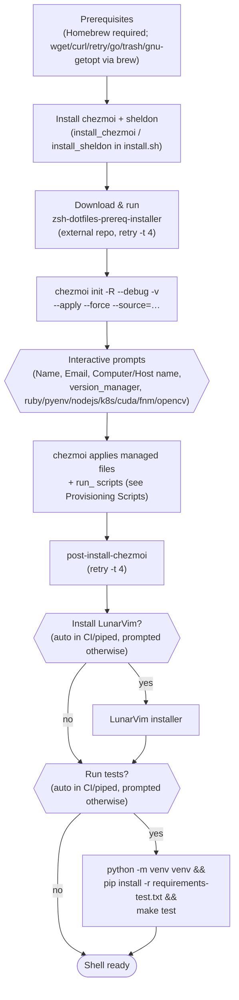

# Installation

> New-machine onboarding: how to get from a bare macOS/Linux box to a fully configured zsh, with every prompt and script explained.

**See also:** [Architecture](architecture.md) · [Feature Flags](feature-flags.md) · [Provisioning Scripts](provisioning-scripts.md) · [Tutorial: first-time setup](tutorials/00-first-time-setup.md)

---

## What you'll learn

- The four ways to install this repo, and when to use each
- Every prompt `chezmoi init` asks, with its default and how to override it
- How the install pipeline is wired together (prereqs → chezmoi → post-install → optional extras → tests)
- What the external `zsh-dotfiles-prep` dependency actually does
- How to troubleshoot template rendering when something looks wrong

**Time estimate:** 10–20 minutes reading, 15–45 minutes for a real machine to finish provisioning (mostly Homebrew and version-manager tool installs).

**Prerequisites:** macOS or Linux (Ubuntu/Debian/CentOS-family), a shell, and (for most paths) [Homebrew](https://brew.sh) already installed on macOS.

---

## The four installation paths

| Path | Command | Best for | Applies immediately? |
|------|---------|----------|----------------------|
| **One-liner** | `sh -c "$(curl -fsLS chezmoi.io/get)" -- init -R --debug -v --apply https://github.com/bossjones/zsh-dotfiles.git` | Fastest path on a machine that already has the base OS tooling | Yes — installs chezmoi *and* applies in one step |
| **Manual** | Install chezmoi, then `chezmoi init -R --debug -v --apply https://github.com/bossjones/zsh-dotfiles.git` | You want to install chezmoi yourself first (e.g. via `brew install chezmoi`) | Yes, on the second command |
| **`install.sh`** | `./install.sh` (or piped via `curl \| sh`) | Brand-new machine — mirrors the CI pipeline: installs Homebrew packages, chezmoi, sheldon, runs the external prereq installer, then chezmoi, then post-install, then optional LunarVim/tests | Yes |
| **`make macos-init-good-defaults-*`** | e.g. `make macos-init-good-defaults-dry-run` | Repeatable provisioning with a canned, non-interactive answer set (`version_manager=mise`, `ruby`/`pyenv`/`nodejs`/`fnm`=true) | Only the non-`dry-run` targets |

Source: [README.md](../README.md#installation), [install.sh](../install.sh), [Makefile](../Makefile).

> **Preview before you mutate.** Every path below shows a dry-run / diff step before the real apply. This machine's owner runs `chezmoi apply` for real day to day — but the safest habit, especially the first time on a new box, is to look before you leap.

---

## Option 1: One-liner (recommended safe sequence)

The README's [one-line install](../README.md#one-line-installation) installs chezmoi and applies in a single command:

```sh
sh -c "$(curl -fsLS chezmoi.io/get)" -- init -R --debug -v --apply https://github.com/bossjones/zsh-dotfiles.git
```

To preview first instead of applying blind, split it into two steps — `chezmoi init` **without** `--apply` only installs chezmoi and clones the source, it does not touch your home directory:

```sh
# 1. Install chezmoi + fetch the source, but don't touch your home directory yet
sh -c "$(curl -fsLS chezmoi.io/get)" -- init -R --debug -v https://github.com/bossjones/zsh-dotfiles.git

# 2. Preview exactly what would change
chezmoi diff
# or, equivalently:
chezmoi apply --dry-run --verbose

# 3. Apply for real once the diff looks right
chezmoi apply -v
```

---

## Option 2: Manual (install chezmoi yourself first)

```sh
# 1. Install chezmoi
sh -c "$(curl -fsLS chezmoi.io/get)"

# 2. Initialize with this repository (fetch + prompt, no apply yet)
chezmoi init -R --debug -v https://github.com/bossjones/zsh-dotfiles.git

# 3. Preview
chezmoi apply --dry-run --verbose

# 4. Apply
chezmoi apply -v
```

Source: [README.md](../README.md#manual-installation).

---

## Option 3: `install.sh` (mirrors CI end to end)

[`install.sh`](../install.sh) is a POSIX shell script that reproduces the full GitHub Actions pipeline locally. Run it directly or piped:

```sh
./install.sh
# or
curl -fsSL https://raw.githubusercontent.com/bossjones/zsh-dotfiles/main/install.sh | sh
```

It performs, in order:

1. **Environment setup** — sets defaults for `ZSH_DOTFILES_PREP_DEBUG`, `ZSH_DOTFILES_PREP_GITHUB_USER` (`bossjones`), `ZSH_DOTFILES_PREP_SKIP_BREW_BUNDLE` (`1`), `ZSH_DOTFILES_SKIP_LUNARVIM` (`0`), `ZSH_DOTFILES_SKIP_TESTS` (`0`), `SHELDON_VERSION` (`0.6.6`), `SHELDON_CONFIG_DIR`/`SHELDON_DATA_DIR`. Detects CI (`$CI`/`$GITHUB_ACTIONS`) and piped (non-interactive) execution automatically.
2. **Homebrew is required** — the script exits with an error and a link to [brew.sh](https://brew.sh) if `brew` isn't found.
3. **Brew packages** — taps `schniz/tap`, installs `wget`, `curl`, `kadwanev/brew/retry`, `go`, `trash`, `gnu-getopt`.
4. **chezmoi + sheldon install** — `install_chezmoi()` prefers `brew install chezmoi`, falling back to the official installer. `install_sheldon()` installs the pinned `$SHELDON_VERSION`: on **arm64** it bootstraps Rust (`rustup`) and `cross`, clones [rossmacarthur/sheldon](https://github.com/rossmacarthur/sheldon), and cross-compiles it from source; on **x86_64** it fetches a prebuilt binary via `rossmacarthur.github.io/install/crate.sh`.
5. **External prereq installer** — downloads and runs `zsh-dotfiles-prereq-installer` (see [below](#the-external-zsh-dotfiles-prep-dependency)) with retries.
6. **`chezmoi init -R --debug -v --apply --force --source="$DOTFILES_SOURCE"`** — the real apply step, wrapped in `retry -t 4` when the `retry` command is available.
7. **`post-install-chezmoi`** — runs [`home/private_dot_bin/executable_post-install-chezmoi`](../home/private_dot_bin/executable_post-install-chezmoi) (deployed to `~/.bin/post-install-chezmoi`), also wrapped in `retry -t 4`.
8. **Optional LunarVim** — installed automatically in CI/non-interactive mode, or prompted for interactively (`y/N`), unless `ZSH_DOTFILES_SKIP_LUNARVIM=1`.
9. **Optional tests** — `make test` inside a fresh Python venv, run automatically in CI/non-interactive mode or prompted for interactively, unless `ZSH_DOTFILES_SKIP_TESTS=1`.

**Environment variables you can set** (documented at the top of [install.sh](../install.sh)):

| Variable | Default | Purpose |
|----------|---------|---------|
| `ZSH_DOTFILES_PREP_GITHUB_USER` | `bossjones` | GitHub username used for cloning repos |
| `ZSH_DOTFILES_PREP_SKIP_BREW_BUNDLE` | `1` | Skip `brew bundle` (heavy package installs) during the prereq step |
| `ZSH_DOTFILES_PREP_DEBUG` | `1` | Verbose/debug output |
| `ZSH_DOTFILES_SKIP_LUNARVIM` | `0` | Set to `1` to skip LunarVim entirely |
| `ZSH_DOTFILES_SKIP_TESTS` | `0` | Set to `1` to skip the pytest run |

For the full variable reference (including runtime and CI-only variables), see **[docs/feature-flags.md](feature-flags.md)**.

---

## Option 4: `make macos-init-good-defaults-*` (canned answers, repeatable)

For provisioning a fresh macOS machine with a known-good, non-interactive answer set (`version_manager=mise`, `ruby`/`pyenv`/`nodejs`/`fnm`=`true`, `k8s`/`cuda`/`opencv`=`false`), the [Makefile](../Makefile) defines four targets built from a shared `CHEZMOI_GOOD_DEFAULTS` flag set:

| Target | What it runs | Use when |
|--------|--------------|----------|
| `make macos-init-good-defaults-dry-run` | `chezmoi init -R --debug -v --dry-run $(CHEZMOI_GOOD_DEFAULTS) --source=.` | **Always run this first.** Previews the full apply with zero side effects. |
| `make macos-init-good-defaults-source` | `chezmoi init -R --debug -v --apply $(CHEZMOI_GOOD_DEFAULTS) --source=.` | Applying from a local checkout of this repo |
| `make macos-init-good-defaults-branch` | `chezmoi init -R --debug -v --apply --branch $(CHEZMOI_BRANCH) $(CHEZMOI_GOOD_DEFAULTS) $(CHEZMOI_REPO)` | Applying a specific branch straight from GitHub (`CHEZMOI_BRANCH` defaults to `main`) |
| `make macos-init-good-defaults-oneliner` | Installs chezmoi via `chezmoi.io/get`, then `init --apply` from GitHub | A machine that doesn't have chezmoi yet |

`CHEZMOI_HOSTNAME` and `CHEZMOI_COMPUTER_NAME` auto-populate from `scutil --get LocalHostName` / `scutil --get ComputerName` (falling back to `hostname -s`). Override any variable on the command line:

```sh
# Preview first
make macos-init-good-defaults-dry-run

# Then apply from the local checkout
make macos-init-good-defaults-source

# Or target a feature branch
make macos-init-good-defaults-branch CHEZMOI_BRANCH=claude/ruby-4-0-1-upgrade-5a05fa
```

Source: [Makefile](../Makefile) (`CHEZMOI_GOOD_DEFAULTS` and the four `.PHONY` targets).

---

## Prompts reference

All prompts surfaced during first-time `chezmoi init` (from [`home/.chezmoi.yaml.tmpl`](../home/.chezmoi.yaml.tmpl) and [README.md](../README.md#interactive-prompts-reference)). Answers are cached in `~/.config/chezmoi/chezmoi.yaml` and reused on subsequent runs.

| Prompt | Type | Default | Env override | Description |
|--------|------|---------|---------------|--------------|
| `Name` | string | `Malcolm Jones` | — | Your full name |
| `Email` | string | *(your email)* | — | Your email address |
| `Computer name` | string | `boss workstation` | `CM_computer_name` | Human-readable machine name |
| `Host name` | string | `bossworkstation` | `CM_hostname` | Short hostname |
| `version_manager` | string | `asdf` | — | Runtime version manager to install (`asdf` or `mise`) |
| `ruby` | bool | `false` | — | Install Ruby via the selected version manager |
| `pyenv` | bool | `false` | — | Install pyenv for Python version management |
| `nodejs` | bool | `false` | — | Install Node.js via the selected version manager |
| `k8s` | bool | `false` | — | Install the Kubernetes toolchain |
| `cuda` | bool | `false` | — | Install CUDA support |
| `fnm` | bool | `false` | — | Install fnm (Fast Node Manager) |
| `opencv` | bool | `false` | — | Install OpenCV system dependencies |

**Re-prompt** everything (clears cached answers):

```sh
chezmoi init --data=false
```

**Skip specific prompts** with environment variables, non-interactively:

```sh
CM_computer_name="my-mac" CM_hostname="mymac" chezmoi init --apply https://github.com/bossjones/zsh-dotfiles.git
```

**Skip all prompts** with CLI flags (used by CI and the `make macos-init-good-defaults-*` targets):

```sh
chezmoi init --source=. --promptString "version_manager=mise" --promptBool "pyenv=true"
```

Full flag-by-flag reference, including which flags are actually wired up to install scripts today: **[docs/feature-flags.md](feature-flags.md)**.

---

## Install-flow diagram



For the full `run_` script lifecycle inside step E (every `run_before`/`run_once_before`/`run_onchange_before`/`run_onchange_after`/`run_after` script, in order), see **[docs/provisioning-scripts.md](provisioning-scripts.md)**.

---

## The external `zsh-dotfiles-prep` dependency

Both `install.sh` and the CI workflow depend on a script hosted in a **separate repository**, [bossjones/zsh-dotfiles-prep](https://github.com/bossjones/zsh-dotfiles-prep):

```sh
wget https://raw.githubusercontent.com/bossjones/zsh-dotfiles-prep/main/bin/zsh-dotfiles-prereq-installer
chmod +x zsh-dotfiles-prereq-installer
retry -t 4 -- ./zsh-dotfiles-prereq-installer --debug
```

This installer runs **before** chezmoi touches anything. It's responsible for the OS-level prerequisites this repo assumes are already present (compilers, headers, and the many Homebrew/apt/dnf packages listed in [CLAUDE.md](../CLAUDE.md#installed-tools--packages)) — chezmoi's own `run_` scripts assume those prerequisites already exist. Because it's fetched over the network at install time:

- It is **not version-pinned** in this repo — you always get `main` from the prep repo.
- `retry -t 4` (installed via `brew install kadwanev/brew/retry`) retries the whole prereq run up to 4 times to smooth over flaky network/package-mirror issues.
- If it fails outright, `install.sh` exits (`set -e`) before ever reaching `chezmoi init`.

If you're debugging a failed install and suspect the prereq stage, that repository — not this one — is where to look first.

---

## Troubleshooting

Chezmoi template rendering is the most common source of "why didn't my change show up" confusion. Three commands, straight from [README.md](../README.md#troubleshooting):

```sh
# 1. Test how a single template renders, without applying anything
chezmoi execute-template < ~/.local/share/chezmoi/dot_zshrc.tmpl

# 2. Inspect the data values templates see (name, email, version_manager, feature flags, …)
chezmoi data

# 3. Verify chezmoi's own health and template syntax
chezmoi doctor
```

| Symptom | Likely cause | Check |
|---------|--------------|-------|
| A template block didn't render the way you expected | Wrong `.chezmoi.os` / `.chezmoi.osRelease` condition, or a data value you expected isn't set | `chezmoi data` |
| `chezmoi apply` reports an error parsing a `.tmpl` file | Go template syntax error | `chezmoi execute-template < path/to/file.tmpl` on just that file |
| Something *should* have changed but didn't | The file is a `run_once_`/`run_onchange_` script whose rendered content hasn't actually changed (see [Provisioning Scripts](provisioning-scripts.md#1-chezmois-run-script-model-precisely)) | Re-render and diff the script, or `chezmoi apply --dry-run --verbose` |
| Feature flag (`k8s`, `fnm`, etc.) doesn't seem to gate anything | Not every boolean flag is wired to an install script yet | See the "Consumed By" column in [docs/feature-flags.md](feature-flags.md) |
| `chezmoi doctor` reports a warning | Missing optional tool, or a config issue | Read the specific line — `doctor` output is self-explanatory per check |

---

## Verify your installation

See the full walkthrough in **[Tutorial 00: First-Time Setup](tutorials/00-first-time-setup.md#verify)** — it covers opening a fresh shell, confirming the `pure` prompt loaded, checking `sheldon --version`, and running `chezmoi doctor`.

---

## Next steps

- **[Tutorial 00: First-Time Setup](tutorials/00-first-time-setup.md)** — do this end to end, with every prompt explained
- **[Tutorial 01: Daily Workflow](tutorials/01-daily-workflow.md)** — pulling and applying updates day to day
- **[docs/feature-flags.md](feature-flags.md)** — every flag and environment variable, in depth
- **[docs/architecture.md](architecture.md)** — how the pieces fit together once installed
