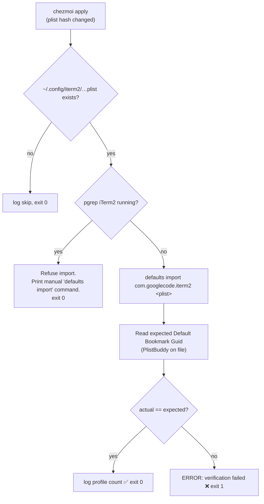

# iTerm2 &amp; macOS Settings

> How this repo version-controls your terminal appearance and macOS system defaults — and why the iTerm2 importer is deliberately paranoid.

**See also:** [Provisioning Scripts](provisioning-scripts.md) · [Architecture](architecture.md) · [Tutorial: customize iTerm2](tutorials/06-customize-iterm2.md)

---

## Overview

Three coordinated pieces keep a macOS machine looking and behaving consistently:

| Piece | File | Deployed / runs as |
|-------|------|--------------------|
| iTerm2 preferences snapshot | [`home/private_dot_config/iterm2/private_com.googlecode.iterm2.plist`](../home/private_dot_config/iterm2/private_com.googlecode.iterm2.plist) | `~/.config/iterm2/com.googlecode.iterm2.plist` |
| iTerm2 import script | [`home/.chezmoiscripts/run_onchange_after_60-macos-iterm2-settings.sh.tmpl`](../home/.chezmoiscripts/run_onchange_after_60-macos-iterm2-settings.sh.tmpl) | `chezmoi apply` (macOS only) |
| Nerd Font installer | [`home/.chezmoiscripts/run_onchange_after_59-macos-install-fonts.sh.tmpl`](../home/.chezmoiscripts/run_onchange_after_59-macos-install-fonts.sh.tmpl) | `chezmoi apply` (macOS only) |
| macOS system defaults | [`home/executable_dot_osx`](../home/executable_dot_osx) → `~/.osx` | run manually (`~/.osx`) |

All three run only when `.chezmoi.os == "darwin"`.

---

## The iTerm2 settings import

The tracked `.plist` is a full snapshot of your iTerm2 preferences (profiles, colors, fonts, global settings). On `chezmoi apply`, script `60-macos-iterm2-settings` imports it into the `com.googlecode.iterm2` defaults domain with `defaults import`.

Because it is a `run_onchange_` script, it **re-runs only when the plist actually changes** — the trigger is a hash embedded in a comment:

```bash
# iterm2 settings hash: {{ include "private_dot_config/iterm2/private_com.googlecode.iterm2.plist" | sha256sum }}
```

### Why it refuses to import while iTerm2 is running

This is the subtle part. iTerm2 holds its settings **in memory** and writes them back to the plist **when it quits**. If the script imported while iTerm2 was open, iTerm2 would clobber the freshly-imported values on its next quit — silently undoing the import.

So the script guards with `pgrep -xq iTerm2` and, if iTerm2 is running, **skips the import** and prints exactly how to finish manually:

```sh
defaults import com.googlecode.iterm2 ~/.config/iterm2/com.googlecode.iterm2.plist
```

### It verifies its own work

After importing, the script doesn't trust that it worked — it reads back the `Default Bookmark Guid` via `PlistBuddy` from the file and compares it against `defaults read` from the live domain. On mismatch it **exits 1** (a real failure); on success it logs the profile count.



> **Design takeaway:** the script is *loud and self-verifying* by design. A silent no-op after "chezmoi apply reported success" would be worse than a clear error — so it either confirms the import landed or fails hard.

To re-export your own settings and let this importer apply them, follow [Tutorial 06](tutorials/06-customize-iterm2.md).

---

## Fonts

The iTerm2 profiles reference the Nerd Font variants of **Droid Sans Mono** and **Hack** (PostScript names `DroidSansMNF`, `HackNF-Regular`). Script `59-macos-install-fonts` installs them via Homebrew casks so the imported profiles render correctly:

| Cask | Font |
|------|------|
| `font-droid-sans-mono-nerd-font` | Droid Sans Mono Nerd Font |
| `font-hack-nerd-font` | Hack Nerd Font |

The script is idempotent (`brew list --cask` check before install) and no-ops cleanly if Homebrew is absent. Monaco and Menlo ship with macOS and need no install.

Font `59` runs before iTerm2 `60` (numeric ordering within the `run_onchange_after_` phase), so fonts are present before profiles that reference them are imported.

---

## macOS system defaults (`~/.osx`)

Broader macOS system tweaks live in [`home/executable_dot_osx`](../home/executable_dot_osx), deployed as an executable `~/.osx`. Unlike the iTerm2 import, this is **not run automatically** by `chezmoi apply` — you run it yourself when you want to (re)apply system defaults:

```sh
~/.osx
```

There is a near-empty companion stub, `run_onchange_before_99-macos-osx-settings.sh.tmpl`, reserved as a placeholder for wiring `~/.osx --no-restart` into the apply flow. It currently does nothing substantive — see [Gotchas](gotchas.md).

---

## Provisioning order recap

Within a macOS `chezmoi apply`, the relevant `run_onchange_after_` scripts fire in numeric order:

```
… → 59-macos-install-fonts → 60-macos-iterm2-settings → 99-golang
```

For the full lifecycle and every script, see [Provisioning Scripts](provisioning-scripts.md).
