# Provisioning Scripts: the `run_` script lifecycle

> See [docs/architecture.md](./architecture.md) for the system-wide picture. This page is a deep dive into one piece of it: [chezmoi](https://www.chezmoi.io/)'s [script execution model](https://www.chezmoi.io/reference/scripts/) as used by the ~50 scripts in [`home/.chezmoiscripts/`](../home/.chezmoiscripts/).

## 1. chezmoi's run-script model, precisely

chezmoi scripts are just template-rendered shell scripts whose **filename** encodes when and how often they run. Every prefix combination used in this repo:

| Prefix pattern | When it runs | Re-run semantics |
|---|---|---|
| `run_before_*` / `run_after_*` (no `once`/`onchange`) | Before / after target files are applied† | Runs **every time**, unconditionally |
| `run_once_before_*` | Before any target file is applied, guaranteed | Runs **once ever** per unique rendered content — chezmoi hashes the rendered script and records the hash in its persistent state; edit the script and it runs again (once) for the new hash |
| `run_onchange_before_*` | Before any target file is applied, guaranteed | Re-runs **whenever the rendered script's content changes** — same hash mechanism as `run_once_`, but the naming signals "this is expected to change" (e.g. a version bump in `.chezmoi.yaml.tmpl` changes the rendered output, so the install script re-runs) |
| `run_onchange_after_*` | After every target file is applied, guaranteed | Re-runs whenever rendered content changes, same mechanism as `run_onchange_before_*` |

`run_once_` and `run_onchange_` are mechanically identical under the hood (both keyed by a SHA256 of the rendered script body); the distinction is intent. This repo uses `run_once_` for a one-time migration/self-heal ([`run_once_before_01-mise-backup-tool-versions.sh.tmpl`](../home/.chezmoiscripts/run_once_before_01-mise-backup-tool-versions.sh.tmpl)) and `run_onchange_` for everything that installs or configures a tool — because those scripts embed template data (pinned versions from `home/.chezmoi.yaml.tmpl`, OS conditionals) that legitimately changes over time and should trigger a re-run.

> **† Verified caveat — the `run_before-00-*`/`run_after-00-*` scripts are not what their names imply.** chezmoi only recognizes a script as "before" or "after" when the attribute is spelled with a trailing **underscore** — `run_before_...` / `run_after_...` — per the prefix constants `beforePrefix = "before_"` / `afterPrefix = "after_"` in chezmoi's own source ([`internal/chezmoi/chezmoi.go`](https://github.com/twpayne/chezmoi/blob/master/internal/chezmoi/chezmoi.go), matched in [`internal/chezmoi/attr.go`](https://github.com/twpayne/chezmoi/blob/master/internal/chezmoi/attr.go)). This repo's four `run_before-00-prereq-*.sh.tmpl` and three `run_after-00-adhoc-*.sh.tmpl` scripts use a **hyphen** instead (`run_before-00-`, `run_after-00-`). Because the literal `before_`/`after_` prefix never matches, chezmoi does not assign them its `ScriptOrderBefore`/`ScriptOrderAfter` — they silently fall back to `ScriptOrderDuring`, the same bucket as ordinary managed files. In practice this means they run **interleaved with file application**, positioned by straight alphabetical sort of their name alongside every dotfile and directory chezmoi is writing — not guaranteed to run before or after everything else. See §3 for exactly where that puts them and why it mostly still works out fine in practice.

**Numeric prefixes** (`00`–`99`) order scripts *within* the same `Before`/`After` bucket — chezmoi sorts by the script's name with the `run_`/`once_`/`onchange_`/`before_`/`after_` attributes stripped off, so `run_onchange_before_02-*` all run before `run_onchange_before_03-*`, regardless of OS. Within the same number, ordering falls back to alphabetical filename sort (e.g. among the `02-*-install-*` scripts, `02-centos-install-asdf` sorts before `02-centos-install-bun`). Because the `once_`/`onchange_` tokens are stripped before sorting too, a `run_once_before_01-*` and a `run_onchange_before_01-*` script are ordered against each other purely by what follows the `01-`, not by which condition they use — see §3 for the concrete effect this has on `01-mise-backup-tool-versions.sh.tmpl`.

Nearly every script is a `.tmpl` gated by one or more of: `.chezmoi.os` (`darwin`/`linux`), `.chezmoi.osRelease.name`/`.id` (distro), and `.version_manager` (`asdf` vs `mise`) — so on any given machine, the majority of these 50 files render to *nothing* and are skipped entirely.

## 2. Full script inventory, by phase

`home/.chezmoiscripts/` currently contains 50 files. Grouped by phase, in the order chezmoi executes them:

### `run_before-00-*`: unconditional prereqs (see † caveat above — these run interleaved with files, not strictly "before")

| Script | OS / distro gate | What it does |
|---|---|---|
| [`run_before-00-prereq-ubuntu.sh.tmpl`](../home/.chezmoiscripts/run_before-00-prereq-ubuntu.sh.tmpl) | linux + `osRelease.name == "Ubuntu"` | Sets `DEBIAN_FRONTEND=noninteractive`/`LANG`, creates `~/.git-template`, detects sudo-vs-root, installs base apt packages |
| [`run_before-00-prereq-centos.sh.tmpl`](../home/.chezmoiscripts/run_before-00-prereq-centos.sh.tmpl) | linux + `osRelease.id` in `centos`/`ol`/`rhel` | Equivalent RHEL-family prereq/logging setup (dnf packages, Go PATH bootstrap) |
| [`run_before-00-prereq-ubuntu-pyenv.sh.tmpl`](../home/.chezmoiscripts/run_before-00-prereq-ubuntu-pyenv.sh.tmpl) | Ubuntu | Installs locales, then the [pyenv](https://github.com/pyenv/pyenv) installer if `~/.pyenv/bin/pyenv` is absent |
| [`run_before-00-prereq-centos-pyenv.sh.tmpl`](../home/.chezmoiscripts/run_before-00-prereq-centos-pyenv.sh.tmpl) | CentOS/OL/RHEL | Same pyenv bootstrap via `dnf`/`glibc-langpack-en` |

### Phase: `run_once_before` (runs once ever, per content hash)

| Script | Gate | What it does |
|---|---|---|
| [`run_once_before_01-mise-backup-tool-versions.sh.tmpl`](../home/.chezmoiscripts/run_once_before_01-mise-backup-tool-versions.sh.tmpl) | `.version_manager == "mise"` | **Migration self-heal.** [mise](https://mise.jdx.dev/)'s source of truth is `~/.config/mise/config.toml`, not asdf's `~/.tool-versions`. This script renames a stale `~/.tool-versions` to `~/.tool-versions.asdf.bak` so mise stops emitting "not found in mise tool registry" warnings for asdf-era bare tool names (e.g. `jsonnet`, `kubetail`). It checks `[ ! -e "$HOME/.tool-versions.asdf.bak" ]` first, so it never clobbers an existing backup — idempotent even though it's nominally "run once" |

### Phase: `run_onchange_before` (re-run when rendered content changes)

**01 — bulk package installs:**

| Script | Gate | What it does |
|---|---|---|
| [`run_onchange_before_01-ubuntu-install-packages.sh.tmpl`](../home/.chezmoiscripts/run_onchange_before_01-ubuntu-install-packages.sh.tmpl) | Ubuntu | Installs the common apt package set (build tools, image/codec libs, CLI tools — see [CLAUDE.md](../CLAUDE.md) for the full library list) |
| [`run_onchange_before_01-centos-install-packages.sh.tmpl`](../home/.chezmoiscripts/run_onchange_before_01-centos-install-packages.sh.tmpl) | CentOS/OL/RHEL | Equivalent dnf package set for RHEL-family Linux 9 |

**02 — per-tool installers** (asdf, mise, bun, deno, fnm, fzf, sheldon, wtp, pyenv, fd, opencv-deps — one script per OS × tool):

| Script | OS gate | What it does |
|---|---|---|
| [`run_onchange_before_02-ubuntu-install-asdf.sh.tmpl`](../home/.chezmoiscripts/run_onchange_before_02-ubuntu-install-asdf.sh.tmpl) / [`...centos-install-asdf...`](../home/.chezmoiscripts/run_onchange_before_02-centos-install-asdf.sh.tmpl) | linux + `version_manager == "asdf"` | `git clone` [asdf](https://asdf-vm.com/) at the pinned `myAsdfVersion` tag into `~/.asdf` |
| [`run_onchange_before_02-macos-install-mise.sh.tmpl`](../home/.chezmoiscripts/run_onchange_before_02-macos-install-mise.sh.tmpl) | darwin + `version_manager == "mise"` | `brew install mise` |
| [`run_onchange_before_02-ubuntu-install-mise.sh.tmpl`](../home/.chezmoiscripts/run_onchange_before_02-ubuntu-install-mise.sh.tmpl) / centos variant | linux + `version_manager == "mise"` | `curl https://mise.run \| sh` |
| [`run_onchange_before_02-macos-install-bun.sh.tmpl`](../home/.chezmoiscripts/run_onchange_before_02-macos-install-bun.sh.tmpl) / ubuntu / centos variants | per-OS | Installs [bun](https://bun.com/) via its official curl installer into `~/.bun` |
| [`run_onchange_before_02-macos-install-deno.sh.tmpl`](../home/.chezmoiscripts/run_onchange_before_02-macos-install-deno.sh.tmpl) / ubuntu / centos variants | per-OS | Installs [Deno](https://deno.land/) via its official installer into `~/.deno` |
| [`run_onchange_before_02-ubuntu-install-fnm.sh.tmpl`](../home/.chezmoiscripts/run_onchange_before_02-ubuntu-install-fnm.sh.tmpl) / centos variant | linux | Installs [fnm](https://github.com/Schniz/fnm) (Fast Node Manager) into `~/.local/share/fnm` |
| [`run_onchange_before_02-linux-install-fzf.sh.tmpl`](../home/.chezmoiscripts/run_onchange_before_02-linux-install-fzf.sh.tmpl) | linux | `git clone` [fzf](https://github.com/junegunn/fzf) at `myFzfVersion` into `~/.fzf`, runs its `install --all` |
| [`run_onchange_before_02-macos-install-fzf.sh.tmpl`](../home/.chezmoiscripts/run_onchange_before_02-macos-install-fzf.sh.tmpl) | darwin | `brew install fzf`, then `$(brew --prefix)/opt/fzf/install --all --no-update-rc` (no-update-rc because `dot_zshrc.tmpl` already sources `~/.fzf.zsh`) |
| [`run_onchange_before_02-macos-install-sheldon.sh.tmpl`](../home/.chezmoiscripts/run_onchange_before_02-macos-install-sheldon.sh.tmpl) | darwin | On `arm64`: bootstraps Rust + `cross`, clones and cross-compiles [sheldon](https://sheldon.cli.rs/) from source at `mySheldonVersion`. Otherwise: downloads the prebuilt crate via `rossmacarthur/install/crate.sh` |
| [`run_onchange_before_02-ubuntu-install-sheldon.sh.tmpl`](../home/.chezmoiscripts/run_onchange_before_02-ubuntu-install-sheldon.sh.tmpl) / centos variant | linux | Downloads the prebuilt sheldon binary via the same crate installer script |
| [`run_onchange_before_02-linux-install-wtp.sh.tmpl`](../home/.chezmoiscripts/run_onchange_before_02-linux-install-wtp.sh.tmpl) | linux | Downloads [wtp](https://github.com/satococoa/wtp) (Worktree Plus) release tarball for the detected architecture into `~/.local/bin` |
| [`run_onchange_before_02-macos-install-wtp.sh.tmpl`](../home/.chezmoiscripts/run_onchange_before_02-macos-install-wtp.sh.tmpl) | darwin | `brew install satococoa/tap/wtp` |
| [`run_onchange_before_02-macos-install-pyenv.sh.tmpl`](../home/.chezmoiscripts/run_onchange_before_02-macos-install-pyenv.sh.tmpl) | darwin + `.pyenv` flag | `brew install pyenv` (+ plugins), mirroring the Linux pyenv path |
| [`run_onchange_before_02-ubuntu-install-fd.sh.tmpl`](../home/.chezmoiscripts/run_onchange_before_02-ubuntu-install-fd.sh.tmpl) | Ubuntu | No-op placeholder (`# noop`) — `fd` is actually installed later in the `99-*-write-completions` scripts |
| [`run_onchange_before_02-ubuntu-install-opencv-deps.sh.tmpl`](../home/.chezmoiscripts/run_onchange_before_02-ubuntu-install-opencv-deps.sh.tmpl) / centos variant | per-OS + `.opencv` flag | Installs the OpenCV/computer-vision system dependency set (see [CLAUDE.md](../CLAUDE.md)) |

**03 — krew:**

| Script | Gate | What it does |
|---|---|---|
| [`run_onchange_before_03-ubuntu-install-krew.sh.tmpl`](../home/.chezmoiscripts/run_onchange_before_03-ubuntu-install-krew.sh.tmpl) / centos variant | linux, requires `kubectl` on `PATH` | Installs [krew](https://krew.sigs.k8s.io/) (kubectl plugin manager) and adds `$KREW_ROOT/bin` to `PATH` |

**04 — uv:**

| Script | Gate | What it does |
|---|---|---|
| [`run_onchange_before_04-setup-uv.sh.tmpl`](../home/.chezmoiscripts/run_onchange_before_04-setup-uv.sh.tmpl) | none (all OSes) | Installs [Astral's `uv`](https://docs.astral.sh/uv/) via its standalone installer if missing, then generates zsh completions for both `uv` and `uvx` into `~/.zsh/completion` **and** `~/.zsh/completions` |

**99 — OS settings & completions (last in the `before` phase):**

| Script | Gate | What it does |
|---|---|---|
| [`run_onchange_before_99-macos-osx-settings.sh.tmpl`](../home/.chezmoiscripts/run_onchange_before_99-macos-osx-settings.sh.tmpl) | darwin | Placeholder for `~/.osx --no-restart` style settings (currently a stub) |
| [`run_onchange_before_99-macos-write-completions.sh.tmpl`](../home/.chezmoiscripts/run_onchange_before_99-macos-write-completions.sh.tmpl) | darwin | Generates/writes zsh completion files (fd and others) |
| [`run_onchange_before_99-ubuntu-write-completions.sh.tmpl`](../home/.chezmoiscripts/run_onchange_before_99-ubuntu-write-completions.sh.tmpl) | Ubuntu | Same, Ubuntu-specific (installs `fd` here, per the `02-*-install-fd` no-op above) |
| [`run_onchange_before_99-centos-write-completions.sh.tmpl`](../home/.chezmoiscripts/run_onchange_before_99-centos-write-completions.sh.tmpl) | CentOS/OL/RHEL | Same, RHEL-family-specific |

### Phase: `run_onchange_after` (after files are applied, re-run on content change)

| Script | Gate | What it does |
|---|---|---|
| [`run_onchange_after_50-macos-install-asdf-plugins.sh.tmpl`](../home/.chezmoiscripts/run_onchange_after_50-macos-install-asdf-plugins.sh.tmpl) | darwin + `version_manager == "asdf"` | On `arm64`, sets Ruby/tmux OpenSSL 3 build flags (`RUBY_CONFIGURE_OPTS`, `LDFLAGS`, `CPPFLAGS`, `PKG_CONFIG_PATH` against `brew --prefix openssl@3`). Adds custom asdf plugin repos (kubectl, helm, k9s, kubectx, mkcert, opa, helm-docs, kubetail), then installs+globally-pins every tool in a template-built `$plugins` dict keyed to the versions in `home/.chezmoi.yaml.tmpl` (ruby, golang, tmux, neovim, github-cli, mkcert, shellcheck, shfmt, yq, helm, helmfile, helm-docs, k9s, kubectx, opa, kubectl, kubetail), then `gem install foreman tmuxinator`. Honors `SCRIPTS_START_AT`/`SKIP_ASDF_PLUGINS` env vars to skip in fast CI runs |
| [`run_onchange_after_50-ubuntu-install-asdf-plugins.sh.tmpl`](../home/.chezmoiscripts/run_onchange_after_50-ubuntu-install-asdf-plugins.sh.tmpl) / [`...centos...`](../home/.chezmoiscripts/run_onchange_after_50-centos-install-asdf-plugins.sh.tmpl) | linux + `version_manager == "asdf"` | Same asdf-plugin-install logic, Linux path (apt/dnf build deps first) |
| [`run_onchange_after_50-mise-install-tools.sh.tmpl`](../home/.chezmoiscripts/run_onchange_after_50-mise-install-tools.sh.tmpl) | `version_manager == "mise"` (all OS) | The [mise](https://mise.jdx.dev/) equivalent of the two scripts above: on `arm64` macOS sets the same OpenSSL 3 build flags; on Linux installs `automake`/`libyaml` build deps; disables `ruby.compile` (`mise settings set ruby.compile false`) since precompiled Ruby binaries are preferred over slow arm64/macOS 26 source builds; then `mise use -g <tool>@<version>` for every tool in its dict (using mise's built-in registry — no custom plugin URLs needed, unlike asdf), plus the same `foreman`/`tmuxinator` gems via `mise exec ruby@... -- gem install` |
| [`run_onchange_after_51-install-cheat.sh.tmpl`](../home/.chezmoiscripts/run_onchange_after_51-install-cheat.sh.tmpl) | linux | Downloads [cheat](https://github.com/cheat/cheat) v4.3.1 for the detected arch, clones the community `cheat/cheatsheets` repo and the personal `bossjones/boss-cheatsheets` repo into `~/.config/cheat/cheatsheets/{community,personal}`, and writes `~/.config/cheat/conf.yml` pointing at both cheatpaths |
| [`run_onchange_after_59-macos-install-fonts.sh.tmpl`](../home/.chezmoiscripts/run_onchange_after_59-macos-install-fonts.sh.tmpl) | darwin | Installs the two [Nerd Font](https://www.nerdfonts.com/) casks referenced by the iTerm2 profiles: `font-droid-sans-mono-nerd-font` and `font-hack-nerd-font` (PostScript names `DroidSansMNF`/`HackNF-Regular`) — Monaco/Menlo ship with macOS and need no install |
| [`run_onchange_after_60-macos-iterm2-settings.sh.tmpl`](../home/.chezmoiscripts/run_onchange_after_60-macos-iterm2-settings.sh.tmpl) | darwin | Imports the chezmoi-managed iTerm2 preferences plist into the `com.googlecode.iterm2` defaults domain, self-verifying the import and refusing to run while iTerm2 is open. **Full detail deferred to [docs/iterm2-and-macos.md](./iterm2-and-macos.md)** — see §4 below for how its `onchange` trigger works |
| [`run_onchange_after_99-golang.sh.tmpl`](../home/.chezmoiscripts/run_onchange_after_99-golang.sh.tmpl) | darwin (body also has a Linux branch, but the whole script is gated `{{- if eq .chezmoi.os "darwin" -}}`) | Sets up Go `PATH` for Homebrew Go (arm64 vs Intel prefix), then `go install golang.org/x/tools/gopls@latest` |

### `run_after-00-*`: unconditional adhoc scripts (see † caveat above — these also run interleaved, not strictly "after")

| Script | Gate | What it does |
|---|---|---|
| [`run_after-00-adhoc-macos.sh.tmpl`](../home/.chezmoiscripts/run_after-00-adhoc-macos.sh.tmpl) | darwin | Writes `~/.zsh/completion/_chezmoi` via `chezmoi completion zsh`, adds the dir to `fpath` |
| [`run_after-00-adhoc-ubuntu.sh.tmpl`](../home/.chezmoiscripts/run_after-00-adhoc-ubuntu.sh.tmpl) | Ubuntu | Same chezmoi completion generation |
| [`run_after-00-adhoc-centos.sh.tmpl`](../home/.chezmoiscripts/run_after-00-adhoc-centos.sh.tmpl) | CentOS/OL/RHEL | Same, plus `fd` install (per its file body) |

## 3. Lifecycle flowchart

chezmoi computes **one single global order** for every entry (files, dirs, and scripts alike): first by bucket — `Before` &lt; `During` &lt; `After` — then, within a bucket, alphabetically by the entry's name with its `run_`/`once_`/`onchange_`/`before_`/`after_` attributes stripped off ([`SourceState.TargetRelPaths`](https://github.com/twpayne/chezmoi/blob/master/internal/chezmoi/sourcestate.go)). `chezmoi apply` then walks that single sorted list top to bottom. The `Before` and `After` buckets only contain scripts whose attribute chezmoi actually recognized (i.e. the correctly-underscored ones); the `During` bucket contains **every managed file** plus the two families of hyphenated scripts that chezmoi didn't recognize as before/after:

```mermaid
flowchart TD
    Start(["chezmoi apply"]) --> Sort["chezmoi sorts ALL entries once:<br/>bucket Before &lt; During &lt; After,<br/>then alphabetically by stripped name"]

    Sort --> RB["BUCKET: Before<br/>(guaranteed to run before any file is written)"]
    RB --> RB01a["01: run_once_before_01-mise-backup-tool-versions (mise only)<br/>interleaved alphabetically with the 01-*-install-packages scripts<br/>('01-centos...' &lt; '01-mise...' &lt; '01-ubuntu...')"]
    RB01a --> RB02["02: per-tool installers<br/>asdf / mise / bun / deno / fnm / fzf / sheldon / wtp / pyenv"]
    RB02 --> RB03["03: krew (kubectl plugin manager)"]
    RB03 --> RB04["04: uv + shell completions"]
    RB04 --> RB99["99: OS settings + completion writers"]

    RB99 --> During["BUCKET: During<br/>every managed file, and the mis-named<br/>run_before-00-*/run_after-00-* scripts,<br/>ALL interleaved, sorted purely alphabetically"]
    During --> D1["Dotfiles apply first: '.' sorts before any letter —<br/>~/.zshrc, ~/.sheldon/plugins.toml, ~/.gitconfig, ~/.config/*, ..."]
    D1 --> D2["run_after-00-adhoc-{macos,ubuntu,centos}.sh.tmpl<br/>(stripped name starts 'a' -&gt; sorts next)"]
    D2 --> D3["run_before-00-prereq-{ubuntu,centos}[-pyenv].sh.tmpl<br/>(stripped name starts 'b' -&gt; sorts after 'after-00-*')"]
    D3 --> D4["home/shell/**/*.zsh module files applied<br/>(target path starts 'shell' -&gt; sorts last)"]

    D4 --> RA["BUCKET: After<br/>(guaranteed to run after every file is written)"]
    RA --> RA50["50: asdf-plugins (asdf) OR mise-install-tools (mise)<br/>— installs/pins ruby, golang, tmux, neovim, k9s, kubectl, ..."]
    RA50 --> RA51["51: install-cheat (linux)"]
    RA51 --> RA59["59: macos-install-fonts (Nerd Fonts)"]
    RA59 --> RA60["60: macos-iterm2-settings<br/>(re-runs only when the tracked plist's sha256 changes)"]
    RA60 --> RA99["99: golang (gopls install)"]

    RA99 --> Done(["Shell ready:<br/>~/.zshrc -> sheldon source -> plugins"])
```



The practical upshot: the `01-mise-backup-tool-versions` self-heal still runs safely before mise is ever invoked (it's in the `Before` bucket, just not literally first among all `01-*` scripts), and the "prereq"/"adhoc" scripts still run early/late enough in practice to do their job (installing base packages, writing completions) even though they are not, mechanically, chezmoi `before_`/`after_` scripts. Nothing here is broken — but a reader relying on the filenames alone would draw the wrong conclusion about strict ordering guarantees, which is exactly why this is called out explicitly.

## 4. Special case: the iTerm2 script's onchange trigger

[`run_onchange_after_60-macos-iterm2-settings.sh.tmpl`](../home/.chezmoiscripts/run_onchange_after_60-macos-iterm2-settings.sh.tmpl) needs to re-run whenever the *tracked iTerm2 preferences plist* changes — not whenever the shell script's own logic changes. Since `run_onchange_` hashes the **rendered script body**, the script embeds the plist's content hash directly in a comment:

```sh
# Re-runs whenever the tracked plist changes:
# iterm2 settings hash: {{ include "private_dot_config/iterm2/private_com.googlecode.iterm2.plist" | sha256sum }}
```

Because `{{ include ... | sha256sum }}` is evaluated at render time, editing `home/private_dot_config/iterm2/private_com.googlecode.iterm2.plist` changes this comment's value, which changes the rendered script's overall hash, which makes chezmoi treat it as "changed" and re-run it on the next `chezmoi apply` — even though not a single line of actual shell logic changed. This is the standard chezmoi idiom for "re-run this script when *some other file* changes."

The script itself also self-verifies: after `defaults import`, it reads back `Default Bookmark Guid` from the defaults domain and compares it against the plist's own value via `PlistBuddy`, failing loudly (exit 1) if they don't match, and refusing to run at all while `iTerm2` is an active process (since iTerm2 flushes its in-memory prefs back to the plist on quit, silently undoing the import).

Full detail on the iTerm2 profile structure, font/color scheme choices, and troubleshooting the import — **[docs/iterm2-and-macos.md](./iterm2-and-macos.md)**.

## 5. Cross-references

| Topic | Page |
|---|---|
| System overview, `.zshrc`/sheldon philosophy, template/data layer | [docs/architecture.md](./architecture.md) |
| asdf vs. mise toggle, what `version_manager` changes across these scripts | [docs/version-managers.md](./version-managers.md) |
| iTerm2 plist import in depth | [docs/iterm2-and-macos.md](./iterm2-and-macos.md) |
| First-time `chezmoi init --apply` walkthrough | [docs/installation.md](./installation.md) |
| Full feature-flag inventory (`.opencv`, `.pyenv`, `.ruby`, …) referenced by these scripts | [docs/feature-flags.md](./feature-flags.md) |

---

*Sources consulted for this page: a full directory listing of [`home/.chezmoiscripts/`](../home/.chezmoiscripts/) (50 files) and the contents of every script named above, including `run_once_before_01-mise-backup-tool-versions.sh.tmpl`, the `02-*-install-*` per-tool installers, `run_onchange_before_04-setup-uv.sh.tmpl`, both `50-*-install-asdf-plugins`/`50-mise-install-tools` variants, `51-install-cheat`, `59-macos-install-fonts`, `60-macos-iterm2-settings`, `99-golang`, the `99-*-write-completions` scripts, and the `run_before-00-prereq-*`/`run_after-00-adhoc-*` scripts. The ordering/attribute-parsing claims (the † caveat and the lifecycle flowchart in §3) were additionally verified directly against chezmoi's own source at commit tip of `twpayne/chezmoi` master: `internal/chezmoi/chezmoi.go` (prefix constants), `internal/chezmoi/attr.go` (`parseFileAttr`), and `internal/chezmoi/sourcestate.go` (`SourceState.TargetRelPaths`, `readScriptsDir`) — not merely inferred from this repo's filenames.*
