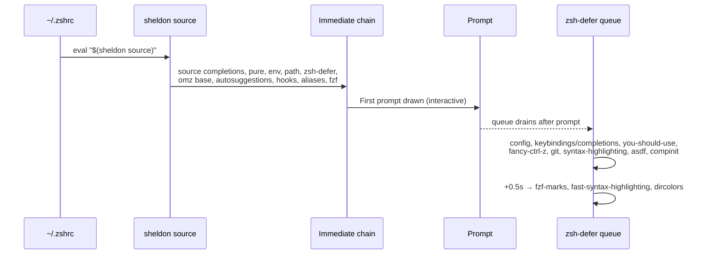

# Shell Loading Pipeline

> How a login shell goes from `~/.zshrc` to a fully-configured, fast-starting Zsh — and why almost nothing in this repo is sourced the "normal" way.

This is the most important page for understanding *how* the dotfiles actually run. If you only read one deep-dive, read this one.

**See also:** [Architecture](architecture.md) · [Feature Flags](feature-flags.md) · [Version Managers](version-managers.md) · [Tutorial: add a tool module](tutorials/02-add-a-tool-module.md)

---

## The core idea: a thin `.zshrc` that hands off to sheldon

`~/.zshrc` is rendered from [`home/dot_zshrc.tmpl`](../home/dot_zshrc.tmpl) and is deliberately tiny. It does only four things:

1. `{{ include "shell/init.zsh" }}` — inline [`home/shell/init.zsh`](../home/shell/init.zsh): set XDG vars on Linux and dedupe `path`/`fpath` with `typeset -U`.
2. `export ZSH_DOTFILES_VERSION_MANAGER=...` — bake the asdf-vs-mise choice into the shell (see [Version Managers](version-managers.md)).
3. If [sheldon](https://sheldon.cli.rs/) is installed **and** `~/.sheldon/plugins.toml` exists → `eval "$(sheldon source)"`.
4. `[ -f ~/.fzf.zsh ] && source ~/.fzf.zsh` (Linux also prepends `~/.cargo/bin`).

That's the whole file. **Everything else — prompt, completions, syntax highlighting, every tool's `env`/`path`, all custom aliases — is loaded as a [sheldon](https://sheldon.cli.rs/) plugin.** The `home/shell/**` modules are not sourced directly by `.zshrc`; they are pulled in by sheldon via glob patterns declared in [`home/dot_sheldon/plugins.toml.tmpl`](../home/dot_sheldon/plugins.toml.tmpl).

```mermaid
flowchart TD
    A["Login shell starts"] --> B["~/.zshrc<br/>(from dot_zshrc.tmpl)"]
    B --> C["include shell/init.zsh<br/>XDG vars, typeset -U path/fpath"]
    C --> D["export ZSH_DOTFILES_VERSION_MANAGER"]
    D --> E{"sheldon on PATH<br/>AND ~/.sheldon/plugins.toml exists?"}
    E -- no --> Z["Minimal shell (no plugins)"]
    E -- yes --> F["eval \"$(sheldon source)\""]
    F --> G["Immediate plugins<br/>(block startup)"]
    G --> H["Prompt drawn ✅"]
    H --> I["zsh-defer queue drains<br/>(deferred plugins)"]
    I --> J["+0.5s: defer-more tier"]
    D --> K["source ~/.fzf.zsh"]
```

The payoff: only a small "immediate" set blocks the first prompt. The heavy machinery (syntax highlighting, git plugin, version manager, `compinit`) runs *after* the prompt is already interactive, via [`zsh-defer`](https://github.com/romkatv/zsh-defer). That is what keeps startup snappy despite the large amount of configuration.

---

## The three load tiers

sheldon emits a source line per plugin. The behavior is controlled by `apply` and by three custom templates at the top of [`plugins.toml.tmpl`](../home/dot_sheldon/plugins.toml.tmpl):

| Tier | Template | Emitted as | When it runs |
|------|----------|-----------|--------------|
| **Immediate** | *(default `source`)* | `source "<file>"` | Inline, during `eval "$(sheldon source)"` — **blocks the first prompt** |
| **Deferred** | `defer` | `zsh-defer source "<file>"` | Queued by [`zsh-defer`](https://github.com/romkatv/zsh-defer); drains **after** the first prompt is drawn |
| **Deferred (extra)** | `defer-more` | `zsh-defer -t 0.5 source "<file>"` | Same queue, but with an added `0.5s` delay — for the least urgent plugins |

A fourth template, `ffpath`, exists for `fpath`-plus-`autoload` style plugins (`fpath+="…/functions" && autoload …`).

> **Mental model:** *immediate* = "I need this before you can type" (prompt, PATH, aliases). *deferred* = "nice to have a beat later" (highlighting, git, version manager). *defer-more* = "whenever, really" (fzf-marks, fast-syntax-highlighting, dircolors).

---

## The `env.zsh` / `path.zsh` glob convention

Two immediate plugins do the heavy lifting for tool configuration by **globbing the module tree**:

```toml
[plugins.env]
local = "~/.local/share/chezmoi/home/shell"
use = ["**/env.zsh"]

[plugins.path]
local = "~/.local/share/chezmoi/home/shell"
use = ["**/path.zsh"]
```

So every `home/shell/<tool>/env.zsh` and `home/shell/<tool>/path.zsh` is auto-sourced — **no registration required**. Drop a file named exactly `env.zsh` or `path.zsh` into a tool folder and it loads. The same pattern powers the deferred `local` plugin (`**/{keybinding,completion}.zsh`) and the `aliases` plugin (`**/aliases.zsh`).

> ⚠️ The glob matches the **exact basename**. `home/shell/go/env.zsh` matches `**/env.zsh`; `home/shell/zsh_dot_d/after/pyenv.zsh` does **not** (its basename is `pyenv.zsh`, not `env.zsh`). This is exactly why the `zsh_dot_d/` tree is dead code — see [Gotchas](gotchas.md).

To add your own module, follow [Tutorial 02: Add a tool module](tutorials/02-add-a-tool-module.md).

---

## Full load order

Plugins load in the order they appear in [`plugins.toml.tmpl`](../home/dot_sheldon/plugins.toml.tmpl). Within a tier, order is preserved; deferred entries drain after the prompt in the order sheldon emitted them.

| # | Plugin | Source | Tier | Role |
|---|--------|--------|------|------|
| 1 | `zsh-completions` | [zsh-users/zsh-completions](https://github.com/zsh-users/zsh-completions) | immediate | Extra completion definitions on `fpath` |
| 2 | `pure` | [sindresorhus/pure](https://github.com/sindresorhus/pure) (`async.zsh`, `pure.zsh`) | immediate | The prompt |
| 3 | `env` | `home/shell/**/env.zsh` | immediate | All tool env vars |
| 4 | `path` | `home/shell/**/path.zsh` | immediate | All tool `PATH` additions |
| 5 | `zsh-defer` | [romkatv/zsh-defer](https://github.com/romkatv/zsh-defer) | immediate | Loads the `zsh-defer` function used by everything below |
| 6 | `config` | `home/shell/config.zsh` | **defer** | History options, vi mode |
| 7 | `local` | `home/shell/**/{keybinding,completion}.zsh` | **defer** | Per-tool keybindings & completions |
| 8 | `zsh-you-should-use` | [MichaelAquilina/zsh-you-should-use](https://github.com/MichaelAquilina/zsh-you-should-use) | **defer** | Reminds you of existing aliases |
| 9 | `oh-my-zsh` | [ohmyzsh/ohmyzsh](https://github.com/ohmyzsh/ohmyzsh) | immediate | Base framework (only used as a source for select plugins) |
| 10 | `fancy-ctrl-z` | ohmyzsh plugin | **defer** | `Ctrl-Z` foregrounds the last job |
| 11 | *(CentOS/Oracle only)* `salt`, `saltstack`, `docker`, `docker-compose`, `rust` | ohmyzsh / vendor | **defer** | Distro-specific completions |
| 12 | `boss-git-zsh-plugin` | [bossjones/boss-git-zsh-plugin](https://github.com/bossjones/boss-git-zsh-plugin) | **defer** | Git aliases & helpers |
| 13 | `zsh-syntax-highlighting` | [zsh-users/zsh-syntax-highlighting](https://github.com/zsh-users/zsh-syntax-highlighting) | **defer** | Command-line syntax colors |
| 14 | `zsh-autosuggestions` | [zsh-users/zsh-autosuggestions](https://github.com/zsh-users/zsh-autosuggestions) | immediate | Fish-style suggestions from history |
| 15 | `zsh-hooks` | [zsh-hooks/zsh-hooks](https://github.com/zsh-hooks/zsh-hooks) | immediate | Hook system used by other plugins |
| 16 | *(if `version_manager == asdf`)* `asdf` | `~/.asdf` (Linux) or Homebrew `asdf@0.11.2`/`asdf` libexec (macOS) | **defer** | asdf runtime shims |
| 17 | `fzf-marks` | [urbainvaes/fzf-marks](https://github.com/urbainvaes/fzf-marks) | **defer-more** | Bookmark directories via fzf |
| 18 | `fast-syntax-highlighting` | [zdharma-continuum/fast-syntax-highlighting](https://github.com/zdharma-continuum/fast-syntax-highlighting) | **defer-more** | Faster highlighter |
| 19 | `zsh-dircolors-solarized` | [joel-porquet/zsh-dircolors-solarized](https://github.com/joel-porquet/zsh-dircolors-solarized) | **defer-more** | Solarized `LS_COLORS` |
| 20 | `compinit` | `home/shell/compinit.zsh` | **defer** | Daily-cached completion init (`compinit`) |
| 21 | *(Ubuntu/Oracle only)* `cuda` | `home/shell/cuda/custom.zsh` | immediate | CUDA env |
| 22 | `bossaliases` | `home/shell/customs/aliases.zsh` | immediate | The big custom alias/function library |
| 23 | `aliases` | `home/shell/**/aliases.zsh` | immediate | Per-tool aliases |
| 24 | `boss_fzf` | inline `source ~/.fzf.zsh` | immediate | fzf keybindings & completion (macOS, Ubuntu/Oracle) |

> **Note the exceptions to the "highlighting is deferred" rule.** `zsh-autosuggestions` (14) and `zsh-hooks` (15) are *immediate* — they are declared without `apply = ["defer"]`. `compinit` (20) is deferred and cached daily, which is a major startup win.

### What that looks like on the timeline



---

## OS and distro conditionals

`plugins.toml.tmpl` is itself a chezmoi Go template, so the plugin *set* is machine-specific:

| Condition | Effect |
|-----------|--------|
| `eq .chezmoi.os "darwin"` | `boss_fzf` inline fzf sourcing; asdf resolved from the Homebrew prefix |
| `eq .chezmoi.os "linux"` | asdf resolved from `~/.asdf/asdf.sh`; `~/.cargo/bin` on PATH |
| `.chezmoi.osRelease.name == "CentOS Linux"` / `"Oracle Linux Server"` | salt/saltstack/docker/docker-compose/rust completions |
| `.chezmoi.osRelease.name == "Ubuntu"` / `"Oracle Linux Server"` | `cuda` module, inline fzf sourcing |
| `.version_manager == "asdf"` | the `asdf` plugin block is emitted at all |

Because these are resolved at `chezmoi apply` time, the rendered `~/.sheldon/plugins.toml` contains only the plugins relevant to *that* machine — there is no runtime `if` cost.

---

## Verifying the load

```sh
# See the exact script sheldon emits (immediate vs zsh-defer lines):
sheldon source | less

# Time a cold interactive shell:
time zsh -i -c exit

# Profile startup: uncomment `zmodload zsh/zprof` at the top of dot_zshrc.tmpl,
# start a shell, then run:
zprof
```

If a module isn't loading, first confirm its filename matches a glob (`env.zsh`, `path.zsh`, `aliases.zsh`, `config.zsh`, `keybinding.zsh`, `completion.zsh`) and that `chezmoi apply` has re-rendered `~/.sheldon/plugins.toml`.
