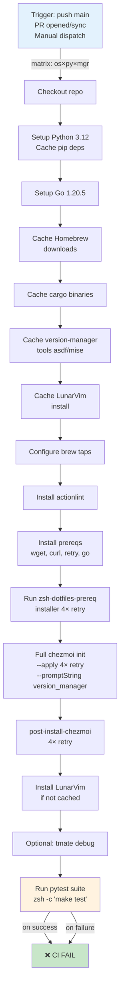

# Testing and CI Reference

Comprehensive reference for the testing framework, GitHub workflows, Docker smoke tests, and pre-commit hooks.

**Table of Contents:**
- [Quick Start](#quick-start)
- [Pytest + libtmux Integration Model](#pytest--libtmux-integration-model)
- [Makefile Targets](#makefile-targets)
- [GitHub Workflows](#github-workflows)
- [GitHub Actions Job Pipeline](#github-actions-job-pipeline)
- [Pre-Commit Hooks](#pre-commit-hooks)
- [Docker Smoke Tests](#docker-smoke-tests)

---

## Quick Start

### Local Testing

```bash
# Run all tests locally (fastest for iteration)
make test

# Run tests with debugger (bpdb) for interactive debugging
make test-pdb

# Run with uv (version-locked dependencies)
make uv-test

# Run with uv + debugger
make uv-test-pdb

# Lint with pre-commit
make pre-commit
```

### Docker Smoke Tests

```bash
# Full smoke test (reproduces CI exactly)
make smoke

# Lint stage only (fastest)
make smoke-lint

# Build stage only
make smoke-build

# Interactive shell for debugging
make smoke-shell

# With version_manager=mise (default: asdf)
VERSION_MANAGER=mise make smoke

# Clean up Docker images/containers
make smoke-clean
```

---

## Pytest + libtmux Integration Model

The test suite uses [pytest](https://pytest.org/) with [libtmux](https://libtmux.git-pull.com/) for integration testing in isolated tmux sessions.

### Test Structure

| Test File | Type | Purpose | Key Features |
|-----------|------|---------|--------------|
| **test_dotfiles.py** | Integration | Tests ZSH shell, aliases, functions, tool setup | Uses libtmux to spawn tmux sessions; most tests are `@pytest.mark.skip`-decorated (run locally only) |
| **test_scripts_backup_dotfiles.py** | Unit | Tests `scripts/backup-dotfiles.py` (PEP 723 script) | 694MB archive regression guard; uses importlib to load hyphen-named script |
| **test_scripts_check_jsonc.py** | Unit | Tests `scripts/check-jsonc.py` (JSONC validator) | JSON-with-comments validation; uses importlib to load script |

### Fixture Model

**conftest.py** provides:
- `zsh_output_subprocess` fixture: Run commands in subprocess zsh and capture output
- `tmux_client` fixture: Shared tmux server (module scope)
- `tmux_fake_server` fixture: Per-test tmux server for isolation
- `clear_env` fixture: Clean environment for each test (via libtmux)

**libtmux.pytest_plugin** (auto-loaded):
- Provides tmux session/window/pane fixtures
- Detects if running with zsh (`USING_ZSH` flag)
- Auto-cleans up sessions after each test

### CI-Active Tests

Most integration tests are skipped in CI (`IN_DOCKER` detection):
```python
@pytest.mark.skip(reason="These tests are meant to only run locally on laptop...")
def test_alias_defined(zsh_output_subprocess):
    ...
```

**Exception:** `TestDotfiles::test_aliases` runs in CI (not decorated `IN_DOCKER`-skip) and verifies key aliases exist.

### Running Tests

```bash
# Run all tests with retries (flaky network resilience)
pytest --reruns 6 test_dotfiles.py test_scripts_backup_dotfiles.py test_scripts_check_jsonc.py

# Makefile shorthand (same as above)
make test

# With coverage
pytest --cov=scripts test_*.py

# With verbose output and durations
make uv-test
# (uv-test uses: pytest -vvvv --durations-min=0.05 --durations=10)
```

---

## Makefile Targets

Defined in the [`Makefile`](../Makefile). Note that only some targets are declared `.PHONY` (the `smoke*`, `smoke-full*`, `install-hooks`, `update-cursor-rules`, and `macos-init-good-defaults-*` groups); the core `sync`/`pre-commit`/`test`/`test-pdb`/`uv-test`/`uv-test-pdb` targets are not — harmless here since no files share those names.

### Testing Targets

| Target | Command | Purpose | Dependencies |
|--------|---------|---------|--------------|
| `sync` | `uv sync --all-extras` + `uv run pre-commit install` | Install all dev dependencies + git hooks | uv, Python 3.12 |
| `pre-commit` | `uv run pre-commit run -a` | Run all pre-commit hooks on staged files | pre-commit, Python 3.12 |
| `test` | `py.test --tb=short --reruns 6 test_*.py` | Run pytest suite with 6 retries | pytest, libtmux, python 3.12 |
| `test-pdb` | `py.test --pdb --pdbcls bpdb:BPdb test_*.py` | Run tests with bpdb debugger on failure | pytest, bpdb, python 3.12 |
| `uv-test` | `uv run pytest -vvvv --reruns 6 --durations=10 test_*.py` | Run via uv (locked deps), verbose, show slow tests | uv, pytest, python 3.12 |
| `uv-test-pdb` | `uv run pytest --pdb --pdbcls bpdb:BPdb test_*.py` | Run via uv with debugger | uv, pytest, bpdb, python 3.12 |

### Development Targets

| Target | Command | Purpose | Notes |
|--------|---------|---------|-------|
| `install-hooks` | `uv venv --python 3.12` + `uv run pre-commit install` | Set up pre-commit git hooks | One-time setup |
| `update-cursor-rules` | Copy `.md` from `hack/drafts/cursor_rules/` to `.cursor/rules/` (rename to `.mdc`) | Generate Cursor IDE rules | Requires `hack/drafts/cursor_rules/*.md` files |

### Smoke Test Targets (Docker-based)

| Target | Runs | Purpose | Example |
|--------|------|---------|---------|
| `smoke` | Full pipeline (lint, build, test) | Reproduces CI exactly in Docker | `make smoke` |
| `smoke-lint` | Lint stage only | Pre-commit checks + chezmoi validation | `make smoke-lint` |
| `smoke-build` | Build stage only | Brew setup + prereq + chezmoi apply + post-install | `make smoke-build` |
| `smoke-shell` | Interactive zsh | Debug failures interactively | `make smoke-shell` |
| `smoke-clean` | None (cleanup) | Remove Docker containers/images | `make smoke-clean` |
| `smoke-asdf` | Full with `VERSION_MANAGER=asdf` | Test asdf version manager lane | `VERSION_MANAGER=asdf make smoke` (or just `make smoke-asdf`) |
| `smoke-mise` | Full with `VERSION_MANAGER=mise` | Test mise version manager lane | `make smoke-mise` |
| `smoke-asdf-shell` | Interactive with `VERSION_MANAGER=asdf` | Interactive asdf debugging | `make smoke-asdf-shell` |
| `smoke-mise-shell` | Interactive with `VERSION_MANAGER=mise` | Interactive mise debugging | `make smoke-mise-shell` |

### Pre-Provisioned Image Targets (DOCKER_BUILDKIT=1 required)

| Target | Builds | Purpose | Use Case |
|--------|--------|---------|----------|
| `smoke-full` | Both asdf + mise images | Bake both pre-provisioned images | Slow but reusable across runs |
| `smoke-full-asdf` | asdf-based image | Bake single asdf image with chezmoi applied | Fast iteration on asdf lane |
| `smoke-full-mise` | mise-based image | Bake single mise image with chezmoi applied | Fast iteration on mise lane |
| `smoke-full-run-asdf` | None (run existing) | Run pre-baked asdf image interactively | Quick testing of asdf setup |
| `smoke-full-run-mise` | None (run existing) | Run pre-baked mise image interactively | Quick testing of mise setup |
| `smoke-full-clean` | None (cleanup) | Remove baked images | Free up disk space |

**Example:**
```bash
DOCKER_BUILDKIT=1 make smoke-full-asdf
make smoke-full-run-asdf  # Then test interactively
```

### macOS Provisioning Targets

Used for new-machine setup with canned answers (`CHEZMOI_GOOD_DEFAULTS`).

> ⚠️ **These are not all dry-run.** `macos-init-good-defaults-source`, `-branch`, and `-oneliner` run `chezmoi init -R --apply` and **modify your home directory for real**. Only `macos-init-good-defaults-dry-run` uses `--dry-run`. Preview first with the dry-run target (or `chezmoi diff`) before running an apply variant.

| Target | Default Args | Runs From | Purpose |
|--------|--------------|-----------|---------|
| `macos-init-good-defaults-source` | --source=. | Current checkout | Provision from local repo |
| `macos-init-good-defaults-branch` | --branch main | GitHub CHEZMOI_REPO | Provision from GitHub (main branch) |
| `macos-init-good-defaults-oneliner` | None (via chezmoi.io/get) | Internet installer | One-liner setup (no git clone needed) |
| `macos-init-good-defaults-dry-run` | --dry-run + --source=. | Current checkout | Preview without changes |

**Defaults embedded in Makefile** (lines 117-129):
```makefile
CHEZMOI_GOOD_DEFAULTS := \
    --promptString "Name=Malcolm Jones" \
    --promptString "Email=bossjones@theblacktonystark.com" \
    --promptString "Computer name=<auto-detected>" \
    --promptString "Host name=<auto-detected>" \
    --promptString "version_manager=mise" \
    --promptBool "ruby=true" \
    --promptBool "pyenv=true" \
    --promptBool "nodejs=true" \
    --promptBool "k8s=false" \
    --promptBool "cuda=false" \
    --promptBool "fnm=true" \
    --promptBool "opencv=false"
```

**Override example:**
```bash
make macos-init-good-defaults-source CHEZMOI_BRANCH=claude/my-feature
```

---

## GitHub Workflows

Five workflows run on push, PR, and schedule.

### Workflow Summary Table

| Workflow | File | Trigger | Platform | Purpose | Status |
|----------|------|---------|----------|---------|--------|
| **GitHub Actions CI** | `tests.yml` | Push (main), PR, manual dispatch | macOS 14, 15 × Python 3.12 × asdf/mise (8 jobs) | Primary test suite; matrix covers OS × version manager | Active (fail-fast: false) |
| **Future macOS** | `tests-future-macos.yml` | Daily cron (07:00 UTC) | macOS 26 (beta), latest × Python 3.12 × asdf/mise | Canary for future macOS; early warning system | Active (continue-on-error: true) |
| **Actionlint** | `actionlint.yml` | Push, PR, merge_group | ubuntu-latest | Lint GitHub Actions workflow syntax; upload SARIF security report | Active |
| **Tmate** | `tmate.yml` | Manual dispatch (workflow_dispatch) | ubuntu-latest | Manual debugging via SSH session | On-demand |
| **Tmate macOS** | `tmate-mac.yml` | (Check file for trigger) | macOS | (Check file for purpose) | Check file |

---

## GitHub Actions Job Pipeline

### tests.yml: Primary CI Pipeline

The main workflow (`tests.yml`) runs on each push and PR. Here's the complete job pipeline:



### Job Matrix

```yaml
strategy:
  fail-fast: false  # Run all jobs even if one fails; useful for version manager testing
  matrix:
    os: ["macos-14", "macos-15"]
    python-version: ["3.12"]
    version_manager: ["asdf", "mise"]
```

Results in **8 jobs total**:
- 2 macOS versions × 1 Python version × 2 version managers = 8 parallel jobs
- `fail-fast: false` ensures both asdf and mise test lanes complete even if one fails

### Environment Variables

Set in `tests.yml` (lines 33-45):

| Variable | Value | Purpose |
|----------|-------|---------|
| `GITHUB_TOKEN` | `${{ secrets.GITHUB_TOKEN }}` | GitHub API access (gh CLI, repo operations) |
| `MISE_RUBY_COMPILE` | `"true"` | Force Ruby compilation in mise (no prebuilt) |
| `LV_BRANCH` | `"release-1.3/neovim-0.9"` | LunarVim branch to install |
| `ZSH_DOTFILES_PREP_CI` | `"1"` | CI mode flag (non-interactive, retries enabled) |
| `ZSH_DOTFILES_PREP_DEBUG` | `"1"` | Debug output enabled |
| `ZSH_DOTFILES_PREP_GITHUB_USER` | `bossjones` | GitHub username for repo clones |
| `ZSH_DOTFILES_PREP_SKIP_BREW_BUNDLE` | `"1"` | Skip heavy brew bundle (time/resource savings) |
| `HOMEBREW_NO_REQUIRE_TAP_TRUST` | `"1"` | Allow non-interactive tap installation (critical for asdf@0.11.2 from bossjones/asdf-versions) |

### Key Caching Strategy

The workflow uses 4 caching strategies to speed up subsequent runs:

1. **Homebrew downloads** (lines 67-75): Cache compiled brew packages
2. **Cargo binaries** (lines 77-86): Cache Rust toolchain from prereq installer
3. **Version manager tools** (lines 88-100): Cache asdf plugins/installs **and** mise installs (keyed by manager)
4. **LunarVim** (lines 102-112): Cache LunarVim install (only re-install on branch change)

**Cache key strategy:**
```yaml
key: vm-${{ matrix.version_manager }}-${{ matrix.os }}-${{ hashFiles('home/.chezmoiscripts/run_onchange_after_50-*.sh.tmpl') }}
```
This invalidates cache when installation scripts change, ensuring fresh tool installs.

### Test Step Execution (lines 171-200)

The pytest step runs inside a zsh shell with proper environment setup:

```bash
zsh -c '
  # Add user bin dirs to PATH
  { echo "$HOME/bin"; echo "$HOME/.bin"; echo "$HOME/.local/bin"; } >> "${GITHUB_PATH}"
  export PATH="${HOME}/.bin:${HOME}/bin:${HOME}/.local/bin:${PATH}"

  # Create venv, install test deps
  python -m venv venv
  source ./venv/bin/activate
  pip install -U pip setuptools wheel
  pip install -U -r requirements-test.txt

  # Activate version manager (asdf or mise branch)
  if [ "${{ matrix.version_manager }}" = "asdf" ]; then
    export ASDF_DIR="${HOME}/.asdf"
    export ASDF_COMPLETIONS="$ASDF_DIR/completions"
    . "$HOME/.asdf/asdf.sh"
    echo "$HOME/.asdf/bin" >> "${GITHUB_PATH}"
    echo "$HOME/.asdf/shims" >> "${GITHUB_PATH}"
  else
    export PATH="$HOME/.local/bin:$PATH"
    echo "$HOME/.local/bin" >> "${GITHUB_PATH}"
    command -v mise >/dev/null 2>&1 && eval "$(mise activate zsh)"
  fi

  # Run tests
  make test
'
```

---

## Pre-Commit Hooks

Defined in `.pre-commit-config.yaml` (lines 1-102). Run on `git commit` (if installed) or manually via `make pre-commit`.

### Hooks by Repository

| Hook | Repository | Stages | Types | Purpose |
|------|-----------|--------|-------|---------|
| **alphabetize-codeowners** | sirosen/texthooks (0.6.8) | pre-commit, pre-push | None | Alphabetize CODEOWNERS file |
| **fix-smartquotes** | sirosen/texthooks (0.6.8) | pre-commit, pre-push | None | Replace smart quotes with ASCII |
| **fix-ligatures** | sirosen/texthooks (0.6.8) | pre-commit, pre-push | None | Fix typographic ligatures |
| **prettier** | pre-commit/mirrors-prettier (v4.0.0-alpha.8) | pre-commit, pre-push | YAML, JSON | Format YAML/JSON (excludes JSONC files) |
| **check-jsonc** | local (scripts/check-jsonc.py) | pre-commit | Python | Validate JSON-with-comments files (read-only) |
| **check-ast** | pre-commit/pre-commit-hooks (v5.0.0) | pre-commit | Python | Validate Python AST |
| **check-json** | pre-commit/pre-commit-hooks (v5.0.0) | pre-commit | JSON | Validate JSON (excludes JSONC) |
| **check-case-conflict** | pre-commit/pre-commit-hooks (v5.0.0) | pre-commit | None | Detect filename case conflicts |
| **check-merge-conflict** | pre-commit/pre-commit-hooks (v5.0.0) | pre-commit | None | Detect merge conflict markers |
| **check-symlinks** | pre-commit/pre-commit-hooks (v5.0.0) | pre-commit | Symlinks | Verify symlinks point to existing files |
| **end-of-file-fixer** | pre-commit/pre-commit-hooks (v5.0.0) | pre-commit | None | Ensure files end with newline |
| **mixed-line-ending** | pre-commit/pre-commit-hooks (v5.0.0) | pre-commit | None | Fix mixed LF/CRLF line endings |
| **trailing-whitespace** | pre-commit/pre-commit-hooks (v5.0.0) | pre-commit | None | Remove trailing whitespace |
| **python-no-log-warn** | pre-commit/pygrep-hooks (v1.10.0) | pre-commit | Python | Warn on logger.warn (deprecated) |
| **text-unicode-replacement-char** | pre-commit/pygrep-hooks (v1.10.0) | pre-commit | Text | Detect Unicode replacement char (corruption indicator) |
| **check-github-workflows** | check-jsonschema (0.31.2) | pre-commit | GitHub Actions | Validate workflow YAML against JSON schema |
| **check-readthedocs** | check-jsonschema (0.31.2) | pre-commit | readthedocs | Validate .readthedocs.yaml |
| **actionlint** | rhysd/actionlint (v1.7.7) | pre-commit | GitHub Actions YAML | Lint GitHub Actions workflow files |

### JSONC Handling

JSONC (JSON-with-comments) files are excluded from prettier (line 49) and checked by a local Python script instead:

```yaml
exclude: &jsonc_files ^(\.devcontainer/devcontainer\.json|home/private_dot_config/cmux/private_cmux\.json)$

# prettier excludes JSONC
- id: prettier
  exclude: *jsonc_files

# Local check-jsonc validates JSONC
- repo: local
  hooks:
    - id: check-jsonc
      entry: python scripts/check-jsonc.py
      files: *jsonc_files
```

### Usage

```bash
# Install hooks (one-time)
make install-hooks

# Run all hooks manually
make pre-commit

# Or directly
pre-commit run -a

# Run specific hook
pre-commit run prettier --all-files
```

---

## Docker Smoke Tests

Defined in `scripts/smoke-test-docker.sh` (lines 1-502) and orchestrated via Makefile and docker-compose.

### Stages

The smoke test script supports 4 stages, run sequentially or individually:

| Stage | Script Function | What It Does | Time |
|-------|-----------------|-------------|------|
| **lint** | `run_lint()` (lines 288-326) | Pre-commit hooks + chezmoi template validation | < 1 min |
| **build** | `run_build()` (lines 328-418) | Brew setup + chezmoi init/apply + post-install + zsh test | 10-15 min |
| **provision** | (build without pytest) | Same as build but skips pytest (used by Dockerfile.full) | 10-15 min |
| **all** | (all stages) | lint → build → pytest (default) | 15-20 min |
| **test** (pytest) | `run_pytest()` (lines 421-444) | Run pytest suite in venv | 5-10 min |

### Environment Setup

`setup_initial_environment()` (lines 44-69) sets:
- `ZSH_DOTFILES_PREP_CI=1`
- `ZSH_DOTFILES_PREP_DEBUG=1`
- `ZSH_DOTFILES_PREP_GITHUB_USER=bossjones`
- `ZSH_DOTFILES_PREP_SKIP_BREW_BUNDLE=1`
- `SHELDON_CONFIG_DIR` and `SHELDON_DATA_DIR`
- Basic PATH setup

### Version Manager Threading in Smoke Test

`setup_version_manager()` (lines 228-286) handles asdf vs. mise:
- If `VERSION_MANAGER=asdf`:
  - Set `ASDF_DIR`, source asdf.sh
  - Add asdf bin/shims to PATH
  - Install Ruby 4.0.1 with OpenSSL 3 flags
- If `VERSION_MANAGER=mise`:
  - Run `eval "$(mise activate bash)"`
  - Never source asdf.sh (Mutual Exclusion Invariant)
  - Install Ruby 4.0.1 via mise with OpenSSL 3 flags

**Critical:** Mutual Exclusion Invariant (specs/migrate-asdf-to-mise.md) enforced:
```bash
if [[ "$VERSION_MANAGER" == "asdf" ]]; then
    # asdf setup (source asdf.sh, set ASDF_DIR, etc.)
else
    # mise setup (eval mise activate)
    # NEVER source asdf.sh
    # NEVER set ASDF_DIR
fi
```

### Docker Compose Integration

`docker-compose.yml` orchestrates smoke testing (not shown here; check file for details):
- Builds container with necessary tools
- Runs smoke script with specified stage
- Passes `VERSION_MANAGER` env var
- Mounts repo as volume

**Usage:**
```bash
# Run lint stage
docker compose run --rm smoke lint

# Run build stage with version_manager=mise
VERSION_MANAGER=mise docker compose run --rm smoke build

# Interactive debugging
docker compose run --rm smoke-shell /bin/zsh
```

---

## Cross-References

- **[Feature Flags](feature-flags.md)** - Feature flag reference (env vars used in workflows)
- **[Version Managers](version-managers.md)** - asdf ⇄ mise threading in CI
- **[Makefile](../Makefile)** - Source: all make targets
- **[.github/workflows/tests.yml](../.github/workflows/tests.yml)** - Source: primary CI pipeline
- **[.github/workflows/tests-future-macos.yml](../.github/workflows/tests-future-macos.yml)** - Source: future macOS canary
- **[.pre-commit-config.yaml](../.pre-commit-config.yaml)** - Source: pre-commit hooks
- **[scripts/smoke-test-docker.sh](../scripts/smoke-test-docker.sh)** - Source: smoke test logic
- **[conftest.py](../conftest.py)** - Source: pytest fixtures and libtmux setup
- **[test_dotfiles.py](../test_dotfiles.py)** - Source: integration tests
- **[pre-commit Documentation](https://pre-commit.com/)** - Official pre-commit hooks guide
- **[libtmux Documentation](https://libtmux.git-pull.com/)** - Official libtmux pytest plugin guide
- **[pytest Documentation](https://pytest.org/)** - Official pytest guide
