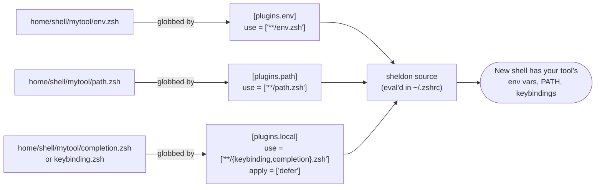

# Tutorial 02: Add a Tool Module

> Add your own tool's environment variables and `PATH` entries using the `home/shell/<tool>/` convention — no plugin registration required.

**See also:** [docs/shell-loading.md](../shell-loading.md) (glob mechanism deep dive) · [CONTRIBUTING.md](../../CONTRIBUTING.md#how-to-add-a-new-tool-module) · [Tutorials index](README.md)

---

## What you'll learn

- Why dropping two files into a new folder is enough to wire up a tool, with zero edits to `plugins.toml.tmpl`
- How sheldon's `env`/`path` plugins glob your files automatically
- How to confirm your new module actually loaded in a fresh shell

**Prerequisites:** [Tutorial 01](01-daily-workflow.md) (know how to preview/apply). We'll use a fictional tool called `mytool` as the running example.

**Time estimate:** 10 minutes.

---

## The convention, in one picture



Source: [`home/dot_sheldon/plugins.toml.tmpl`](../../home/dot_sheldon/plugins.toml.tmpl).

```toml
[plugins.env]
local = "~/.local/share/chezmoi/home/shell"
use = ["**/env.zsh"]

[plugins.path]
local = "~/.local/share/chezmoi/home/shell"
use = ["**/path.zsh"]
```

There is **no per-tool registration** — sheldon globs every `env.zsh` and `path.zsh` under `home/shell/` at `sheldon source` time. The glob matches the exact basename, so the filename must be spelled exactly `env.zsh` / `path.zsh` (see the note in [docs/shell-loading.md](../shell-loading.md#the-envzsh--pathzsh-glob-convention)).

---

## Step 1: Create the module directory

```sh
mkdir -p ~/.local/share/chezmoi/home/shell/mytool
```

(Adjust the path if your chezmoi source directory lives elsewhere — check with `chezmoi source-path`.)

---

## Step 2: Add `env.zsh`

The simplest real example in this repo is [`home/shell/go/env.zsh`](../../home/shell/go/env.zsh), which exports `PATH` entries and an alias behind OS/arch checks. For `mytool`, keep it minimal:

```sh
# home/shell/mytool/env.zsh
export MYTOOL_HOME="$HOME/.mytool"
```

---

## Step 3: Add `path.zsh`

Following the pattern used by [`home/shell/fzf/path.zsh`](../../home/shell/fzf/path.zsh) — detect OS/arch, only add the directory to `PATH` if it actually exists:

```sh
# home/shell/mytool/path.zsh
#!/usr/bin/env zsh

if [[ -d "$HOME/.mytool/bin" ]]; then
    path+="$HOME/.mytool/bin"
fi
```

---

## Step 4 (optional): keybindings, completion, or aliases

If your tool ships its own completion or keybindings, follow [`home/shell/fzf/completion.zsh`](../../home/shell/fzf/completion.zsh) / [`keybinding.zsh`](../../home/shell/fzf/keybinding.zsh) — these are globbed by `[plugins.local]` and load **deferred** (after the first prompt), which is why fzf's key bindings don't slow down shell startup.

For tool-specific aliases, add `aliases.zsh` — globbed by `[plugins.aliases]` (`use = ["**/aliases.zsh"]`).

---

## Step 5: Preview, then apply

```sh
chezmoi diff --source=.
# or, if working from a live checkout already applied before:
chezmoi apply --dry-run --verbose

chezmoi apply -v
```

---

## Verify

```sh
# 1. See sheldon's generated source script and confirm your file is in it
sheldon source | grep mytool

# 2. Open a brand-new shell (not just re-source — sheldon regenerates its
#    cache the first time it runs after plugins.toml changes)
zsh

# 3. Confirm the env var and PATH entry are present
echo $MYTOOL_HOME
echo $PATH | tr ':' '\n' | grep mytool
```

If nothing shows up:

| Check | How |
|---|---|
| Filename matches the glob exactly | `ls home/shell/mytool/` — must be `env.zsh` / `path.zsh`, not `mytool.zsh` or `Env.zsh` |
| chezmoi actually applied the change | `chezmoi diff` should show no pending difference |
| Sheldon regenerated its lock/cache | `sheldon lock --update` then open a new shell |
| Directory referenced in `path.zsh` actually exists | The `[[ -d ... ]]` guard silently no-ops if the tool isn't installed yet |

---

## Next steps

- **[docs/shell-loading.md](../shell-loading.md)** — the full plugin load order and every glob in `plugins.toml.tmpl`
- **[Tutorial 03: Toggle a Feature Flag](03-toggle-a-feature-flag.md)** — gate a module behind an install-time flag instead of always loading it
