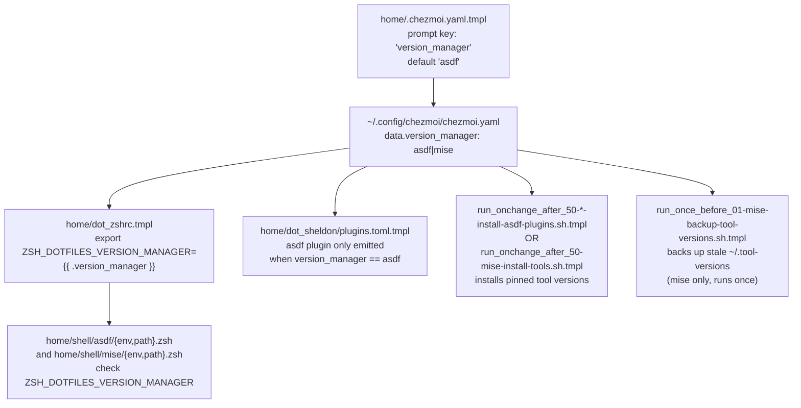

# Tutorial 04: Switch Version Manager

> Migrate a machine from `asdf` to [`mise`](https://mise.jdx.dev/) (or back), and understand the one flag that threads through the entire provisioning system.

**See also:** [docs/version-managers.md](../version-managers.md) (full architecture) · [docs/feature-flags.md](../feature-flags.md) · [Tutorials index](README.md)

---

## What you'll learn

- How the `version_manager` flag flows from a chezmoi prompt all the way to your running shell
- How to switch it, safely previewing first
- What the self-healing `~/.tool-versions` backup step does and why it exists
- How to confirm the switch actually took effect

**Prerequisites:** [Tutorial 00](00-first-time-setup.md) completed.

**Time estimate:** 15–30 minutes (tool reinstall takes the bulk of the time).

---

## How `version_manager` threads through the system



Source, read directly: [`home/.chezmoi.yaml.tmpl`](../../home/.chezmoi.yaml.tmpl) (the prompt is intentionally kept **outside** the `if $interactive` block so `--promptString version_manager=…` matches it correctly in non-interactive runs), [`home/dot_zshrc.tmpl`](../../home/dot_zshrc.tmpl) (`export ZSH_DOTFILES_VERSION_MANAGER={{ .version_manager | quote }}`), [`home/shell/asdf/env.zsh`](../../home/shell/asdf/env.zsh) / [`home/shell/mise/env.zsh`](../../home/shell/mise/env.zsh) and their `path.zsh` counterparts.

---

## Step 1: Preview the switch

Re-prompting or passing `--promptString` re-renders every template that depends on `.version_manager` — preview it first:

```sh
chezmoi apply --dry-run --verbose --source=.
```

(This still shows the *current* state, since nothing's changed yet — it's here as your "before" baseline to compare against.)

---

## Step 2: Switch `version_manager` to `mise`

**Non-interactive (recommended — changes only this one value):**

```sh
chezmoi init --source=. --promptString "version_manager=mise" --apply --force
```

**Or, re-prompt everything:**

```sh
chezmoi init --data=false --source=.
# When prompted for version_manager, type: mise
chezmoi apply --force
```

Either way, preview first if you'd rather not combine `init` and `--apply` in one step:

```sh
chezmoi init --source=. --promptString "version_manager=mise"
chezmoi diff
chezmoi apply -v --force
```

---

## Step 3: Understand the automatic `~/.tool-versions` backup

If you're migrating from an asdf-provisioned machine, [`run_once_before_01-mise-backup-tool-versions.sh.tmpl`](../../home/.chezmoiscripts/run_once_before_01-mise-backup-tool-versions.sh.tmpl) runs automatically (once) whenever `version_manager == mise`:

> An asdf-era `~/.tool-versions` lists tools under bare names (e.g. `jsonnet`, `kubetail`) that mise can't resolve from its registry, producing noisy "not found in mise tool registry" warnings on every mise command. mise's source of truth is now `~/.config/mise/config.toml`, so the stale file gets renamed out of the way (not deleted) before any mise install step runs.

It's idempotent — it never clobbers an existing `~/.tool-versions.asdf.bak`, and if there's no stale file it just logs that and moves on.

---

## What happens after the switch

1. **The old manager's data stays** — switching to `mise` doesn't remove `~/.asdf`. You can manually delete it later if you're fully done with asdf.
2. **`~/.tool-versions` gets backed up** to `~/.tool-versions.asdf.bak` (see Step 3), so mise doesn't choke on asdf-formatted entries.
3. **mise installs and globally pins** every tool in the `run_onchange_after_50-mise-install-tools.sh.tmpl` list (ruby, golang, tmux, neovim, github-cli, kubectl, helm, k9s, etc.) via `mise use -g <tool>@<pinned-version>`.
4. **`~/.zshrc` now exports `ZSH_DOTFILES_VERSION_MANAGER="mise"`**, and sheldon's rendered `plugins.toml` no longer includes the asdf plugin block.

---

## Verify

```sh
# 1. Confirm mise is on PATH and reports a version
mise --version

# 2. Confirm the shell variable flipped
echo $ZSH_DOTFILES_VERSION_MANAGER   # should print: mise

# 3. Confirm mise activated in this shell (open a NEW shell first)
mise doctor

# 4. Confirm the stale asdf tool-versions file was backed up, if you had one
ls -la ~/.tool-versions.asdf.bak 2>/dev/null && echo "backed up" || echo "no stale file existed"
```

Open a **brand-new** shell before checking — `home/shell/mise/path.zsh` runs `eval "$(mise activate zsh)"` only when a fresh zsh starts and `ZSH_DOTFILES_VERSION_MANAGER=mise`.

To switch back to asdf later, repeat Step 2 with `--promptString "version_manager=asdf"`. Both managers can coexist; `ZSH_DOTFILES_VERSION_MANAGER` alone determines which one is active in your shell (see the `enable_asdf` / `enable_mise` / `enable_version_manager` helper functions in [`home/shell/customs/aliases.zsh`](../../home/shell/customs/aliases.zsh) for manually forcing one on).

---

## Next steps

- **[docs/version-managers.md](../version-managers.md)** — full architecture diagram and pinned-version reference table
- **[Tutorial 05: Run Smoke Tests Locally](05-run-smoke-tests-locally.md)** — verify both `asdf` and `mise` lanes pass in Docker before pushing a change
