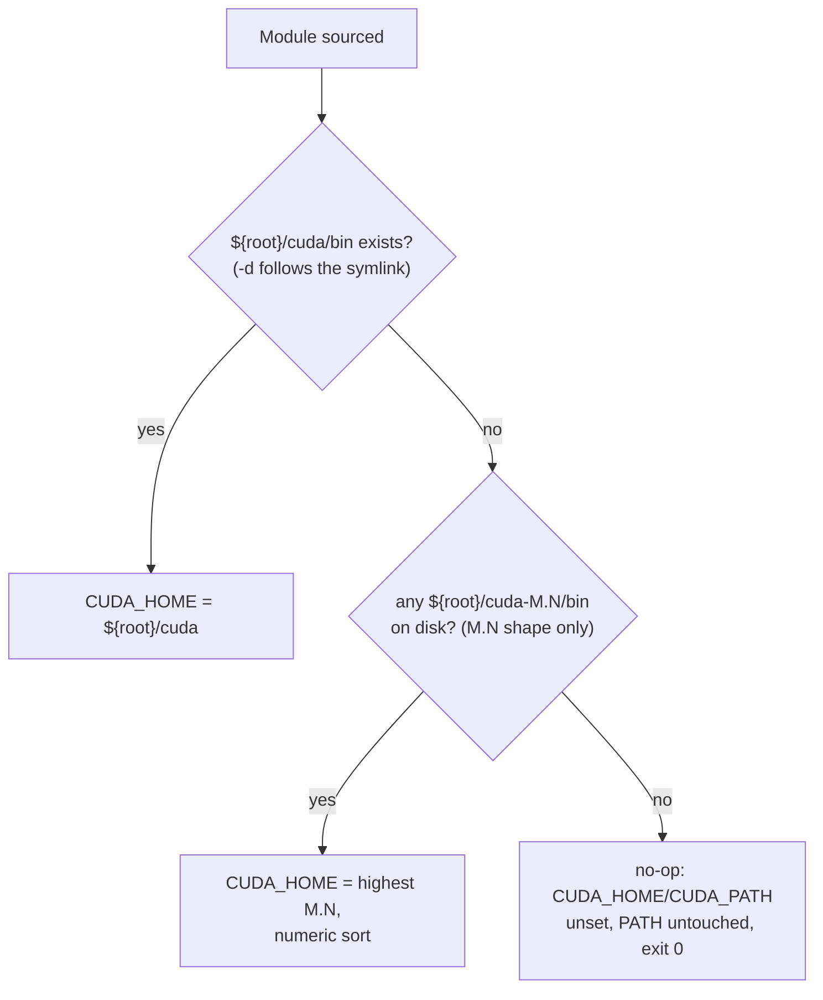

# Tutorial 07: Verify CUDA Before Applying

> Inspect your CUDA/driver state by hand, prove the shell module resolves correctly, and rehearse a toolkit upgrade in a GPU-attached container — all before you touch your host's actual toolkit.

**See also:** [docs/testing-and-ci.md](../testing-and-ci.md#cuda--gpu-verification-rigs) (the automated rigs this tutorial explains) · [docs/shell-loading.md](../shell-loading.md) (the cuda module in the load order) · [Tutorial 05: Run Smoke Tests Locally](05-run-smoke-tests-locally.md) · [Tutorials index](README.md)

---

## What you'll learn

- How [`home/shell/cuda/custom.zsh`](../../home/shell/cuda/custom.zsh) decides which toolkit to use, and how to prove it on your own machine
- Why the module deliberately never sets `LD_LIBRARY_PATH`, and how to confirm that's safe on your host
- How to rehearse every state the module can be in — dangling symlink, stale minor versions, half-removed packages — using a disposable fake root, with no changes to `/usr/local`
- How to expose your GPU to a container without editing `daemon.json` or restarting Docker, so you can test a toolkit upgrade against your real driver before installing it
- Why a PTX-only build is the sharpest compatibility check you can run, and what it actually proves
- Which `apt` package names and pin patterns have burned people, with the commands to check before you touch anything

**Prerequisites:** Ubuntu 22.04 (or similar) with an NVIDIA GPU and driver already installed; `zsh` (ships with this repo). The container sections additionally need [Docker](https://www.docker.com/) and [`nvidia-container-toolkit`](https://docs.nvidia.com/datacenter/cloud-native/container-toolkit/latest/install-guide.html) — skip Steps 5–6 if you just want the shell-module checks.

**Time estimate:** 30–45 minutes end to end; 5 minutes if you only do the module checks (Steps 1–3).

---

## Why do this by hand when `make smoke-cuda` / `make smoke-gpu` already exist?

They exist precisely because [nothing in CI covers `home/shell/cuda/`](../testing-and-ci.md#cuda--gpu-verification-rigs) — the GitHub Actions matrix is macOS-only, and the `cuda` sheldon plugin is gated on `.chezmoi.os == "linux"`. The Docker rigs are the real gate for that code, and for most changes you should just run them.

This tutorial is the manual counterpart. Run the rigs to get a pass/fail; run this tutorial when the rig fails and you need to know *which* check broke, or when you're about to change your CUDA setup and want to probe a scenario the rigs don't happen to cover (a specific driver number, a specific toolkit series, your actual host's directory layout).

---

## Step 1: Read the module before you trust it

Open [`home/shell/cuda/custom.zsh`](../../home/shell/cuda/custom.zsh) and [`home/shell/cuda/posix-env.sh`](../../home/shell/cuda/posix-env.sh). The zsh version loads **immediately** — step 21 of the [load order](../shell-loading.md) — so it only uses builtins and globbing, no subprocesses, and it runs on every new shell whether or not you have a GPU.



The resolution order, in the module's own words:

1. Prefer `${root}/cuda` — the symlink [`update-alternatives`](https://manpages.debian.org/bookworm/dpkg/update-alternatives.1.en.html) maintains. `[[ -d ... ]]` follows symlinks, so a **dangling** symlink (target deleted, link still present — the real transient state mid-`apt purge`) correctly fails this check.
2. Otherwise, glob `${root}/cuda-[0-9]*.[0-9]*(N-/)` — the [glob qualifiers](https://zsh.sourceforge.io/Doc/Release/Expansion.html#Glob-Qualifiers) mean dirs/symlinks-to-dirs only (`-/`), silent if none match (`N`) — and walk them in **reverse numeric** order (`${(On)candidates}`) looking for the first one with a `bin/`. The `<major>.<minor>` glob shape is deliberate: it matches `cuda-13.0` but not the `update-alternatives` major-version aliases `cuda-11` / `cuda-12` / `cuda-13`, which are pointers to a toolkit, not toolkits themselves.
3. Otherwise do nothing — no `CUDA_HOME`, no `PATH` change, exit 0.

`root` defaults to `/usr/local` but can be overridden by `ZSH_DOTFILES_CUDA_ROOT` — that's the hook this whole tutorial depends on: it lets you exercise the real logic against a throwaway directory tree instead of your actual `/usr/local`.

Once a `cuda_home` is picked, the module exports `CUDA_HOME` and `CUDA_PATH` (CMake's `FindCUDAToolkit` looks for the latter) and adds `${cuda_home}/bin` to `PATH` — guarded by a `case ":${PATH}:" in *":${cuda_home}/bin:"*)` check, so re-sourcing the module (a new tab, `exec zsh`, whatever) cannot grow `PATH` on every load.

The POSIX sibling, `posix-env.sh` (inlined into [`home/compat.sh.tmpl`](../../home/compat.sh.tmpl) and [`home/compat.bash.tmpl`](../../home/compat.bash.tmpl) for `~/.profile`/`~/.bashrc`), is deliberately dumber: it trusts **only** the `update-alternatives` symlink, with no highest-version fallback. POSIX `sh` can't version-sort without spawning a subprocess, and a lexical "last match" would rank `cuda-9.0` above `cuda-13.0` — so if the symlink is broken, `sh`/`bash` sessions just get no CUDA env. That's an accepted degradation: nobody does CUDA work from a `dash` login shell here.

**Check what it resolves on your actual host right now:**

```sh
zsh -f -c 'source "$(chezmoi source-path)/shell/cuda/custom.zsh"
echo "CUDA_HOME=${CUDA_HOME:-<none>}"
echo "CUDA_PATH=${CUDA_PATH:-<none>}"
echo $PATH | tr ":" "\n" | grep cuda'

update-alternatives --display cuda
```

> **Note the path.** `chezmoi source-path` already ends in `.../chezmoi/home`, because
> [`.chezmoiroot`](../../.chezmoiroot) redirects the source root to `home/`. So the module is at
> `$(chezmoi source-path)/shell/cuda/custom.zsh` — writing `.../home/shell/...` doubles the
> `home/` and silently fails to source anything.

If a toolkit is installed, you'll see `CUDA_HOME`/`CUDA_PATH` pointing at `/usr/local/cuda` and `update-alternatives --display cuda` showing the same target as its "currently selected" link. If nothing is installed (common if your CUDA support comes entirely from pip wheels — see Step 7), both print `<none>` and the `grep cuda` line prints nothing, which is the correct, silent no-op.

---

## Step 2: Confirm `LD_LIBRARY_PATH` really isn't needed

This is the part that looks wrong until you check it. Most CUDA tutorials tell you to export `LD_LIBRARY_PATH=/usr/local/cuda/lib64` — this module never does, on purpose.

`/usr/local/cuda-X/lib64` is a **symlink** to `targets/x86_64-linux/lib`, and the `.deb` packages already register that real directory with the dynamic linker via a drop-in [`ld.so.conf.d`](https://man7.org/linux/man-pages/man8/ld.so.8.html) file:

```sh
readlink -f /usr/local/cuda/lib64
cat /etc/ld.so.conf.d/000_cuda.conf
```

So `ldconfig`'s cache already knows where `libcudart` lives, with `LD_LIBRARY_PATH` unset:

```sh
echo "${LD_LIBRARY_PATH:-<unset>}"
ldconfig -p | grep -c libcudart
```

A non-zero count with `LD_LIBRARY_PATH` unset confirms it. NVIDIA's own [installation guide](https://docs.nvidia.com/cuda/cuda-installation-guide-linux/index.html) says the variable is only needed for **runfile** installs (which don't register with `ldconfig`) — not for the `.deb`/apt path this repo uses.

The reason this module treats it as a trap rather than a no-op: `LD_LIBRARY_PATH` **outranks** the `ldconfig` cache in the linker's search order. A stale value left over from an old toolkit install can silently shadow the correct library — for example, forcing an old `libcublas.so` from `/usr/local/cuda-11.8/lib64` into a process that actually wants the newer one `ldconfig` would have handed it. You can see the shadowing mechanism directly if you have more than one toolkit series on disk:

```sh
# If you have two toolkit series installed, compare where ldconfig resolves
# a library versus where a manually-set LD_LIBRARY_PATH would pull it from:
ldconfig -p | grep libcublas
LD_LIBRARY_PATH=/usr/local/cuda-11.8/lib64 ldd $(command -v nvcc 2>/dev/null || echo /bin/true) 2>/dev/null
```

The module's design avoids ever creating that footgun: no `LD_LIBRARY_PATH` is set, so there's nothing to go stale.

---

## Step 3: Rehearse every module state with a disposable fake root

`ZSH_DOTFILES_CUDA_ROOT` lets you point the module at any directory tree, so you can build fake toolkit layouts and watch the real resolution logic run against them — no `sudo`, no touching `/usr/local`.

**One habit that matters here: always use `env -i` and a fresh `zsh -f`.** A normal shell inherits `PATH` (and possibly `LD_LIBRARY_PATH`) from your interactive session, which silently contaminates the result — during development, this produced a passing-looking result that was actually just leftover state from the parent shell. `env -i` clears the environment entirely; `zsh -f` skips your own `.zshrc`/plugins.

Set up once:

```sh
DOTFILES="$(chezmoi source-path)"     # already ends in .../chezmoi/home (see .chezmoiroot)
ZMOD="${DOTFILES}/shell/cuda/custom.zsh"
PMOD="${DOTFILES}/shell/cuda/posix-env.sh"
root=$(mktemp -d)

# Sanity-check the paths before relying on them:
[ -r "$ZMOD" ] && [ -r "$PMOD" ] && echo "modules found" || echo "check DOTFILES"
```

**Several toolkits + a valid symlink → prefers the symlink:**

```sh
mkdir -p "$root"/cuda-11.8/bin "$root"/cuda-13.0/bin
ln -s "$root"/cuda-13.0 "$root"/cuda

env -i PATH=/usr/bin:/bin ZSH_DOTFILES_CUDA_ROOT="$root" \
    zsh -f -c "source '$ZMOD'; echo CUDA_HOME=\$CUDA_HOME"
# CUDA_HOME=/tmp/tmp.XXXXXXXXXX/cuda
```

**Dangling symlink (target deleted — the real mid-purge transient state) → falls back to the highest real toolkit:**

```sh
rm "$root"/cuda
ln -s "$root"/cuda-does-not-exist "$root"/cuda

env -i PATH=/usr/bin:/bin ZSH_DOTFILES_CUDA_ROOT="$root" \
    zsh -f -c "source '$ZMOD'; echo CUDA_HOME=\$CUDA_HOME"
# CUDA_HOME=/tmp/tmp.XXXXXXXXXX/cuda-13.0

env -i PATH=/usr/bin:/bin ZSH_DOTFILES_CUDA_ROOT="$root" \
    dash -c ". '$PMOD'; echo CUDA_HOME=\${CUDA_HOME:-NONE}"
# CUDA_HOME=NONE  -- posix-env.sh trusts only the symlink, no fallback
```

**`cuda-9.0` alongside `cuda-13.0`, no symlink (the numeric-sort trap) → picks 13.0, not 9.0:**

```sh
rm "$root"/cuda
mkdir -p "$root"/cuda-9.0/bin

env -i PATH=/usr/bin:/bin ZSH_DOTFILES_CUDA_ROOT="$root" \
    zsh -f -c "source '$ZMOD'; echo CUDA_HOME=\$CUDA_HOME"
# CUDA_HOME=/tmp/tmp.XXXXXXXXXX/cuda-13.0
```

**Self-check: why `(On)` and not `(O)`.** Prove the trap directly, without the module, using zsh's own [parameter expansion flags](https://zsh.sourceforge.io/Doc/Release/Expansion.html#Parameter-Expansion-Flags):

```sh
zsh -c 'a=(cuda-9.0 cuda-13.0 cuda-11.8)
print -l ${(O)a}     # plain reverse sort is LEXICAL
print -l ${(On)a}    # (n) makes it NUMERIC'
```

```text
cuda-9.0
cuda-13.0
cuda-11.8
cuda-13.0
cuda-11.8
cuda-9.0
```

`${(O)a}` (lexical) ranks `cuda-9.0` first — exactly the wrong answer. `${(On)a}` (numeric) ranks `cuda-13.0` first — what the module actually uses.

**Major-version aliases present → ignored:**

```sh
mkdir -p "$root"/cuda-13/bin   # update-alternatives-style alias, not a real toolkit

env -i PATH=/usr/bin:/bin ZSH_DOTFILES_CUDA_ROOT="$root" \
    zsh -f -c "source '$ZMOD'; echo CUDA_HOME=\$CUDA_HOME"
# CUDA_HOME=/tmp/tmp.XXXXXXXXXX/cuda-13.0  -- cuda-13 never entered the glob

zsh -f -c "print -l ${root}/cuda-[0-9]*.[0-9]*(N-/)"
# lists cuda-11.8, cuda-13.0, cuda-9.0 -- cuda-13 is absent from the match set
```

**Directory exists but `bin/` is missing (a half-removed package) → rejected:**

```sh
root2=$(mktemp -d)
mkdir -p "$root2"/cuda-12.1     # no bin/ underneath

env -i PATH=/usr/bin:/bin ZSH_DOTFILES_CUDA_ROOT="$root2" \
    zsh -f -c "source '$ZMOD'; echo CUDA_HOME=\${CUDA_HOME:-NONE}"
# CUDA_HOME=NONE
```

**Nothing installed → silent no-op, exit 0, `PATH` untouched:**

```sh
root3=$(mktemp -d)

env -i PATH=/usr/bin:/bin ZSH_DOTFILES_CUDA_ROOT="$root3" \
    zsh -f -c "source '$ZMOD'; echo \"CUDA_HOME=\${CUDA_HOME:-NONE} PATH=\$PATH\""
echo "exit=$?"
# CUDA_HOME=NONE PATH=/usr/bin:/bin
# exit=0
```

**Sourced twice → exactly one `PATH` entry:**

```sh
env -i PATH=/usr/bin:/bin ZSH_DOTFILES_CUDA_ROOT="$root" \
    zsh -f -c "source '$ZMOD'; source '$ZMOD'
    print -r -- \${#\${(M)\${(s.:.)PATH}:#*cuda*}}"
# 1
```

Clean up the fixtures when you're done — they're in `mktemp -d` output, so they're plain temp directories, not anything precious.

---

## Step 4: Read NVIDIA's two compatibility tables correctly

Before touching your toolkit, know which of NVIDIA's two tables actually applies — conflating them is how people end up either over-cautious or under-prepared:

- **Per-release minimum**, from ["CUDA Toolkit and Corresponding Driver Versions"](https://docs.nvidia.com/cuda/cuda-toolkit-release-notes/index.html) in the [release notes](https://docs.nvidia.com/cuda/archive/13.0.3/cuda-toolkit-release-notes/index.html): the driver version NVIDIA states you need for *that specific* toolkit build. For example, CUDA 13.0 GA needs ≥ 580.65.06, 13.0 Update 3 needs ≥ 580.126.20, and CUDA 13.3 Update 1 needs ≥ 610.43.02.
- **Minor-version-compatibility minimum**, from [CUDA Compatibility](https://docs.nvidia.com/deploy/cuda-compatibility/): the much lower floor that applies across an entire major series because of the PTX-JIT mechanism covered in Step 6. For CUDA 13.x, that floor is driver ≥ 580.

So a driver at **580.173.02** fully satisfies every CUDA 13.0 point release under the first table, but falls short of CUDA 13.3's stated requirement — both statements are true at once, about different tables. Check your own numbers rather than guessing:

```sh
nvidia-smi --query-gpu=driver_version --format=csv,noheader
```

Then compare that number against the *specific* toolkit version's release notes page, not just the major series.

---

## Step 5: Expose your GPU to a container without restarting Docker

The rehearsal in Step 6 needs the GPU inside a container. [`nvidia-container-toolkit`](https://docs.nvidia.com/datacenter/cloud-native/container-toolkit/latest/install-guide.html) is what wires that up; if you already added NVIDIA's apt repo (via `cuda-keyring`), it's available from the same network repo with no extra setup.

```sh
sudo apt-get install -y nvidia-container-toolkit
```

There are two ways to attach the GPU to a container:

**CDI (preferred).** The [Container Device Interface](https://github.com/cncf-tags/container-device-interface) is a vendor-neutral spec for exposing devices to containers; Docker discovers specs from `/etc/cdi` and `/var/run/cdi`. No `daemon.json` edit, and no Docker restart — so any containers you already have running are left alone. Needs Docker 25+:

```sh
docker info | grep -i -A1 cdi          # confirm CDI support
sudo nvidia-ctk cdi generate --output=/etc/cdi/nvidia.yaml
nvidia-ctk cdi list                     # verify the spec was written
```

```text
time="..." level=info msg="Found 3 CDI devices"
nvidia.com/gpu=0
nvidia.com/gpu=GPU-6e7a0c22-0357-e89e-e18a-f29f86ef8de1
nvidia.com/gpu=all
```

`docker info` should then list the spec directories and the discovered devices:

```text
 CDI spec directories:
  /etc/cdi
  /var/run/cdi
 Discovered Devices:
  cdi: nvidia.com/gpu=0
  cdi: nvidia.com/gpu=GPU-6e7a0c22-0357-e89e-e18a-f29f86ef8de1
  cdi: nvidia.com/gpu=all
```

Use it with `--device`:

```sh
docker run --rm --device nvidia.com/gpu=all nvidia/cuda:13.0.0-devel-ubuntu22.04 nvidia-smi -L
```

**nvidia runtime (the older path).** Requires a `daemon.json` edit and a Docker restart — which *does* interrupt any containers currently running:

```sh
sudo nvidia-ctk runtime configure --runtime=docker
sudo systemctl restart docker      # interrupts running containers
docker run --rm --gpus all nvidia/cuda:13.0.0-devel-ubuntu22.04 nvidia-smi -L
```

Prefer CDI unless you have a specific reason not to — it's what [`make smoke-gpu`](../testing-and-ci.md#cuda--gpu-verification-rigs) uses.

For the Compose equivalents, see Docker's [GPU support in Compose](https://docs.docker.com/compose/how-tos/gpu-support/) and [GPU resource constraints](https://docs.docker.com/engine/containers/resource_constraints/). Note that Compose's documented `deploy.resources.reservations.devices` block with `driver: nvidia` goes through the **nvidia runtime**, so it needs the `daemon.json` path above. The CDI equivalent is a plain `devices:` entry — which is what [`docker-compose.yml`](../../docker-compose.yml) uses for the `gpu-verify` service:

```yaml
devices:
  - nvidia.com/gpu=all
```

---

## Step 6: Rehearse a toolkit upgrade inside the container

The key idea, and the one thing worth remembering from this whole tutorial: **the container runtime injects the HOST driver, not a driver from the image.** So running `nvidia/cuda:<version>-devel-ubuntu22.04` with your GPU attached tests *your actual driver* against *that toolkit* — a faithful, disposable rehearsal of installing that toolkit on the host, without installing anything on the host. Use a `-devel` tag; `-base`/`-runtime` images don't ship `nvcc`. See the [image list on Docker Hub](https://hub.docker.com/r/nvidia/cuda).

Start a shell in the target toolkit's image:

```sh
docker run --rm -it --device nvidia.com/gpu=all nvidia/cuda:13.0.0-devel-ubuntu22.04 bash
```

**1. What does the driver report, from inside the container?**

```sh
nvidia-smi --query-gpu=driver_version,name,compute_cap --format=csv,noheader
```

Measured on the real machine this tutorial was written against:

```text
580.173.02, NVIDIA GeForce RTX 3060 Ti, 8.6
```

**2. What toolkit is actually in this image?**

```sh
nvcc --version
```

```text
Cuda compilation tools, release 13.0, V13.0.48
```

**3. Does this toolkit still target your GPU's architecture?** A newer toolkit dropping your architecture is a hard blocker, not a warning:

```sh
nvcc --list-gpu-arch | grep compute_86
```

If that prints nothing, stop — this toolkit cannot produce code for your GPU, full stop, regardless of anything else in this tutorial.

**4. Compile and run something for your actual architecture** (`sm_86` for compute capability 8.6 — adjust to the `compute_cap` value from item 1 above):

The probe **must contain an actual `__global__` kernel and launch it.** A program that only calls
runtime-API functions compiles to a binary with no device code at all, which makes item 5's JIT check
silently meaningless — see the warning there.

```cpp
// probe.cu
#include <cstdio>

__global__ void k(int* out) { *out = 42; }

int main() {
    int driver_api = 0, runtime_api = 0;
    cudaDriverGetVersion(&driver_api);
    cudaRuntimeGetVersion(&runtime_api);
    cudaDeviceProp prop{};
    cudaGetDeviceProperties(&prop, 0);
    printf("device=%s sm=%d.%d driver_api=%d runtime_api=%d\n",
           prop.name, prop.major, prop.minor, driver_api, runtime_api);

    int* d;
    if (cudaMalloc(&d, sizeof(int)) != cudaSuccess) { printf("MALLOC_FAIL\n"); return 3; }
    k<<<1, 1>>>(d);
    cudaError_t err = cudaDeviceSynchronize();
    if (err != cudaSuccess) { printf("LAUNCH_FAIL=%s\n", cudaGetErrorString(err)); return 4; }

    int h = 0;
    cudaMemcpy(&h, d, sizeof(int), cudaMemcpyDeviceToHost);
    printf("kernel_result=%d %s\n", h, h == 42 ? "OK" : "BAD");
    return h == 42 ? 0 : 5;
}
```

```sh
nvcc -arch=sm_86 -o probe probe.cu
./probe
```

```text
device=NVIDIA GeForce RTX 3060 Ti sm=8.6 driver_api=13000 runtime_api=13000
kernel_result=42 OK
```

A prebuilt `cubin` loading and running confirms the basics. It does **not** yet prove minor-version compatibility — that's the next check.

**5. The PTX JIT check — the sharpest test in this whole tutorial.** Build with `-arch=compute_86 -code=compute_86` instead of `sm_86`. That combination emits **only PTX**, no cubin at all, so there is nothing for the driver to load directly — it is forced to JIT-compile the PTX itself at launch time:

```sh
nvcc -arch=compute_86 -code=compute_86 -o probe_ptx probe.cu
./probe_ptx
```

```text
device=NVIDIA GeForce RTX 3060 Ti sm=8.6 driver_api=13000 runtime_api=13000
kernel_result=42 OK
```

> **Confirm the test isn't hollow before you trust it.** This check only means something if the binary
> actually contains PTX and no cubin. Verify with
> [`cuobjdump`](https://docs.nvidia.com/cuda/cuda-binary-utilities/index.html):
>
> ```sh
> cuobjdump --dump-ptx probe_ptx | grep -c '\.entry'   # expect >= 1  (PTX is present)
> cuobjdump --dump-elf probe_ptx | grep -c 'elf code'  # expect 0     (no cubin to fall back on)
> ```
>
> If the first number is `0` there is no device code in the binary at all, and the run below proves
> nothing about JIT — it would pass even on a driver that could not JIT anything. That is exactly what
> happens if your `probe.cu` has no `__global__` kernel, or has one that is never launched.

This matters because **this is the exact mechanism CUDA minor-version compatibility relies on** — a driver from an earlier point release in the same major series is expected to JIT-compile PTX from a later toolkit successfully. If your driver is too old for the toolkit, this is the check that fails, even when item 4's prebuilt cubin ran fine (a cubin only proves the specific SM version it was built for still executes; it says nothing about whether the driver's PTX compiler understands newer toolkit output). If this step fails, treat it as authoritative: do not install that toolkit series against this driver.

On the measured machine, every one of these checks passed, including PTX JIT — consistent with driver 580.173.02 clearing CUDA 13.0's minor-version-compatibility floor of 580 (Step 4).

---

## Step 7: Sanity-check apt package selection before you touch anything

These are all traps that were hit for real while building the automated rigs — check for them before running an install or removal, not after. [`specs/cuda-toolkit-cleanup.md`](../../specs/cuda-toolkit-cleanup.md) has the full list, including one that nearly deleted a working driver.

**Find the manual root before marking anything `auto`.** An obsolete-looking `nvidia-driver-<old>`
metapackage often has `Depends: nvidia-driver-<new>`, making it the only manually-marked root holding
the current driver in place. Marking it `auto` hands the whole stack to `autoremove`:

```sh
apt-mark showmanual | grep -E 'nvidia|cuda'
apt-cache depends nvidia-driver-550          # -> Depends: nvidia-driver-580
sudo apt-get -s autoremove | grep -cE '^(Remv|Purg) '
```

Note the `(Remv|Purg)` alternation: **apt prints `Purg`, not `Remv`, for `--purge` operations**, so a
gate that greps only `^Remv` silently matches nothing and passes vacuously.

**`apt install cuda` pulls a driver, and can replace your working one.** The `cuda` metapackage depends on `cuda-drivers`. If you only want a toolkit:

```sh
sudo apt-get install -y cuda-toolkit-13-0     # exact series, no driver package
```

**Plain `cuda-toolkit` floats to the newest series** (13.3 as of this writing), which may need a driver newer than yours (Step 4). Pin the series explicitly as above.

**Never run `apt-get remove --purge '^nvidia-.*'`.** It shows up in blog posts as a "clean slate" one-liner and it destroys your working driver along with everything else matching that pattern.

**`cuda-keyring` pins NVIDIA's entire repo above Ubuntu's.** Installing it drops `/etc/apt/preferences.d/cuda-repository-pin-600`, at priority 600 — above Ubuntu's default 500. After that, `apt upgrade` prefers NVIDIA's driver builds over Ubuntu's unless you counter-pin. Check before assuming either way:

```sh
apt-cache policy nvidia-driver-580
```

**A naive counter-pin is wrong.** Pinning broad patterns like `nvidia-* libnvidia-*` back down blocks packages that have no Ubuntu equivalent at all — `nvidia-container-toolkit`, `libnvidia-container1`, `nvidia-fs`, `nvidia-gds` — while still *missing* `libxnvctrl0`, which NVIDIA ships under a name the naive pattern doesn't match. Pin specific driver-package name patterns instead (see the pin block in [`scripts/cuda-verify-config.sh`](../../scripts/cuda-verify-config.sh), Stage 1, for the exact patterns this repo verified), then confirm with a **negative control** — check the candidate both *without* and *with* the pin file, so you know the pin actually did something rather than the test passing vacuously either way:

```sh
apt-cache policy cuda-toolkit-13-0            # before adding your pin
# ... write the pin file ...
apt-cache policy cuda-toolkit-13-0            # after — candidate/priority should change
apt-cache policy nvidia-container-toolkit      # must still resolve — this is what a broad pin breaks
```

If a broad pin broke it, `apt-cache policy` reports no candidate at all:

```text
nvidia-container-toolkit:
  Installed: (none)
  Candidate: (none)
```

and the install fails with:

```text
This may mean that the package is missing, has been obsoleted, or
is only available from another source

E: Package 'nvidia-container-toolkit' has no installation candidate
```

Note the failure mode is indistinguishable from "the package doesn't exist" unless you think to check
your own pin files — which is what makes this one easy to misdiagnose. `apt-cache policy` is the
faster diagnostic: a package present in the index but pinned out shows its versions with a negative
priority, whereas a genuinely absent package shows no version table at all. See
[`apt_preferences(5)`](https://manpages.debian.org/bookworm/apt/apt_preferences.5.en.html) for how
priorities are resolved.

**`apt purge '*cuda*'` also removes `cuda-keyring` itself** — taking NVIDIA's `sources.list` entry and its 600 pin with it. A hand-written pin file under `/etc/apt/preferences.d/` belongs to no package, so it survives a purge that wipes out everything package-owned.

Other useful commands for checking before you commit to a change:

```sh
apt-cache madison cuda-toolkit-13-0     # every available version/repo for a package
apt-get -s install cuda-toolkit-13-0    # simulate the install, read what it would pull
apt-get -s upgrade                      # simulate a full upgrade
update-alternatives --display cuda      # what the symlink currently resolves to
dpkg -S /usr/local/cuda/bin/nvcc        # which package owns a given path
dkms status                             # driver kernel modules currently built
```

**Removing the system toolkit does not break pip-installed PyTorch.** A `+cuXXX` PyTorch wheel resolves its own CUDA libraries from `site-packages/nvidia/*`, never from `/usr/local/cuda`:

```sh
ldd "$(python -c 'import torch, os; print(os.path.dirname(torch.__file__))')/lib/libtorch_cuda.so" \
    | grep -E 'cublas|cudart'
```

The paths printed live under `.../site-packages/nvidia/...`, not `/usr/local/cuda`. Purging a system toolkit affects only things that *compile* CUDA code (like `nvcc` builds), not a pip-installed PyTorch that only *runs* it.

---

## When to use the automated rigs instead

Once you understand what a check is actually asserting, prefer the rigs for day-to-day verification — they run the same logic against real NVIDIA packages, are faster to run than to hand-type, and don't require you to remember all of the above:

```sh
make smoke-cuda   # module verification against real apt packages, no GPU needed
make smoke-gpu    # driver/toolkit rehearsal against your host's real driver, GPU required
```

Each Step above maps onto a stage in one of the two scripts, so they double as readable references:
Steps 1–3 correspond to [`scripts/cuda-verify-config.sh`](../../scripts/cuda-verify-config.sh)
(stages 0, 2–4, 7–8), Step 7's pin checks to its stage 1, and Steps 4–6 to
[`scripts/cuda-verify-gpu.sh`](../../scripts/cuda-verify-gpu.sh).

Come back to this tutorial when a rig fails and you need to isolate which check broke, or when you want to probe a scenario the rigs don't parameterize (a specific driver floor via `MIN_DRIVER`, a specific toolkit via `CUDA_IMAGE`/`CUDA_SERIES` — see [docs/testing-and-ci.md](../testing-and-ci.md#cuda--gpu-verification-rigs) for every override).

Remember why these rigs exist at all: **CI never touches this code.** The GitHub Actions matrix in [`tests.yml`](../../.github/workflows/tests.yml) is macOS-only, and the `cuda` sheldon plugin is gated on `.chezmoi.os == "linux"` — so no CI job ever sources `home/shell/cuda/custom.zsh` or `posix-env.sh`. [`Dockerfile.cuda`](../../Dockerfile.cuda) and [`Dockerfile.gpu`](../../Dockerfile.gpu) are the only real coverage.

> **Safety note:** [`scripts/cuda-verify-config.sh`](../../scripts/cuda-verify-config.sh) installs and purges real NVIDIA packages as part of its matrix. It refuses to run outside a container unless you set `FORCE=1` — don't set that on a machine you care about.

---

## Troubleshooting

| Symptom | Likely cause | Fix |
|---|---|---|
| `nvidia-smi` not found inside the container | GPU wasn't actually attached to the container | Re-run with `--device nvidia.com/gpu=all` (CDI) or `--gpus all` (nvidia runtime); confirm the toolkit is installed on the host with `nvidia-ctk cdi list` |
| `nvcc` not found | You used a `-base` or `-runtime` image tag | Use a `-devel` tag — only those ship the compiler |
| `no CDI devices` / device not found | CDI spec missing or stale, or Docker < 25 | Re-run `sudo nvidia-ctk cdi generate --output=/etc/cdi/nvidia.yaml`; check `docker info \| grep -i -A1 cdi` for CDI support |
| Fake-root probe gives a result that doesn't match this tutorial | Ran in a normal shell instead of `env -i ... zsh -f` | A normal shell inherits your real `PATH`/env and silently contaminates the result — always use `env -i` with an explicit `PATH` |
| `E: Package 'nvidia-container-toolkit' has no installation candidate` after pinning | Your counter-pin used a too-broad pattern (`nvidia-*`/`libnvidia-*`) | Narrow the pin to actual driver-package name patterns; see Step 7 |
| PTX JIT step fails, but the `sm_86`-built binary ran fine | Driver is below the toolkit's minor-version-compatibility floor | Don't install this toolkit against this driver — a passing cubin does not mean a passing PTX JIT; see Step 6 |

---

## Verify

```sh
# 1. The module resolves correctly against a disposable fake root -- no host changes
ZMOD="$(chezmoi source-path)/shell/cuda/custom.zsh"
root=$(mktemp -d) && mkdir -p "$root"/cuda-13.0/bin && ln -s "$root"/cuda-13.0 "$root"/cuda
env -i PATH=/usr/bin:/bin ZSH_DOTFILES_CUDA_ROOT="$root" \
    zsh -f -c "source '$ZMOD'; echo \$CUDA_HOME"
# -> prints the fake symlink path

# 2. LD_LIBRARY_PATH is unset, and libcudart still resolves on the real host
echo "${LD_LIBRARY_PATH:-<unset>}"
ldconfig -p | grep -c libcudart

# 3. The container rehearsal passed every stage, including PTX JIT
#    (rerun Step 6 by hand, or trust the automated rig once you've read this far)
make smoke-gpu
```

If all three come back clean, you understand the module well enough to debug a rig failure, and you've rehearsed the specific toolkit change against your real driver without installing anything on the host yet.

---

## Next steps

- **[docs/testing-and-ci.md](../testing-and-ci.md#cuda--gpu-verification-rigs)** — the full rig reference: every stage of `Dockerfile.cuda`/`Dockerfile.gpu`, and every environment-variable override
- **[docs/shell-loading.md](../shell-loading.md)** — where the `cuda` module sits in the full 24-step plugin load order
- **[Tutorial 05: Run Smoke Tests Locally](05-run-smoke-tests-locally.md)** — the same "reproduce CI before you push" philosophy, applied to the main smoke lane
