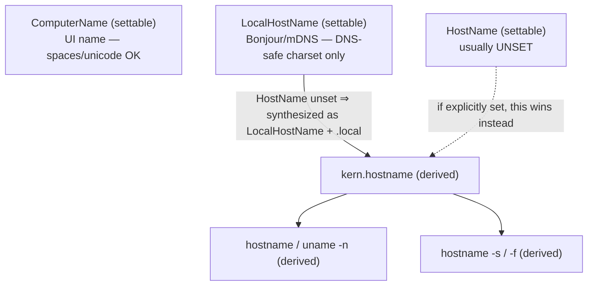
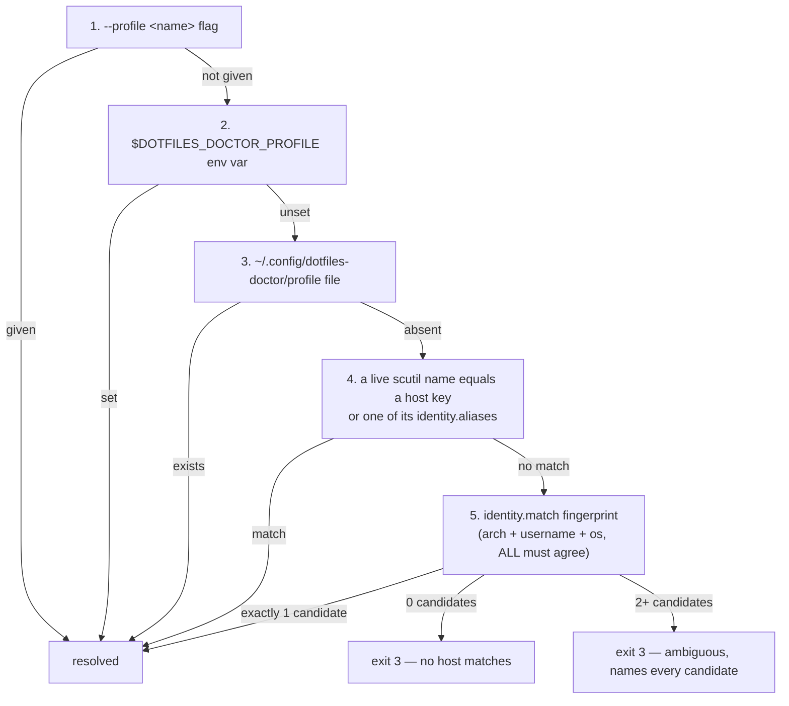

# Tutorial 08: Investigate an Environment

> Sit down at a macOS machine you don't fully trust — a stale personal laptop, a machine that hasn't been surveyed, even your own daily driver after a long gap — and use `hack/doctor/doctor.py` to find out what it actually is, whether it matches its profile, and exactly where it has drifted, without changing anything on disk.

**See also:** [docs/doctor.md](../doctor.md) (the full command reference) · [specs/migration-doctor.md](../../specs/migration-doctor.md) (the design this script implements) · [docs/gotchas.md](../gotchas.md) · [Tutorials index](README.md)

---

## What you'll learn

- How to probe every macOS hostname source on a machine that isn't even in the fleet config yet, with [`hack/doctor/doctor.py --identity`](../../hack/doctor/doctor.py)
- Why `HostName` being unset is the *healthy default*, not a fault — and which two hostnames actually matter
- The five-rule order the doctor uses to figure out "which machine am I?", and why two real hosts in this fleet (`supertop`, `minitop`) are **deliberately** unresolvable by hardware fingerprint alone
- How to read the six result statuses (`PASS`/`FAIL`/`WARN`/`SKIP`/`KNOWN`/`ERROR`) and what `KNOWN` specifically means
- The difference between `--state today` (tolerate tracked drift) and `--state target` (demand full convergence), and how it composes with `--phase`
- How to drill into one finding with `--explain`, `--only`, and `--skip`
- How to consume the doctor's output as JSON for scripting or handing to an agent
- Why the doctor's exit codes (`0`/`1`/`2`/`3`) are the real interface, and how to branch on them in a shell script
- A real diagnosis, start to finish: why `chezmoi status` exits `1` on `adobetop` today, traced through the `chezmoi-config-has-every-key` check to the exact template rename that caused it

**Prerequisites:** macOS with [`chezmoi`](https://www.chezmoi.io/) and [`uv`](https://docs.astral.sh/uv/) installed (`doctor.py` is a [PEP 723](https://peps.python.org/pep-0723/) self-contained script — `uv` bootstraps `pyyaml` and `jsonschema` for you, no virtualenv needed). This repo already checked out. No `sudo`, no GPU, no fleet membership required for Steps 1–3.

**Time estimate:** 20–30 minutes.

**Final result:** you can walk up to any macOS machine, running this repo's dotfiles or not, and answer "which machine is this, is it healthy, and what's still broken" — using only read commands.

---

## The one thing to hold onto: this tool never changes anything

Before touching a single flag: `doctor.py` is **read-only by construction**. Every check may carry a `fix:` string. That string is printed to your terminal and nothing else — it is never executed. The doctor never runs `chezmoi init`, never runs `chezmoi apply`, never runs `scutil --set`. You always do the fix yourself, by hand, after reading it. That's what makes it safe to run on a machine you don't fully trust yet.

---

## Step 1: Probe identity with no config and no resolved host

You've just sat down at this machine. You don't know if it's in `profiles.yaml`. You don't know its hostname situation. Start here anyway:

```sh
make doctor-identity
# equivalent to: ./hack/doctor/doctor.py --identity
```

This is the one command in the whole tool that needs **neither** a valid `profiles.yaml` entry **nor** a resolved host — [`main()`](../../hack/doctor/doctor.py) checks `args.identity` before it even loads the config file. That's deliberate: a survey machine that has never been added to the fleet is exactly the case this needs to handle, and `probe_identity()` doesn't touch `hosts:` or `profiles:` at all.

Illustrative output (yours will show your own machine's names):

```text
settable (authoritative):
  computer_name      adobetop
  local_host_name    adobetop
  host_name          (not set)
derived:
  kern_hostname      adobetop.local
  hostname           adobetop.local
  hostname_s         adobetop
  hostname_f         adobetop.local
  uname_n            adobetop.local
  networksetup       adobetop

arch=arm64 user=malcolm model=<hw.model>
```

Three names are **settable** — you can change each independently with `sudo scutil --set <Name> <value>` — and everything under `derived:` is computed *from* them, never the other way round:



**`host_name` reading `(not set)` is the healthy macOS default**, not a finding. Nothing sets `HostName` unless someone explicitly runs `sudo scutil --set HostName ...` — most Macs never have it set, and `kern.hostname` is happily synthesized from `LocalHostName + .local` instead. This is why the `hostname` check type takes an `allow_unset` flag (see [`_h_hostname`](../../hack/doctor/doctor.py)), and why `HostName` alone is `severity: warn` in `identity.assert` blocks while `ComputerName`/`LocalHostName` stay `error` — those two are what `.chezmoi.hostname` and every hostname-conditional template actually see.

The one thing `--identity` *does* flag is the three settable names **disagreeing with each other** — that's `probe_identity()`'s `agree` field, printed as a warning only when `len(named) > 1` distinct values exist among the ones that are actually set.

**Checkpoint:** run `make doctor-identity` yourself right now. Confirm `computer_name` and `local_host_name` are both set to something sensible, and note whether `host_name` is `(not set)` — that's normal — or set to something that *disagrees* with the other two, which is the actual problem this check exists to catch.

---

## Step 2: See what machines the fleet already knows about

Now check whether this machine — or any machine like it — is already in the committed config:

```sh
./hack/doctor/doctor.py --list-profiles
```

```text
  adobetop     profile=work
  minitop      profile=personal (hypothesis)
  supertop     profile=personal (hypothesis)
```

The `(hypothesis)` tag comes straight from `identity.hypothesis: true` in [`profiles.yaml`](../../hack/doctor/profiles.yaml) — it marks a host block that was written from inference, not a completed survey. `supertop` is "present in `~/.ssh/config` as user `bossjones` and nothing more"; `minitop` carries two *chained* assumptions (that it's the `mac-mini` SSH host, and that `mac-mini` is the machine the design spec calls `Mac.scarlettlab.home`) — see [specs/migration-doctor.md](../../specs/migration-doctor.md#the-minitop-hypothesis) if you want the full chain. Treat every value under a hypothesis host as provisional until its survey issue closes.

**Checkpoint:** run `--list-profiles` and confirm you can see which of the three fleet hosts are confirmed versus hypothesis. If the machine you're sitting at doesn't match any of these three by name, that's fine — it just means resolution (next step) will fall through to fingerprint matching.

---

## Step 3: Understand resolution — and the ambiguity that's a feature, not a bug

A bare `./hack/doctor/doctor.py` run has to answer "which host block am I?" before it can check anything. [`resolve_host()`](../../hack/doctor/doctor.py) tries five rules in order and stops at the first one that produces exactly one answer:



Rules 1–3 are explicit overrides; rule 4 is "your scutil names already say who you are"; rule 5 is the fallback — a hardware/user fingerprint match, used **only if it's unique**.

Here's the case worth understanding in detail, because it's load-bearing rather than an edge case: `supertop` and `minitop` are **both** `{arch: arm64, username: bossjones, os: darwin}` in [`profiles.yaml`](../../hack/doctor/profiles.yaml). If neither machine's `ComputerName`/`LocalHostName` has been set correctly yet, rule 4 finds nothing and rule 5 finds *two* candidates — by construction, not by accident. Running the doctor on either machine in that state gets you:

```text
✗ Cannot resolve profile: 2 candidates match this machine's fingerprint
    supertop   arch=arm64, username=bossjones, os=darwin
    minitop    arch=arm64, username=bossjones, os=darwin

  Disambiguate by any of:
    sudo scutil --set ComputerName supertop && sudo scutil --set LocalHostName supertop
    echo supertop > ~/.config/dotfiles-doctor/profile
    doctor.py --profile supertop
```

and exits **3**. It does not guess. It does not pick the first alphabetically. It stops and names both candidates by identity, because a hardware fingerprint genuinely cannot tell two `arm64`/`bossjones`/`darwin` machines apart, and a tool that silently picked one would eventually apply the wrong profile's expectations to the wrong machine.

This is deliberate friction, and it's cheap to resolve three ways — pick whichever fits how you work:

1. **Fix the hostname for real** (most durable): `sudo scutil --set ComputerName supertop && sudo scutil --set LocalHostName supertop` — rule 4 then resolves it every time, on every future run, with zero flags.
2. **Pin it locally, once**: `echo supertop > ~/.config/dotfiles-doctor/profile` — this file is never chezmoi-managed, so it's genuinely machine-local and survives even if the hostnames stay wrong.
3. **Override per-invocation**: `doctor.py --profile supertop` — no persistence, useful for a one-off check or a script.

**Checkpoint:** run `./hack/doctor/doctor.py --list-profiles` again and, if you're on `adobetop` or another confirmed host, run the bare `./hack/doctor/doctor.py` and confirm the `Host:` line at the top names the right machine and says `(resolved by: auto)`. If you get exit `3`, read the candidate list it printed — that's the tool working correctly, not failing.

---

## Step 4: Run it, and read the six statuses

With identity sorted out (or overridden with `--profile`), run the doctor for real:

```sh
./hack/doctor/doctor.py
```

Every line is one check, rendered by [`render_text()`](../../hack/doctor/doctor.py) as `<glyph> <STATUS> <id> <message>`, with `traces:` and `fix:` printed underneath any failure:

| Glyph | Status | Meaning |
|---|---|---|
| `✓` | `PASS` | The check's assertion held. |
| `✗` | `FAIL` | The check's assertion did not hold. |
| `⚠` | `WARN` | Failed, but the check is `severity: warn` — [`run_check()`](../../hack/doctor/doctor.py) downgrades a `warn`-severity `FAIL` to `WARN` automatically. |
| `⊘` | `SKIP` | A `when:` gate didn't match this machine (e.g. `hw_model: "MacBook.*"` on a Mac mini) — the check simply doesn't apply here. |
| `●` | `KNOWN` | A **drift** entry whose deviation is still present, under `--state today`. Accepted, tracked, not a surprise. |
| `✗` | `ERROR` | The check itself is broken — bad regex, unhandled exception, unknown `type:` — [`run_check()`](../../hack/doctor/doctor.py) catches exceptions so one broken check can never abort the whole run. |

`KNOWN` is the status worth sitting with, because it's the one that isn't just "pass" or "fail" in disguise. A drift entry in [`profiles.yaml`](../../hack/doctor/profiles.yaml) describes a deviation **as it exists today** — for example `adobetop-cuda-true-on-macos`, tracked as `#101`, says `cuda` is `true` on a machine where the target state wants `false`. Under `--state today` that assertion *passing* (i.e., `cuda` really is still `true`) is reported as `KNOWN`, not `PASS` — the doctor is telling you "yes, this known problem is still exactly the known problem, nothing has silently changed." See [`_drift_verdict()`](../../hack/doctor/doctor.py) for the exact logic; Step 5 covers what happens to the same check under `--state target`.

**Checkpoint:** run the bare `./hack/doctor/doctor.py` and find at least one `KNOWN` line in the output if you're on a host with drift entries (`adobetop` has several). Read its `traces:` — that's the GitHub issue or spec finding tracking it, confirming it's an accepted deviation with a plan, not an unmanaged one.

---

## Step 5: `--state today` vs `--state target`, composed with `--phase`

The doctor answers two genuinely different questions depending on which axis you pull:

```sh
./hack/doctor/doctor.py --state today     # default: tolerate known drift
./hack/doctor/doctor.py --state target    # demand full convergence — drift counts as FAIL
```

Under `--state target`, every drift entry that's still present flips from `KNOWN` to `FAIL` (message: `drift not yet resolved (<tracked>); expected <expected>`) — see [`_drift_verdict()`](../../hack/doctor/doctor.py). This is the honest answer to "how far is this machine from where it's supposed to be, ignoring anything we've already agreed to tolerate for now?"

`--phase` is a completely different axis — *when in a migration procedure* a check applies, not *whether drift is tolerated*:

```sh
./hack/doctor/doctor.py --phase pre     # preconditions: safe to start migrating?
./hack/doctor/doctor.py --phase post    # acceptance: did the migration land?
./hack/doctor/doctor.py --phase always  # invariants only (the default)
./hack/doctor/doctor.py --phase all     # everything, regardless of phase
```

They compose, because they answer orthogonal questions:

```sh
./hack/doctor/doctor.py --phase post --state target
```

That combination — every acceptance check passing, and zero tolerated drift remaining — is the strongest assertion the tool can make, and it's literally the design's definition of "done" for a migration (see [specs/migration-doctor.md](../../specs/migration-doctor.md#state-and-phase-are-different-axes)).

**Checkpoint:** on a host with drift entries, run `--state today` and `--state target` back to back and confirm at least one line flips from `KNOWN` to `FAIL` between the two. That's the tool proving the drift register is real and load-bearing, not decorative.

---

## Step 6: Drill into one finding — the real diagnosis

This is where investigation stops being abstract. On `adobetop`, a bare run surfaces something like this (trimmed to the interesting lines):

```text
  ✗ FAIL   chezmoi-templates-render        exit 1, want 0
           fix:    A template error here usually means a missing data key --
                   see chezmoi-config-has-every-key.
  ✗ FAIL   chezmoi-config-has-every-key    missing from chezmoi data: myRubyVersion,
                                            myGolangVersion, ... (19 renamed keys),
                                            myPyenvPythonVersion, myWtpVersion,
                                            myFzfTabRev -- re-run `chezmoi init`
                                            (hasKey false ⇒ the prompt fires)
```

The symptom is `chezmoi status` exiting `1` — annoying, and by itself it doesn't say why. Before reaching for `--explain`, look at what each check actually asserts: `chezmoi-templates-render` just runs `chezmoi status --source=$HOME/.local/share/chezmoi` and wants exit `0` (a thin wrapper around the real command). `chezmoi-config-has-every-key` is the one that explains it — its handler, [`_h_data_complete()`](../../hack/doctor/doctor.py), parses the `data:` block out of `home/.chezmoi.yaml.tmpl` directly, collects every key the template *declares*, and diffs that list against what `chezmoi data --format json` actually returns *live* on this machine.

The diagnosis: the template was updated to rename `myAsdf*Version` → `my*Version` (19 keys) and add three new ones (`myPyenvPythonVersion`, `myWtpVersion`, `myFzfTabRev`), but this machine's `~/.config/chezmoi/chezmoi.yaml` was never regenerated — it still carries the *old* key names. With `missingkey=error` set in the template config, any template that dereferences a now-renamed key hits an absent key and `chezmoi status` fails outright. One generic check (`chezmoi_data_complete`) catches this **entire class** of "a flag was introduced after your last apply" bug, rather than needing a hand-written assertion per key.

Pull up the check's full definition — the same JSON you'd hand an agent or paste into an issue — with `--explain`:

```sh
./hack/doctor/doctor.py --explain chezmoi-config-has-every-key
```

This prints the check's raw spec (`type`, `phase`, `traces`, `fix`, everything) and **runs nothing** — safe to use purely to read what a check does before deciding whether to trust its verdict.

To re-run just that one check (or its sibling on the drift register, `adobetop-stale-version-key-names`) without the noise of everything else:

```sh
./hack/doctor/doctor.py --only chezmoi-config-has-every-key,chezmoi-templates-render
```

`--skip` is the inverse — useful when one check is slow, flaky in your environment, or simply not what you're investigating right now:

```sh
./hack/doctor/doctor.py --skip work-hub-host-is-corp
```

The fix here is exactly what the check prints and nothing more: re-run `chezmoi init` with the full `--promptString`/`--promptBool` set from a real TTY. **Never hand-edit `chezmoi.yaml`** to patch in a missing key.

The [`fzf_tab`](../fzf-tab.md) flag shows why, and the asymmetry is worth internalising:

| Hand-edit | Safe? | Why |
|---|---|---|
| `fzf_tab: false` | ✅ | `plugins.toml.tmpl` guards on `and (hasKey . "fzf_tab") .fzf_tab`, so line 135 is never evaluated |
| `fzf_tab: true` | ❌ | Line 135 dereferences `.myFzfTabRev`, which only `.chezmoi.yaml.tmpl:147` emits. With `missingkey=error`, `apply` fails |

Re-running `init` regenerates both keys together, which is the only path that is correct in both directions.

**Checkpoint:** run `./hack/doctor/doctor.py --explain chezmoi-config-has-every-key` and confirm you can read its `type`, `phase`, and `fix` fields directly from the printed JSON — that's the same information the text renderer shows on failure, just without running the check.

---

## Step 7: Get JSON out, for scripts and agents

Every mode above also works with `--format json`:

```sh
./hack/doctor/doctor.py --format json
```

[`render_json()`](../../hack/doctor/doctor.py) emits one object per result with `id`, `title`, `status`, `severity`, `message`, `traces`, `tracked`, and `fix` — everything the text renderer shows, structured. Pipe it into `jq` to answer a specific question fast:

```sh
# Every finding that failed, id + message only
./hack/doctor/doctor.py --format json | jq -r '.results[] | select(.status=="FAIL") | "\(.id): \(.message)"'

# Just the tracked drift and its issue numbers
./hack/doctor/doctor.py --format json | jq -r '.results[] | select(.tracked) | "\(.id) -> \(.tracked)"'
```

This is also the shape to hand an investigating agent instead of scraped terminal text — structured, stable field names, and it includes the `fix:` string so the agent can *propose* a remediation without ever being tempted to run one itself (the doctor gives it nothing executable to run).

**Checkpoint:** confirm `./hack/doctor/doctor.py --format json | python3 -m json.tool` parses cleanly — that's exactly what `make smoke-doctor` asserts in CI.

---

## Step 8: Exit codes are the real interface

Everything above is for a human reading a terminal. For a script, the four exit codes are the actual contract — see [`main()`](../../hack/doctor/doctor.py) and `EXIT_OK`/`EXIT_FAILED`/`EXIT_CONFIG`/`EXIT_RESOLUTION`:

| Code | Meaning |
|---|---|
| `0` | Every `error`-severity check passed. `warn` failures and (under `--state today`) known drift may still be present. |
| `1` | At least one `error` check failed, or drift remains unresolved under `--state target`. |
| `2` | `profiles.yaml` is missing, unparseable, or fails schema validation. |
| `3` | The host could not be resolved, or resolved ambiguously (Step 3). |

The distinction between `1` and `3` is the one worth internalizing: `1` means *"I know exactly which machine this is, and it's not healthy."* `3` means *"I don't even know which machine this is yet."* A pre-flight gate should never conflate the two — "not ready to migrate" and "I don't know what this machine is" call for completely different next actions.

A shell conditional that actually branches on this:

```sh
./hack/doctor/doctor.py --phase pre --state today
case $? in
  0) echo "safe to start migrating" ;;
  1) echo "precondition failed -- read the FAIL lines above" ; exit 1 ;;
  2) echo "profiles.yaml itself is broken -- fix the config first" ; exit 2 ;;
  3) echo "cannot even identify this machine -- see the candidates above" ; exit 3 ;;
esac
```

**Checkpoint:** run `./hack/doctor/doctor.py --profile nonesuch` and confirm `echo $?` prints `3`. Then run `./hack/doctor/doctor.py --validate` and confirm `echo $?` prints `0`. Those two are exactly what [`make smoke-doctor`](../../Makefile) asserts.

---

## Verify

```sh
# 1. Identity probing needs no config and no resolved host
make doctor-identity

# 2. The fleet config is valid, and lists known hosts
./hack/doctor/doctor.py --validate
./hack/doctor/doctor.py --list-profiles

# 3. A bare run resolves this machine (or fails informatively with exit 3)
./hack/doctor/doctor.py; echo "exit=$?"

# 4. --state today and --state target disagree on at least one drift entry
#    (on a host with tracked drift, e.g. adobetop)
diff <(./hack/doctor/doctor.py --state today --format json | jq -r '.results[].status') \
     <(./hack/doctor/doctor.py --state target --format json | jq -r '.results[].status') || true

# 5. --explain runs nothing and prints a check's definition
./hack/doctor/doctor.py --explain chezmoi-config-has-every-key

# 6. Exit codes behave as documented
./hack/doctor/doctor.py --profile nonesuch >/dev/null 2>&1; echo "unknown profile -> $?"   # 3
```

If all six come back as described, you can investigate any macOS machine's dotfiles state — surveyed or not, healthy or not — using only read-only commands, and you know exactly which finding to trust and why.

---

## Where next

- **[docs/doctor.md](../doctor.md)** — the full command and check-type reference
- **[specs/migration-doctor.md](../../specs/migration-doctor.md)** — the design this script implements: the fleet table, the drift sunset policy, the full check-type registry, and the still-open questions (`Q10`, `Q15`, `Q16`, `Q17`)
- **[docs/gotchas.md](../gotchas.md)** — other sharp edges in this repo worth knowing before you touch a machine
- **[docs/version-managers.md](../version-managers.md)** — the `asdf` ⇄ `mise` migration the `chezmoi-version-manager-mise` check is watching for
- **[docs/feature-flags.md](../feature-flags.md)** — every chezmoi prompt value the `chezmoi_data` / `chezmoi_data_complete` checks assert against
- **[Tutorial 04: Switch Version Manager](04-switch-version-manager.md)** — the migration this doctor was built to gate
