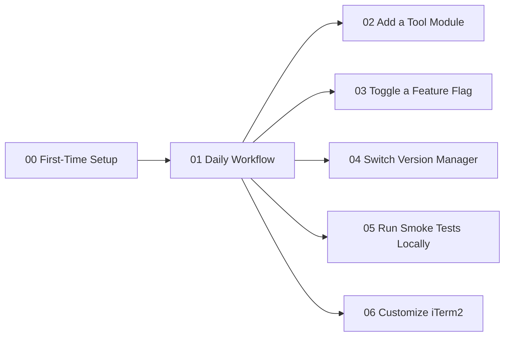

# Tutorials

> A hands-on, goal-oriented tutorial track for this chezmoi-managed zsh-dotfiles repo. Each tutorial is copy-pasteable and ends with a **Verify** section.

**See also:** [docs/installation.md](../installation.md) · [CONTRIBUTING.md](../../CONTRIBUTING.md) · [docs/architecture.md](../architecture.md)

---

## Suggested order

| # | Tutorial | Outcome |
|---|----------|---------|
| 00 | [First-Time Setup](00-first-time-setup.md) | A brand-new machine goes from bare shell to a fully provisioned, chezmoi-managed zsh |
| 01 | [Daily Workflow](01-daily-workflow.md) | You can pull upstream changes, preview them, apply them, and edit a managed file safely |
| 02 | [Add a Tool Module](02-add-a-tool-module.md) | You've added your own `home/shell/<tool>/{env,path}.zsh` module and confirmed it auto-loads |
| 03 | [Toggle a Feature Flag](03-toggle-a-feature-flag.md) | You've flipped an optional install flag (e.g. `pyenv`) on or off and verified the effect |
| 04 | [Switch Version Manager](04-switch-version-manager.md) | You've migrated the machine from `asdf` to `mise` (or back) |
| 05 | [Run Smoke Tests Locally](05-run-smoke-tests-locally.md) | You can reproduce the CI matrix in Docker before pushing |
| 06 | [Customize iTerm2](06-customize-iterm2.md) | Your iTerm2 profile changes are captured into the repo and re-applied on another machine |

If you're brand new here, start at **00** and work down — each tutorial after 01 stands alone, so feel free to skip to whichever one matches what you're trying to do today.

---

## Learning path

---

## Related reference docs

- **[docs/installation.md](../installation.md)** — the full install-path reference (one-liner, manual, `install.sh`, `make macos-init-good-defaults-*`)
- **[docs/feature-flags.md](../feature-flags.md)** — every chezmoi prompt and environment variable
- **[docs/version-managers.md](../version-managers.md)** — asdf ⇄ mise deep dive
- **[docs/testing-and-ci.md](../testing-and-ci.md)** — pytest, libtmux, and Docker smoke tests
- **[docs/iterm2-and-macos.md](../iterm2-and-macos.md)** — iTerm2 import script and macOS defaults
- **[docs/shell-loading.md](../shell-loading.md)** — the sheldon plugin load order and glob conventions
- **[docs/architecture.md](../architecture.md)** — the system-wide picture
