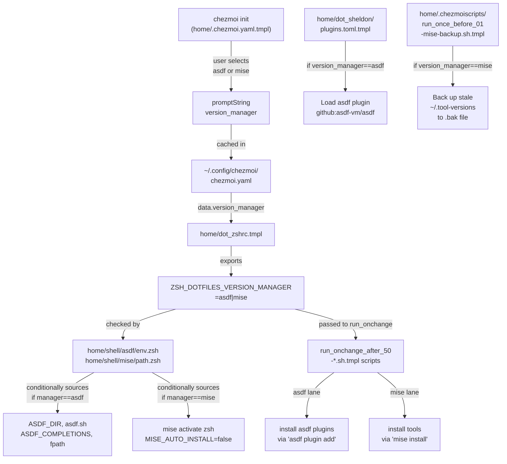
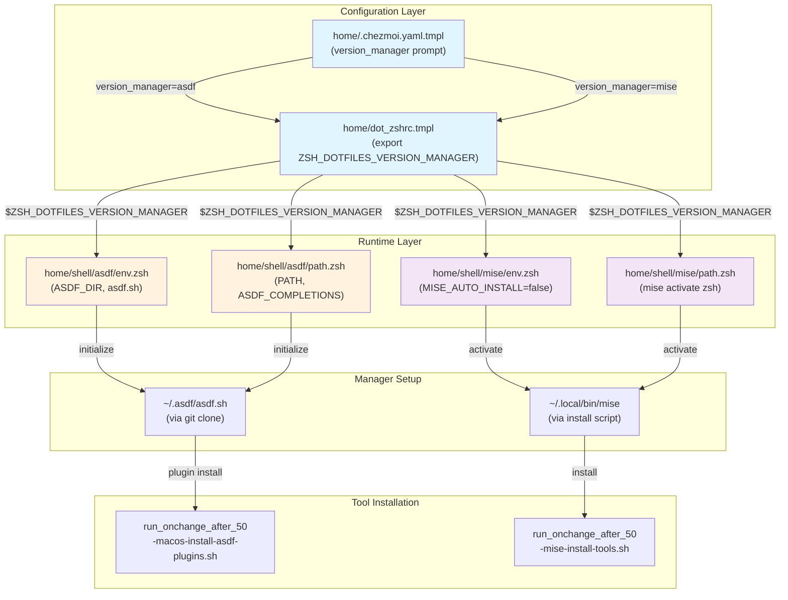

# Version Managers: asdf ⇄ mise

Deep-dive reference for the asdf and mise integration, including how the choice threads end-to-end through configuration, installation, and runtime.

**Table of Contents:**
- [Quick Summary](#quick-summary)
- [End-to-End Threading](#end-to-end-threading)
- [Pinned Tool Versions](#pinned-tool-versions)
- [Architecture Diagram](#architecture-diagram)
- [Practical: How to Switch](#practical-how-to-switch)
- [Module Gating Logic](#module-gating-logic)
- [Sheldon Plugin Conditional Loading](#sheldon-plugin-conditional-loading)
- [Installation Scripts by Manager](#installation-scripts-by-manager)

---

## Quick Summary

The repository supports two runtime version managers:

| Manager | Upstream | Default | When to Use |
|---------|----------|---------|------------|
| **[asdf](https://asdf-vm.com/)** | [asdf-vm/asdf](https://github.com/asdf-vm/asdf) | Yes (current) | Mature, many plugins, good for polyglot workflows |
| **[mise](https://mise.jdx.dev/)** | [jdx/mise](https://github.com/jdx/mise) | No (opt-in) | Faster, modern, good for single-language teams |

**Key difference:** asdf uses per-tool plugins; mise is built on [direnv](https://direnv.net/) and auto-installs tools.

---

## End-to-End Threading

This diagram shows how the `version_manager` flag flows through the system:



### Step-by-Step Flow

1. **Chezmoi initialization** (`home/.chezmoi.yaml.tmpl`, line 102-107):
   - Template prompts for `version_manager` via `promptString "version_manager" "asdf"`
   - Outside `if $interactive` block so `--promptString version_manager=mise` works in Docker/CI

2. **Data caching** (`~/.config/chezmoi/chezmoi.yaml`):
   ```yaml
   data:
     version_manager: asdf  # or mise
   ```

3. **ZSH export** (`home/dot_zshrc.tmpl`, line 9):
   ```bash
   export ZSH_DOTFILES_VERSION_MANAGER={{ .version_manager | quote }}
   ```

4. **Module gating** (asdf: `home/shell/asdf/env.zsh` and `path.zsh`; mise: `home/shell/mise/env.zsh` and `path.zsh`):
   - asdf env.zsh: `if [ "${ZSH_DOTFILES_VERSION_MANAGER:-}" = "asdf" ]; then export ASDF_DIR=...`
   - mise path.zsh: `if [ "${ZSH_DOTFILES_VERSION_MANAGER:-}" = "mise" ]; then eval "$(mise activate zsh)"`

5. **Sheldon conditional loading** (`home/dot_sheldon/plugins.toml.tmpl`, lines not shown in excerpt but templated):
   - Only asdf plugin is loaded if `version_manager==asdf`

6. **Installation scripts** (run_onchange_after_50-*.sh.tmpl):
   - `run_onchange_after_50-macos-install-asdf-plugins.sh.tmpl`: installs asdf + plugins
   - `run_onchange_after_50-mise-install-tools.sh.tmpl`: installs tools via mise
   - **Mutual Exclusion**: only one script runs per chezmoi apply

7. **Migration self-heal** (`run_once_before_01-mise-backup-tool-versions.sh.tmpl`):
   - If `version_manager==mise`, back up stale `~/.tool-versions` (asdf-era file) to prevent noisy warnings

---

## Pinned Tool Versions

All tool versions are pinned in `home/.chezmoi.yaml.tmpl` under `data:` (lines 117-152). This ensures reproducible builds.

| Tool | Version | Via | Comments |
|------|---------|-----|----------|
| **fzf** | `0.73.1` | asdf/mise | Fuzzy finder CLI tool |
| **sheldon** | `0.6.6` | custom bootstrap (Rust build for arm64) | ZSH plugin manager |
| **asdf** | `v0.11.2` | git clone via prereq | Version manager (if selected) |
| **Ruby** | `4.0.1` | asdf/mise | Full-stack language (compile via rbenv) |
| **Python** | `3.12.8` (via pyenv) | asdf/mise | Data science, DevOps scripting |
| **Golang** | `1.25.1` | asdf/mise | Cloud tooling (chezmoi, k8s tools) |
| **tmux** | `3.5a` | Homebrew or asdf/mise | Terminal multiplexer |
| **Neovim** | `latest` | Homebrew | Text editor |
| **github-cli (gh)** | `2.93.0` | asdf/mise | GitHub CLI tool |
| **mkcert** | `1.4.4` | asdf/mise | Local SSL certificate generator |
| **shellcheck** | `0.11.0` | asdf/mise | Shell script linter |
| **shfmt** | `3.13.1` | asdf/mise | Shell script formatter |
| **yq** | `4.53.2` | asdf/mise | YAML/JSON processor |
| **helm** | `3.14.2` | asdf/mise | Kubernetes package manager |
| **helmfile** | `0.162.0` | asdf/mise | Helm orchestrator |
| **helm-docs** | `1.13.1` | asdf/mise | Helm chart documenter |
| **k9s** | `0.32.4` | asdf/mise | Kubernetes TUI dashboard |
| **kubectx** | `0.9.5` | asdf/mise | Kubectl context switcher |
| **opa** | `0.62.1` | asdf/mise | Open Policy Agent (security policies) |
| **kubectl** | `1.26.12` | asdf/mise | Kubernetes CLI |
| **kubetail** | `1.6.20` | asdf/mise | Kubernetes log aggregator |
| **fnm** | `20.19.5` (Node version via fnm) | fnm (if enabled) | Fast Node Manager Node version |
| **wtp** | `2.10.3` | asdf/mise | Unknown tool (verify in repo) |

### How to Update Versions

1. Edit `home/.chezmoi.yaml.tmpl` under `data:` section
2. Run `chezmoi apply --force` to trigger re-installation
3. For asdf: `asdf install <plugin> <version>`
4. For mise: `mise install <tool>@<version>`

---

## Architecture Diagram

### High-Level System Architecture



---

## Practical: How to Switch

### Option 1: Re-run chezmoi init (Recommended)

```bash
# Clear cached data and re-prompt
chezmoi init --data=false --source=.

# When prompted for version_manager, select the other one
# Then apply
chezmoi apply --force
```

### Option 2: Direct Configuration Edit

```bash
# Edit the cached config
$EDITOR ~/.config/chezmoi/chezmoi.yaml

# Change version_manager from asdf to mise (or vice versa)
# Then apply
chezmoi apply --force
```

### Option 3: CLI Flag (Non-Interactive)

```bash
chezmoi init --source=. \
    --promptString version_manager=mise \
    --apply --force
```

### What Happens After Switch

When you switch from asdf to mise (or vice versa):

1. **Old manager remains** (asdf data stays if you switch to mise; you can manually remove `~/.asdf` if desired)
2. **New manager is initialized** in ~/.local/bin/mise (or ~/.asdf)
3. **~/.tool-versions backup** (if switching to mise): the old asdf `~/.tool-versions` is backed up to `~/.tool-versions.asdf.bak`
4. **Tools are re-installed** via the new manager (run_onchange scripts detect the change and re-run)
5. **ZSH restarts** to pick up new exports

**Safety:** Both managers can coexist. The `$ZSH_DOTFILES_VERSION_MANAGER` variable determines which is active.

---

## Module Gating Logic

### asdf Gating (home/shell/asdf/env.zsh and path.zsh)

**env.zsh** (lines 1-33):
```bash
if [ "${ZSH_DOTFILES_VERSION_MANAGER:-}" = "asdf" ]; then
    # macOS: set ASDF_DIR if not already set
    # Linux: set ASDF_DIR
    export ASDF_DIR="${HOME}/.asdf"
    # ... OS detection and more setup
fi
```

**path.zsh** (lines 1-37):
```bash
if [ "${ZSH_DOTFILES_VERSION_MANAGER:-}" = "asdf" ]; then
    export ASDF_DIR="${HOME}/.asdf"
    export ASDF_COMPLETIONS="$ASDF_DIR/completions"
    fpath=(${ASDF_DIR}/completions $fpath)  # Add to zsh function path
    # ... OS-specific PATH setup
fi
```

### mise Gating (home/shell/mise/env.zsh and path.zsh)

**env.zsh** (all 3 lines):
```bash
# Minimal — mise self-bootstraps via 'mise activate'
export MISE_AUTO_INSTALL=false
```

**path.zsh** (all 3 lines):
```bash
if [ "${ZSH_DOTFILES_VERSION_MANAGER:-}" = "mise" ] && command -v mise >/dev/null 2>&1; then
    eval "$(mise activate zsh)"
fi
```

### Mutual Exclusion Invariant (specs/migrate-asdf-to-mise.md)

**Critical rule when VERSION_MANAGER=mise:**
- **Never** source asdf.sh
- **Never** set ASDF_DIR or ASDF_COMPLETIONS
- This prevents tool-version conflicts and PATH contamination

The scripts enforce this by checking `$ZSH_DOTFILES_VERSION_MANAGER` before any asdf setup.

---

## Sheldon Plugin Conditional Loading

[Sheldon](https://rossmacarthur.github.io/sheldon/) (`home/dot_sheldon/plugins.toml.tmpl`) conditionally loads the asdf plugin only when the version manager is asdf.

**In plugins.toml.tmpl** (not fully shown in earlier read, but conditional pattern):
```toml
# Conditionally load asdf plugin (template syntax)
# {{ if eq .version_manager "asdf" }}
[plugins.asdf]
github = "asdf-vm/asdf"
# {{ end }}
```

**Effect:**
- When `version_manager=asdf`: asdf completion functions are loaded via Sheldon
- When `version_manager=mise`: asdf plugin is skipped; mise completions are handled by `mise activate`

---

## Installation Scripts by Manager

### asdf Lane: run_onchange_after_50-macos-install-asdf-plugins.sh.tmpl

Runs when asdf is selected. Installs asdf plugins and tool versions.

**Pattern:**
```bash
if [ "${ZSH_DOTFILES_VERSION_MANAGER:-}" = "asdf" ]; then
    asdf plugin add ruby https://github.com/asdf-vm/asdf-ruby.git
    asdf install ruby 4.0.1
    # ... more plugins
fi
```

**Platforms:** Separate scripts for macOS, Ubuntu, CentOS/Oracle Linux.

**Triggered by:** `chezmoi apply` when template renders with `version_manager: asdf`.

### mise Lane: run_onchange_after_50-mise-install-tools.sh.tmpl

Runs when mise is selected. Installs tools via mise.

**Pattern:**
```bash
if [ "${ZSH_DOTFILES_VERSION_MANAGER:-}" = "mise" ]; then
    mise install ruby@4.0.1
    mise install python@3.12.8
    # ... more tools
fi
```

**Simplicity:** mise auto-detects tool versions from `.tool-versions` (or `~/.config/mise/config.toml`), no plugin management needed.

**Triggered by:** `chezmoi apply` when template renders with `version_manager: mise`.

### Migration Self-Heal: run_once_before_01-mise-backup-tool-versions.sh.tmpl

Runs once before any installation when switching to mise.

**Purpose:** An asdf-era `~/.tool-versions` lists tools by bare name (e.g., `jsonnet`, `kubetail`) that mise's registry can't resolve, producing noisy warnings.

**Action:**
```bash
if [ -f "$HOME/.tool-versions" ] && [ ! -e "$HOME/.tool-versions.asdf.bak" ]; then
  mv "$HOME/.tool-versions" "$HOME/.tool-versions.asdf.bak"
fi
```

**Idempotent:** Never clobbers an existing backup; safe to re-run.

---

## Cross-References

- **[Feature Flags](feature-flags.md)** - `version_manager` flag details and prompt/reuse mechanism
- **[Testing &amp; CI](testing-and-ci.md)** - How GitHub workflows test both managers
- **[Tutorial: switch version manager](tutorials/04-switch-version-manager.md)** - Step-by-step tutorial for switching
- **[home/.chezmoi.yaml.tmpl](../home/.chezmoi.yaml.tmpl)** - Source: version_manager prompt and all pinned versions
- **[home/dot_zshrc.tmpl](../home/dot_zshrc.tmpl)** - Source: ZSH_DOTFILES_VERSION_MANAGER export
- **[home/shell/asdf/](../home/shell/asdf)** - Source: asdf env/path gating
- **[home/shell/mise/](../home/shell/mise)** - Source: mise env/path gating
- **[asdf Documentation](https://asdf-vm.com/)** - Official asdf plugin management guide
- **[mise Documentation](https://mise.jdx.dev/)** - Official mise quick start and features
- **[specs/migrate-asdf-to-mise.md](../specs/migrate-asdf-to-mise.md)** - Migration roadmap and mutual exclusion invariant
